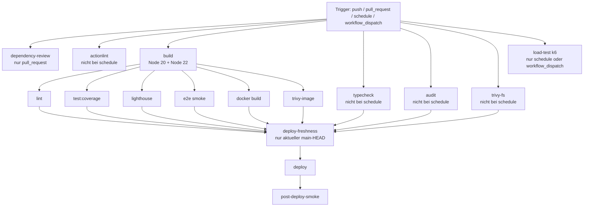

<!-- markdownlint-disable MD013 -->

# CI-Workflow verständlich erklärt (für Junior-Entwickler:innen)

Diese Seite erklärt den kompletten GitHub-Workflow in [../.github/workflows/ci.yml](../.github/workflows/ci.yml):

- Was wird geprüft?
- Wann läuft welcher Job?
- Warum ist dieser Check wichtig?
- Was bedeutet ein Fehler konkret für deinen PR?

Für detaillierte lokale Testkommandos und zusätzliche Last-/Smoke-Varianten siehe [TESTING.md](TESTING.md).

---

## In 5 Minuten verstehen

Wenn du neu im Projekt bist, reicht dieses mentale Modell:

1. **Vorstufe (früh, parallel):** PR-Risiken und Workflow-Qualität prüfen (`dependency-review`, `actionlint`).
2. **Technische Basis:** Das Projekt muss in einer realistischen Umgebung bauen (`build`, `typecheck`, `lint`).
3. **Verhalten:** Tests müssen grün sein und Mindestqualität halten (`test:coverage`, `e2e`, `lighthouse`).
4. **Sicherheit:** Dependency- und Container-Risiken dürfen keine High/Critical-Blocker enthalten (`audit`, `trivy-fs`, `trivy-image`).
5. **Release:** Nur wenn alles grün ist und der Commit noch aktueller `main`-HEAD ist (`deploy-freshness`), darf deployed werden (`deploy`), danach kommt der Gesundheitscheck (`post-deploy-smoke`).

### PR-Checkliste für Erstbeiträge

Nutze diese Reihenfolge lokal, bevor du einen PR öffnest:

1. `npm run typecheck`
2. `npm run lint`
3. `npm run test:coverage`
4. Bei Frontend-/Locale-Änderungen zusätzlich: `npm run build:localize -w @arsnova/frontend`
5. Optional produktionsnah: `npm run verify:production-serving`

Wenn ein Schritt fehlschlägt, behebe ihn lokal zuerst. So sparst du CI-Runden und Reviewer-Zeit.

---

## 1) Ziel der Pipeline

Die CI-Pipeline soll drei Dinge sicherstellen:

1. **Technische Korrektheit**: Build, Typprüfung, Lint und Unit/Integrationstests laufen stabil.
2. **Produktqualität**: Frontend ist baubar, zugänglich (A11y), und die Kernflows funktionieren End-to-End.
3. **Release-Sicherheit**: Sicherheitsprüfungen bestehen, Deploy ist geschützt und wird nachgelagert verifiziert.

---

## 2) Wann startet die Pipeline?

Auslöser in [../.github/workflows/ci.yml](../.github/workflows/ci.yml):

1. **push auf main**
2. **pull_request auf main**
3. **schedule** (nachts, täglich)
4. **workflow_dispatch** (manuell per GitHub UI)

---

## 3) Gesamtbild als Ablaufgrafik

Wichtig: Jobs ohne direkte Abhängigkeit laufen **parallel**.

---

## 4) Job für Job: Was, wo, wann, warum

### 4.1 dependency-review

- **Was?** Prüft Dependency-Änderungen im PR auf bekannte Risiken.
- **Wo?** Action `actions/dependency-review-action` in [../.github/workflows/ci.yml](../.github/workflows/ci.yml).
- **Wann?** Nur bei `pull_request`.
- **Warum?** Verhindert, dass riskante Paket-Updates unbemerkt gemerged werden.

### 4.2 actionlint

- **Was?** Linting/Validierung der GitHub-Workflow-Dateien.
- **Wo?** Action `raven-actions/actionlint` in [../.github/workflows/ci.yml](../.github/workflows/ci.yml).
- **Wann?** Bei allen Events außer `schedule`.
- **Warum?** Verhindert CI-Fehler durch fehlerhafte YAML-/Workflow-Logik.

### 4.3 build (Node-Matrix: 20 und 22)

- **Was?**
  1. `npm ci`
  2. `prisma validate`
  3. `prisma generate`
  4. TypeScript-Build (`shared-types` + Backend)
  5. Frontend-Typecheck (`tsc --noEmit`)
  6. Lokalisierter Frontend-Produktionsbuild
  7. Upload des Frontend-Artefakts (für Folgejobs)
- **Wo?** Build-Schritte in [../.github/workflows/ci.yml](../.github/workflows/ci.yml).
- **Wann?** Fast immer; Kernjob für viele Abhängigkeiten.
- **Warum?** Bestätigt, dass das System baubar ist und alle Folgechecks auf einem validen Build aufsetzen.

### 4.4 typecheck

- **Was?** Root-`typecheck` über Workspaces (`shared-types`, Backend, Frontend).
- **Wo?** Scripts in [../package.json](../package.json), Workspace-Configs in [../apps/backend/vitest.config.ts](../apps/backend/vitest.config.ts) und [../apps/frontend/vitest.config.ts](../apps/frontend/vitest.config.ts) für Testkontext.
- **Wann?** Alle Events außer `schedule`.
- **Warum?** Fängt Typfehler früh ab, bevor Runtime-Tests laufen.

### 4.5 lint

- **Was?** ESLint über `libs/` und `apps/`.
- **Wo?** Script in [../package.json](../package.json).
- **Wann?** Nach erfolgreichem `build`.
- **Warum?** Hält Codequalität und Konsistenz im Team hoch.

### 4.6 audit

- **Was?** `npm audit --audit-level=high --omit=dev` als Gate (Produktionsabhängigkeiten).
- **Wo?** Audit-Job in [../.github/workflows/ci.yml](../.github/workflows/ci.yml).
- **Wann?** Alle Events außer `schedule`.
- **Warum?** Blockiert bekannte High-Severity-Schwachstellen vor dem Merge/Deploy.

### 4.7 test (Coverage-Gate)

- **Was?** `npm run test:coverage` für Backend + Frontend.
- **Wo?** Root-Script in [../package.json](../package.json), Schwellenwerte in
  [../apps/backend/vitest.config.ts](../apps/backend/vitest.config.ts) und
  [../apps/frontend/vitest.config.ts](../apps/frontend/vitest.config.ts).
- **Wann?** Nach erfolgreichem `build`.
- **Warum?** Prüft Verhalten und stellt Mindestabdeckung sicher.

### 4.8 lighthouse

- **Was?** Lighthouse CI gegen den gebauten Frontend-Stand (`/de/`, `/en/`).
- **Wo?** Job in [../.github/workflows/ci.yml](../.github/workflows/ci.yml), Regeln in [../.lighthouserc.cjs](../.lighthouserc.cjs).
- **Wann?** Nach `build`, außer bei `schedule`.
- **Warum?** Qualitätssignal für Accessibility/Performance/Best-Practices/SEO.

### 4.9 e2e

- **Was?** Playwright-Smoke mit echten Services (Postgres + Redis), Backend/Frontend-Start und Unified-Session-Flow.
- **Wo?** Job in [../.github/workflows/ci.yml](../.github/workflows/ci.yml), Flow-Skript in [../apps/frontend/scripts/check-unified-session-flow.mjs](../apps/frontend/scripts/check-unified-session-flow.mjs).
- **Wann?** Nach `build`, außer bei `schedule`.
- **Warum?** Testet den Nutzerfluss systemnah (nicht nur isolierte Unit-Tests).

### 4.10 load-test

- **Was?** k6-Health-Loadtest gegen Produktion.
- **Wo?** Job in [../.github/workflows/ci.yml](../.github/workflows/ci.yml), Skript in [../scripts/load/k6-trpc-health-50vu.js](../scripts/load/k6-trpc-health-50vu.js).
- **Wann?** Nur bei `schedule` oder `workflow_dispatch`.
- **Warum?** Regelmäßige Lastsicht, ohne jeden PR-Run zu verlangsamen.

### 4.11 trivy-fs

- **Was?** Security-Scan des Repository-Dateisystems (HIGH/CRITICAL).
- **Wo?** Trivy-Job in [../.github/workflows/ci.yml](../.github/workflows/ci.yml).
- **Wann?** Alle Events außer `schedule`.
- **Warum?** Deckt bekannte Schwachstellen/Fehlkonfigurationen in Dateien und Dependencies auf.

### 4.12 trivy-image

- **Was?** Baut ein Scan-Image und führt Trivy-Image-Scan aus (HIGH/CRITICAL).
- **Wo?** In [../.github/workflows/ci.yml](../.github/workflows/ci.yml).
- **Wann?** Nach `build`, außer bei `schedule`.
- **Warum?** Findet container-spezifische Risiken vor Deployment.

### 4.13 docker

- **Was?** Docker-Image-Build (ohne Push).
- **Wo?** Job in [../.github/workflows/ci.yml](../.github/workflows/ci.yml), Build-Definition in [../Dockerfile](../Dockerfile).
- **Wann?** Nach `build`, außer bei `schedule`.
- **Warum?** Prüft, dass das Release-Artefakt (Container) tatsächlich baubar ist.

### 4.14 deploy-freshness

- **Was?** Prüft kurz vor dem Production-Deploy, ob der geprüfte Commit (`github.sha`) noch der aktuelle `main`-HEAD ist.
- **Wo?** Deploy-Freshness-Job in [../.github/workflows/ci.yml](../.github/workflows/ci.yml).
- **Wann?** Nur bei `push` auf `main` und wenn `DEPLOY_ENABLED=true` gesetzt ist, nach allen Quality-Gates.
- **Warum?** Verhindert stale Deployments: Ein älterer, langsamer CI-Lauf darf keinen inzwischen überholten Commit mehr produktiv ausrollen.

### 4.15 deploy

- **Was?** Server-Deploy via SSH; führt serverseitig [../scripts/deploy.sh](../scripts/deploy.sh) aus.
- **Wo?** Deploy-Job in [../.github/workflows/ci.yml](../.github/workflows/ci.yml).
- **Wann?** Nur wenn `deploy-freshness` bestätigt hat, dass `github.sha` noch aktueller `main`-HEAD ist.
- **Warum?** Produktivdeployment bleibt kontrolliert, an alle Quality-Gates gekoppelt und auf den tatsächlich geprüften Commit gepinnt.

### 4.16 post-deploy-smoke

- **Was?** Nachgelagerter Smoke-Check auf der Zielumgebung über [../scripts/verify-production-serving.mjs](../scripts/verify-production-serving.mjs).
- **Wo?** Job in [../.github/workflows/ci.yml](../.github/workflows/ci.yml).
- **Wann?** Nur wenn `deploy` erfolgreich war.
- **Warum?** Verifiziert, dass die produktive Auslieferung wirklich erreichbar und gesund ist.

### 4.17 rollback-on-smoke-failure

- **Was?** Automatischer Rollback auf den vorherigen Commit (`github.event.before`) und erneutes serverseitiges Deployment.
- **Wo?** Job in [../.github/workflows/ci.yml](../.github/workflows/ci.yml).
- **Wann?** Bei `push` auf `main`, wenn `deploy` erfolgreich war, aber `post-deploy-smoke` fehlschlug.
- **Warum?** Reduziert Ausfallzeit und stellt den zuletzt funktionierenden Stand schnell wieder her.

---

## 5) Welche Jobs sind echte Gates vor Deploy?

Vor `deploy-freshness` müssen erfolgreich sein:

1. lint
2. test (mit Coverage)
3. docker
4. typecheck
5. lighthouse
6. e2e
7. audit
8. trivy-fs
9. trivy-image

Wenn einer davon fehlschlägt, wird nicht deployt. Wenn danach `deploy-freshness` feststellt, dass `github.sha` nicht mehr aktueller `main`-HEAD ist, wird der Deploy sauber übersprungen.

---

## 6) Was bedeutet ein Fail für mich im Alltag?

- **Fail in build/typecheck/lint**: meist Code- oder Typproblem direkt in deinem PR.
- **Fail in test/e2e**: Verhalten ist regressiv oder instabil.
- **Fail in audit/trivy**: Sicherheitsrisiko gefunden; Upgrade/Fix nötig.
- **Fail in lighthouse**: Qualitätsanforderung (insb. A11y) unterschritten.
- **Fail in docker**: Release-Artefakt nicht reproduzierbar.
- **Fail in post-deploy-smoke**: Deployment lief technisch, aber die App ist nicht gesund ausgeliefert.
- **Fail in rollback-on-smoke-failure**: Das automatische Zurückrollen ist gescheitert; sofort manuell eingreifen.

---

## 7) Gute Reihenfolge für lokale Checks vor PR

Empfehlung (schnell nach aussagekräftig):

1. `npm run typecheck`
2. `npm run lint`
3. `npm run test:coverage`
4. Bei Frontend-/SSR-Änderungen: `npm run build:localize -w @arsnova/frontend`
5. Optional für produktionsnahe Validierung: `npm run verify:production-serving`

Mehr Details und Spezialfälle stehen in [TESTING.md](TESTING.md).

---

## 8) Glossar für Junior-Entwickler:innen

- **Gate**: Ein Muss-Check. Wenn rot, stoppt die Pipeline vor dem nächsten kritischen Schritt.
- **needs**: Abhängigkeit zwischen Jobs. Ein Job startet erst, wenn seine Vorgänger grün sind.
- **Artifact**: Datei/Ordner aus einem Job, die in späteren Jobs wiederverwendet wird.
- **Matrix**: Derselbe Job läuft in mehreren Umgebungen (hier Node 20 und 22).
- **Smoke-Test**: Kurzer End-to-End-Test, der die wichtigsten Kernfunktionen prüft.

---

## 9) Welche Reports/Artefakte entstehen und wo finde ich sie?

In GitHub findest du Artefakte so:

1. Repository öffnen
2. Tab Actions
3. Gewünschten CI-Run öffnen
4. Unten im Bereich Artifacts die Downloads auswählen

| Artefaktname            | Erzeugender Job | Inhalt                                                        | Fundstelle im Runner                                                | Retention |
| ----------------------- | --------------- | ------------------------------------------------------------- | ------------------------------------------------------------------- | --------- |
| `frontend-dist-browser` | `build`         | Lokalisierter Frontend-Produktionsbuild                       | `apps/frontend/dist/browser`                                        | 1 Tag     |
| `coverage-reports`      | `test`          | Backend- und Frontend-Coverage (HTML + Textsummary-Dateien)   | `apps/backend/coverage`, `apps/frontend/coverage`                   | 7 Tage    |
| `lighthouse-reports`    | `lighthouse`    | Lighthouse-Ausgabe (A11y/Performance/SEO/Best-Practices)      | `.lighthouseci`                                                     | 7 Tage    |
| `e2e-service-logs`      | `e2e`           | Laufzeitlogs von Backend und Frontend während des Smoke-Tests | `${{ runner.temp }}/backend.log`, `${{ runner.temp }}/frontend.log` | 7 Tage    |
| `trivy-fs-report`       | `trivy-fs`      | Trivy Filesystem Security Report (SARIF)                      | `trivy-fs.sarif`                                                    | 7 Tage    |
| `trivy-image-report`    | `trivy-image`   | Trivy Container Image Security Report (SARIF)                 | `trivy-image.sarif`                                                 | 7 Tage    |

Hinweise:

1. `audit`, `dependency-review` und `actionlint` liefern primär Check-Status und Logs, aber kein eigenes Download-Artefakt.
2. Die Trivy-Gates bleiben blockierend: erst wird mit `exit-code: '1'` geprüft, danach wird zusätzlich ein Report für den Download erzeugt.

---

## 10) Branch Protection (Required Checks)

Damit die Pipeline-Regeln wirklich verbindlich sind, sollten in GitHub Branch Protection für `main` diese Checks als **required** gesetzt werden:

1. `build`
2. `typecheck`
3. `lint`
4. `test`
5. `lighthouse`
6. `e2e`
7. `audit`
8. `trivy-fs`
9. `trivy-image`
10. `actionlint`
11. `dependency-review`

Empfehlung: `deploy-freshness`, `deploy`, `post-deploy-smoke` und `rollback-on-smoke-failure` nicht als PR-required setzen, da diese nur im Push/Release-Pfad relevant sind.

---

## 11) Canonical References

- Workflow-Datei: [../.github/workflows/ci.yml](../.github/workflows/ci.yml)
- Test-Referenz: [TESTING.md](TESTING.md)
- Sicherheitsüberblick: [SECURITY-OVERVIEW.md](SECURITY-OVERVIEW.md)
- Deploy-Skript: [../scripts/deploy.sh](../scripts/deploy.sh)
- Post-Deploy-Verifikation: [../scripts/verify-production-serving.mjs](../scripts/verify-production-serving.mjs)
