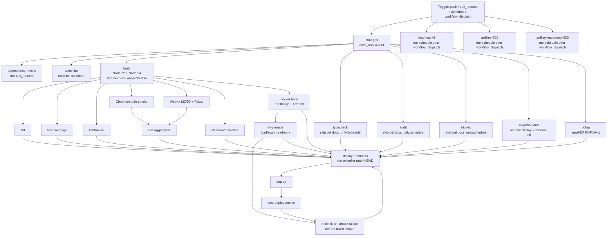

<!-- markdownlint-disable MD013 -->

# CI-Workflow verständlich erklärt (für Junior-Entwickler:innen)

Diese Seite erklärt den kompletten GitHub-Workflow in [../.github/workflows/ci.yml](../.github/workflows/ci.yml):

- Was wird geprüft?
- Wann läuft welcher Job?
- Warum ist dieser Check wichtig?
- Was bedeutet ein Fehler konkret für deinen PR?

Für detaillierte lokale Testkommandos und zusätzliche Last-/Smoke-Varianten siehe [TESTING.md](TESTING.md).

---

## In 5 Minuten verstehen

Wenn du neu im Projekt bist, reicht dieses mentale Modell:

1. **Vorstufe (früh):** `changes` erkennt docs-only Änderungen; parallel dazu prüfen `dependency-review`, `actionlint`, `format` und `migration` frühe PR-, Workflow-, Format- und Datenbankschemarisiken.
2. **Technische Basis:** Das Projekt muss in einer realistischen Umgebung bauen (`build`, `landing-build`, `typecheck`, `lint`, i18n-Konsistenz). `lint` umfasst Angular-Template-A11y; `landing-build` prüft Astro 7 mit `astro check`, baut die Landing und führt danach axe aus.
3. **Verhalten:** Tests müssen grün sein und Mindestqualität halten (`test:coverage`, Chromium-/WebKit-`e2e`, `classroom-smokes`, `lighthouse`, `pdfua`).
4. **Sicherheit:** `audit`, Dependency Review und Trivy blockieren ab High; CodeQL prüft SAST, die CI erzeugt ein CycloneDX-SBOM.
5. **Release:** Nur wenn alles grün ist und der Commit noch aktueller `main`-HEAD ist (`deploy-freshness`), darf deployed werden (`deploy`), danach kommt der Gesundheitscheck (`post-deploy-smoke`).

### PR-Checkliste für Erstbeiträge

Nutze diese Reihenfolge lokal, bevor du einen PR öffnest:

1. `npm run typecheck`
2. `npm run lint`
3. `npm run test:coverage`
4. Bei Frontend-/Locale-Änderungen zusätzlich: `npm run build:localize -w @arsnova/frontend`
5. Bei PDF-Export-Änderungen zusätzlich: `npm run validate:pdfua`
6. Optional produktionsnah: `npm run verify:production-serving`

Wenn ein Schritt fehlschlägt, behebe ihn lokal zuerst. So sparst du CI-Runden und Reviewer-Zeit.

---

## 1) Ziel der Pipeline

Die CI-Pipeline soll drei Dinge sicherstellen:

1. **Technische Korrektheit**: Build, Typprüfung, Lint und Unit/Integrationstests laufen stabil.
2. **Produktqualität**: Frontend ist baubar, zugänglich (A11y), und die Kernflows funktionieren End-to-End.
3. **Release-Sicherheit**: Sicherheitsprüfungen bestehen, Deploy ist geschützt und wird nachgelagert verifiziert.

---

## 2) Wann startet die Pipeline?

Auslöser in [../.github/workflows/ci.yml](../.github/workflows/ci.yml):

1. **push auf main**
2. **pull_request auf main**
3. **schedule** (nachts, täglich)
4. **workflow_dispatch** (manuell per GitHub UI)

---

## 3) Gesamtbild als Ablaufgrafik


```mermaid
flowchart TD
  A[Trigger: push / pull_request / schedule / workflow_dispatch]
  A --> Z[changes<br/>docs_only output]

  Z --> B[dependency-review<br/>nur pull_request]
  Z --> C[actionlint<br/>nicht bei schedule]
  Z --> D[build<br/>Node 22 + Node 24<br/>skip bei docs_only/schedule]
  Z --> E[typecheck<br/>skip bei docs_only/schedule]
  Z --> F[audit<br/>skip bei docs_only/schedule]
  Z --> G[trivy-fs<br/>skip bei docs_only/schedule]
  Z --> G2[migration drift<br/>migrate deploy + schema diff]
  Z --> PUA[pdfua<br/>veraPDF PDF/UA-1]

  D --> H[lint]
  D --> I[test:coverage]
  D --> J[lighthouse]
  D --> KC[Chromium e2e smoke]
  D --> KW[WebKit MOTD + Fokus]
  KC --> K[e2e Aggregator]
  KW --> K
  D --> K2[classroom smokes]
  D --> L[docker build<br/>ein Image + Artefakt]
  L --> M[trivy-image<br/>load/scan, read-only]
  M --> P[publish-image<br/>GHCR nur main]

  H --> Q[deploy-freshness<br/>nur aktueller main-HEAD]
  I --> Q
  J --> Q
  K --> Q
  K2 --> Q
  L --> Q
  E --> Q
  F --> Q
  G --> Q
  G2 --> Q
  PUA --> Q
  M --> Q
  P --> Q

  Q --> N[deploy]

  N --> O[post-deploy-smoke]
  O --> P[rollback-on-smoke-failure<br/>nur bei failed smoke]

  A --> R[load-test k6<br/>nur schedule oder workflow_dispatch]
  A --> R2[artillery-500<br/>nur schedule oder workflow_dispatch]
  A --> R2a[artillery-reconnect-500<br/>nur schedule oder workflow_dispatch]
```

Wichtig: Jobs ohne direkte Abhängigkeit laufen **parallel**.

---

## 4) Job für Job: Was, wo, wann, warum

### 4.0 changes (Change Filter)

- **Was?** Ermittelt, ob der Change-Set ausschließlich Doku-Dateien enthält (`docs/*` und `*.md`).
- **Wo?** Job `changes` in [../.github/workflows/ci.yml](../.github/workflows/ci.yml).
- **Wann?** Bei `push` und `pull_request` (bei `schedule`/`workflow_dispatch` standardmäßig `docs_only=false`).
- **Warum?** Spart Runner-Zeit: Bei docs-only laufen die Jobs weiter (Ruleset-Pflichtchecks behalten Matrix-Namen), schwere Steps werden per Fast Pass übersprungen.

### 4.1 dependency-review

- **Was?** Prüft Dependency-Änderungen im PR auf bekannte Risiken.
- **Wo?** Action `actions/dependency-review-action` in [../.github/workflows/ci.yml](../.github/workflows/ci.yml).
- **Wann?** Nur bei `pull_request`.
- **Warum?** Verhindert, dass riskante Paket-Updates unbemerkt gemerged werden.

### 4.2 actionlint

- **Was?** Linting/Validierung der GitHub-Workflow-Dateien plus operative Shell-/Python-Checks (Backup, Monitoring, spaCy-Sidecar-Unittests ohne Modell-Download).
- **Wo?** Action `raven-actions/actionlint` und Folgeschritte in [../.github/workflows/ci.yml](../.github/workflows/ci.yml).
- **Wann?** Bei allen Events außer `schedule`.
- **Warum?** Verhindert CI-Fehler durch fehlerhafte YAML-/Workflow-Logik und hält Sidecar-Vertrag/Operationsskripte grün.

### 4.3 build (Node-Matrix: 22 und 24)

- **Was?**
  1. `npm ci`
  2. `prisma validate`
  3. `prisma generate`
  4. TypeScript-Build (`shared-types` + Backend)
  5. Frontend-Typecheck (`tsc --noEmit`)
  6. Lokalisierter Frontend-Produktionsbuild
  7. Upload des Frontend-Artefakts (für Folgejobs)
- **Wo?** Build-Schritte in [../.github/workflows/ci.yml](../.github/workflows/ci.yml).
- **Wann?** Fast immer; Kernjob für viele Abhängigkeiten.
- **Warum?** Bestätigt, dass das System baubar ist und alle Folgechecks auf einem validen Build aufsetzen.

### 4.3a migration

- **Was?** Wendet die vollständige versionierte Migrationskette auf eine leere PostgreSQL-Datenbank an und vergleicht das Ergebnis mit `prisma/schema.prisma`.
- **Wo?** Job `migration` in [../.github/workflows/ci.yml](../.github/workflows/ci.yml).
- **Wann?** Bei allen Events außer `schedule`; docs-only Änderungen erhalten einen schnellen grünen Platzhalter.
- **Warum?** Verhindert, dass Schemafelder nur durch `prisma db push` existieren und frische Deployments trotz erfolgreichem `migrate deploy` zur Laufzeit scheitern.

### 4.4 typecheck

- **Was?** Root-`typecheck` über Workspaces (`shared-types`, Backend, Frontend).
- **Wo?** Scripts in [../package.json](../package.json), Workspace-Configs in [../apps/backend/vitest.config.ts](../apps/backend/vitest.config.ts) und [../apps/frontend/vitest.config.ts](../apps/frontend/vitest.config.ts) für Testkontext.
- **Wann?** Alle Events außer `schedule`.
- **Warum?** Fängt Typfehler früh ab, bevor Runtime-Tests laufen.

### 4.5 lint

- **Was?** Blockierendes ESLint-Gate über `libs/`, `apps/` und alle inventarisierten
  operativen JS-/TS-Skripte. Das Voll-Gate verlangt null Fehler und null Warnungen;
  Negativ-/Mutationstests prüfen die Laufzeitprofile sowie Changed- und Voll-Gate.
  Das Changed-Script-Gate verwendet bei Pull Requests `base.sha…head.sha`, bei Pushes
  `before…sha` und behandelt Löschungen, Renames sowie Null-SHAs explizit.
- **Wo?** Script in [../package.json](../package.json).
- **Wann?** Nach erfolgreichem `build`.
- **Warum?** Verhindert sowohl neue Skript-Lintschuld als auch unbemerkte Lücken in
  der laufzeitspezifischen Inventur; der bestehende Check-Kontext bleibt unverändert.
  Bei docs-only Änderungen wird das Anwendungs-Lint übersprungen, der
  Required-Check-Validator läuft jedoch weiterhin, damit eine reine
  Dokumentationsänderung die generierte Soll-/Ist-Darstellung nicht umgehen kann.

### 4.6 audit

- **Was?** `npm audit --audit-level=high --omit=dev` als Gate für
  Produktionsabhängigkeiten plus CycloneDX-SBOM-Artefakt.
- **Wo?** Audit-Job in [../.github/workflows/ci.yml](../.github/workflows/ci.yml).
- **Wann?** Alle Events außer `schedule`.
- **Warum?** Blockiert bekannte High-/Critical-Schwachstellen vor dem Merge/Deploy
  und dokumentiert die ausgelieferten Komponenten.

### 4.7 test (Coverage-Gate)

- **Was?** `npm run test:coverage` für Shared Contracts, Backend und Frontend.
- **Wo?** Root-Script in [../package.json](../package.json), Schwellenwerte in
  [../apps/backend/vitest.config.ts](../apps/backend/vitest.config.ts) und
  [../apps/frontend/vitest.config.ts](../apps/frontend/vitest.config.ts) sowie
  [../libs/shared-types/vitest.config.ts](../libs/shared-types/vitest.config.ts).
- **Wann?** Nach erfolgreichem `build`.
- **Warum?** Prüft Verhalten und stellt Mindestabdeckung sicher.

### 4.7a pdfua

- **Was?** Validiert die fünf PDF/UA-Demoexporte mit veraPDF 1.30.2 gegen
  PDF/UA-1. Ein einzelner Normverstoß blockiert den Job. Playwright Chromium
  für die PDF-Erzeugung installiert [../scripts/ci/playwright-install.sh](../scripts/ci/playwright-install.sh)
  in zwei Schritten: Browser-Binary mit Zeitlimit und Wiederholung, danach
  `install-deps` ohne kurzen Kill. Auf GitHub-Runnern wird
  `azure.archive.ubuntu.com` auf `archive.ubuntu.com` umgebogen, weil der
  Azure-Spiegel `apt-get update` minutenlang blockieren kann.
- **Wo?** Job in [../.github/workflows/ci.yml](../.github/workflows/ci.yml),
  Runner in [../scripts/validate-pdfua.mjs](../scripts/validate-pdfua.mjs).
- **Wann?** Parallel zu den übrigen Qualitätsjobs, außer bei `schedule` und
  docs-only.
- **Warum?** `Tagged: yes` weist nur einen Strukturbaum nach. veraPDF prüft
  zusätzlich normrelevante Fonts, Unicode-Abbildungen, Metadaten,
  Strukturelemente und Annotationen.
- **Artefakt:** `verapdf-ua1-report`, 30 Tage.

### 4.8 lighthouse

- **Was?** Lighthouse CI prüft Home DE/EN mit drei Läufen je URL auf
  Performance, LCP (höchstens 5 s), CLS und TBT. Ein separater
  Accessibility-Lauf prüft Home DE/EN, Quiz-Liste, Hilfe und Datenschutz.
  Dort blockieren sowohl der Kategorien-Score als auch jedes fehlgeschlagene
  gewichtete Einzelaudit.
- **Wo?** Job in [../.github/workflows/ci.yml](../.github/workflows/ci.yml),
  Regeln in [../.lighthouserc.cjs](../.lighthouserc.cjs) und
  [../.lighthouserc-a11y.cjs](../.lighthouserc-a11y.cjs).
- **Wann?** Nach `build`, außer bei `schedule`.
- **Warum?** Qualitätssignal für Accessibility/Performance/Best-Practices/SEO.
- **Letzter lokaler Nachweis:** Am 2026-07-11 bestanden 6/6 Läufe mit
  Performance 0,79–0,80 und LCP 3,705–3,829 s; siehe
  [QA-Nachlauf](implementation/LOCAL-QA-RECHECK-2026-07-11.md).

### 4.9 e2e-chromium und e2e

- **Was?** `e2e-chromium` führt Playwright-Smokes mit echten Services (Postgres + Redis),
  produktionsnahen Migrationen und Backend-/Frontend-Start: Host-/Presenter-Auth,
  Presenter-Lobby-Geometrie, Host-Musik, `SHORT_TEXT`, `NUMERIC_ESTIMATE`,
  Quiz-Sync und Unified Session. Der Presenter-Viewport-Smoke prüft eine
  gefüllte Lobby mit 50 Personen blockierend in vier Tablet-/Beamer-Viewports
  auf Scroll, Clipping und Flächenüberlappung. Er läuft für Kindergarten,
  Mittelstufe, Oberstufe und Nobelpreis im Light Theme sowie anonym im Dark
  Theme; die nummerierten Packed-Modi prüfen zusätzlich Theme-Icon und
  Beitrittsreihenfolge.
  Vor den Flows laufen axe auf statischen Kernrouten sowie Reflow-, Fokus- und
  Zielgrößenprüfungen. `SHORT_TEXT` und Unified Session führen axe zusätzlich
  in aktiven, Ergebnis-, Q&A-, Blitzlicht- und Session-Ende-Zuständen aus. Der
  stabile Required-Check `e2e` aggregiert `e2e-chromium` und `webkit-e2e` und
  wird nur bei zwei erfolgreichen Browser-Jobs grün. Die Aggregator-Bedingung
  ist `always() && !cancelled()`, damit ein abgebrochener Workflow den
  Required-Check nicht nachträglich rot färbt. Ein Job-Timeout eines
  Browser-Jobs bleibt `cancelled` und lässt den Aggregator weiterhin rot
  werden. Playwright-Browser werden über
  [../scripts/ci/playwright-install.sh](../scripts/ci/playwright-install.sh)
  (Browser-Binary mit Zeitlimit, OS-Deps ohne kurzen apt-Kill) installiert.
- **Wo?** Job und Skriptinventar in [../.github/workflows/ci.yml](../.github/workflows/ci.yml)
  und [../apps/frontend/package.json](../apps/frontend/package.json).
- **Wann?** Nach `build`, außer bei `schedule`.
- **Warum?** Testet den Nutzerfluss und Accessibility-Regressionen systemnah
  (nicht nur isolierte Unit-Tests).

### 4.9a webkit-e2e

- **Was?** Installiert WebKit explizit über
  [../scripts/ci/playwright-install.sh](../scripts/ci/playwright-install.sh)
  und führt einen Desktop-MOTD-Smoke aus.
  Der Smoke prüft Tastatur- und Pointer-Rücksprung, die anschließende Tab-Reihe und bildet
  Safaris fehlenden Pointer-Buttonfokus sowie ein fehlendes globales
  `TouchEvent` nach.
- **Wo?** Job in [../.github/workflows/ci.yml](../.github/workflows/ci.yml),
  Browserwahl und Fokus-Smoke in
  [../apps/frontend/scripts/check-motd-focus-flow.mjs](../apps/frontend/scripts/check-motd-focus-flow.mjs).
- **Wann?** Parallel zu `e2e-chromium` nach `build`, außer bei `schedule`.
- **Warum?** Verhindert, dass WebKit nur als nie genutzter Chromium-Fallback
  existiert. Playwright WebKit ersetzt dennoch keinen manuellen Safari-Smoke,
  weil Safari- und macOS-Tastatureinstellungen außerhalb der Engine liegen.

### 4.10 classroom-smokes

- **Was?** Sechs protokollnahe Unterrichts-Szenarien (je 30 TN) gegen lokales Backend: Blitzlicht-Tempo, Q&A, Demo-Quiz mit 9 Fragen, WebSocket Vote-Progress (Host-WS + HTTP-Votes), WebSocket-Reconnect-Welle sowie Q&A-/Blitzlicht-Fan-out.
- **Wo?** Job in [../.github/workflows/ci.yml](../.github/workflows/ci.yml); Skripte:
  - [../scripts/load/blitzlicht-classroom-30.mjs](../scripts/load/blitzlicht-classroom-30.mjs)
  - [../scripts/load/qa-classroom-30.mjs](../scripts/load/qa-classroom-30.mjs)
  - [../scripts/load/demo-quiz-classroom-30.mjs](../scripts/load/demo-quiz-classroom-30.mjs)
  - [../scripts/load/ws-vote-progress-classroom-30.mjs](../scripts/load/ws-vote-progress-classroom-30.mjs)
  - [../scripts/load/ws-reconnect-wave-classroom-30.mjs](../scripts/load/ws-reconnect-wave-classroom-30.mjs)
  - [../scripts/load/channel-ws-fanout-classroom-30.mjs](../scripts/load/channel-ws-fanout-classroom-30.mjs)
- **Wann?** Push/PR auf `main` und `workflow_dispatch`, außer `docs_only` und `schedule`.
- **Warum?** Prüft Session-/Kanal-Hotpaths (Vote, Q&A, Redis-Blitzlicht, Realtime-WS) ohne Browser; ergänzt E2E um API-nahe Last-Smokes und ist ein direktes Deploy-Gate.
- **Artefakt:** `classroom-smoke-reports` (standardisiertes JSON und JUnit XML pro Szenario + `backend.log`).

### 4.11 artillery-500

- **Was?** Artillery-Live-Session (Quiz + Q&A + Blitzlicht, HTTP + WebSocket);
  Standard 500 TN im CI-Runner. Im selben geplanten Lauf
  folgen die schweren Vote-Smokes für Host-Progress (200 TN), Timer-Fairness
  (600 TN), der Yjs-Mehrclient-Sync, der Freitext-/Wordcloud-Pfad und ein
  5-Minuten-Live-Session-Soak mit Backend-Prozess-, Redis- und PostgreSQL-Probes.
- **Wo?** Job in [../.github/workflows/ci.yml](../.github/workflows/ci.yml); Runner [../scripts/load/run-artillery-500.mjs](../scripts/load/run-artillery-500.mjs).
- **Wann?** Nur bei `schedule` oder `workflow_dispatch`.
- **Artefakt:** `artillery-500-reports` (standardisierte JSON-/JUnit-Reports, Artillery-Report + `backend.log`).
- **Sicher manuell:** `gh workflow run ci.yml --ref <branch> -f artillery_participants=500 -f artillery_ramp_seconds=60 -f run_production_load=false`. Derselbe Dispatch startet auch `artillery-reconnect-500`; `false` verhindert den hart gegen Produktion gerichteten k6-Job. Beide Jobs erzeugen ein eigenes ephemeres, maskiertes `ADMIN_DIAGNOSTIC_SECRET`; `ADMIN_SECRET` wird dafür nie verwendet.
- **Letzter lokaler Nachweis:** Artillery 500/500 und der 5-Minuten-Soak
  bestanden im Gesamtlauf; Yjs und das 600er Timer-Fairness-Latenzgate bestanden
  im [QA-Nachlauf 2026-07-11](implementation/LOCAL-QA-RECHECK-2026-07-11.md).

### Manueller Demo-Classroom-Dauerlauf

Der 10-Minuten-Demo-Classroom-Dauerlauf mit Redis-/PostgreSQL- und
Monitoring-Probes ist **kein GitHub-Actions-Job und kein PR-/Deploy-Gate**. Er
wird ausschließlich manuell gegen ein lokales Backend gestartet. Der Runner
wird mit PR [#165](https://github.com/kqc-real/arsnova.eu/pull/165)
bereitgestellt und ist lokal validiert.

Der lokale Nachweis vom 2026-07-27 bestand 21/21 Gates bei 48 vollständigen
Runden, 1.440 Joins, 14.400/14.400 Votes und 19.104 fehlerfreien HTTP-Aufrufen
(p95 59,62 ms, p99 83,78 ms; Redis/PostgreSQL je 121/121 Probes). Er ersetzt
nicht die offene S6.5-Zielhostabnahme.

### 4.11a artillery-reconnect-500

- **Was?** Artillery-Reconnect-Welle (Quiz-only): Join → WS subscribe → Disconnect → Reconnect → Host-Reveal → Assert `RESULTS`; Standard 100 TN im CI-Runner, konfigurierbar bis 500.
- **Wo?** Job in [../.github/workflows/ci.yml](../.github/workflows/ci.yml); Runner [../scripts/load/run-artillery-reconnect-500.mjs](../scripts/load/run-artillery-reconnect-500.mjs).
- **Wann?** Nur bei `schedule` oder `workflow_dispatch`.
- **Artefakt:** `artillery-reconnect-500-reports` (Summary JSON + Artillery-Report + `backend.log`).

### 4.12 load-test

- **Was?** k6-Health-Loadtest gegen Produktion.
- **Wo?** Job in [../.github/workflows/ci.yml](../.github/workflows/ci.yml), Skript in [../scripts/load/k6-trpc-health-50vu.js](../scripts/load/k6-trpc-health-50vu.js).
- **Wann?** Im Schedule nur mit `PRODUCTION_LOAD_ENABLED=true`; manuell nur mit
  `run_production_load=true`.
- **Warum?** Regelmäßige Lastsicht, ohne jeden PR-Run zu verlangsamen.
- **Security-Follow-up:** Nicht gegen Produktion auslösen. Lokal stattdessen
  `BASE_URL=http://127.0.0.1:3000 VUS=50 DURATION=30s npm run load:k6:health`
  gegen ein eigens gestartetes Dev-Backend verwenden.

### 4.13 trivy-fs

- **Was?** Security-Scan des Repository-Dateisystems (HIGH/CRITICAL).
- **Wo?** Trivy-Job in [../.github/workflows/ci.yml](../.github/workflows/ci.yml).
- **Wann?** Alle Events außer `schedule`.
- **Warum?** Deckt bekannte Schwachstellen/Fehlkonfigurationen in Dateien und Dependencies auf.

### 4.14 trivy-image

- **Was?** Lädt das vom Job `docker` exportierte Produktionsimage-Artefakt, prüft
  Archiv-SHA-256 sowie Image-ID und führt Trivy-Image-Scan aus (HIGH/CRITICAL)
  mit `TRIVY_PLATFORM=linux/arm64` (ARM64-only Artefakt; Trivy defaultet sonst
  auf amd64). Der Job ist read-only (`contents: read`), enthält keinen
  Image-Build und kein GHCR-Login/Push.
- **Wo?** In [../.github/workflows/ci.yml](../.github/workflows/ci.yml); Hilfsskript
  [../scripts/ci/load-production-image.sh](../scripts/ci/load-production-image.sh).
- **Wann?** Nach `docker`, außer bei `schedule`.
- **Warum?** Stellt sicher, dass der Scan dasselbe Artefakt betrifft wie Build und
  Runtime-Smokes, ohne PR-Code `packages: write` zu geben.

### 4.14b publish-image

- **Was?** Nur bei `push` auf `main` und nur nach erfolgreichem `trivy-image`:
  lädt dasselbe Produktionsimage-Artefakt erneut, pusht es nach
  `ghcr.io/kqc-real/arsnova.eu:<github.sha>` und setzt Job-Output `image_ref` auf
  die kanonische Digest-Referenz `ghcr.io/kqc-real/arsnova.eu@sha256:…`. Der Digest
  kommt aus dem `docker push`-Log (Fallback: `RepoDigests`), nicht aus einem
  ungültigen `imagetools`-Templatefeld.
- **Wo?** Job `Publish Scanned Image` in
  [../.github/workflows/ci.yml](../.github/workflows/ci.yml); Hilfsskript
  [../scripts/ci/resolve-pushed-image-ref.sh](../scripts/ci/resolve-pushed-image-ref.sh).
- **Wann?** Nur `push` auf `main`, nach `trivy-image`.
- **Warum?** `packages: write` bleibt vom PR-/Scan-Job isoliert; unveröffentlichte
  PRs können GHCR nicht beschreiben.

### 4.15 docker

- **Was?** Baut das Produktionsimage genau einmal **nativ auf
  `ubuntu-24.04-arm`** für `linux/arm64` (aktuelle Produktions-Zielplattform),
  prüft Runner-/Docker-/Image-Architektur, führt Compose-/Runtime-Smokes aus und
  exportiert dasselbe lokale Image als kurzlebiges Actions-Artefakt
  (`production-image-<github.sha>`, Retention 1 Tag, `overwrite: true` für
  Job-Reruns) inkl. Image-ID und Archiv-SHA-256. Kein Multi-Arch-Manifest
  (siehe [#229](https://github.com/kqc-real/arsnova.eu/issues/229)).
- **Wo?** Job in [../.github/workflows/ci.yml](../.github/workflows/ci.yml),
  Build-Definition in [../Dockerfile](../Dockerfile); Export über
  [../scripts/ci/save-production-image.sh](../scripts/ci/save-production-image.sh).
- **Wann?** Nach `build`, außer bei `schedule`.
- **Warum?** Produktion läuft auf ARM64; ein Multi-Arch-Basisimage garantiert
  kein Multi-Arch-Anwendungsimage. Build/Scan/Publish bleiben ein Artefakt.

### 4.16 deploy-freshness

- **Was?** Prüft kurz vor dem Production-Deploy, ob der geprüfte Commit (`github.sha`) noch der aktuelle `main`-HEAD ist.
- **Wo?** Deploy-Freshness-Job in [../.github/workflows/ci.yml](../.github/workflows/ci.yml).
- **Wann?** Nur bei `push` auf `main` und wenn `DEPLOY_ENABLED=true` gesetzt ist, nach allen Quality-Gates.
- **Warum?** Verhindert stale Deployments: Ein älterer, langsamer CI-Lauf darf keinen inzwischen überholten Commit mehr produktiv ausrollen.

### 4.17 deploy

- **Was?** Server-Deploy via SSH; übergibt `DEPLOY_IMAGE` aus
  `needs.publish-image.outputs.image_ref` (kanonische Digest-Referenz) sowie
  `DEPLOY_SHA` (`github.sha`). Per SSH wird zuerst `DEPLOY_SHA` ausgecheckt
  (Bootstrap), danach [../scripts/deploy.sh](../scripts/deploy.sh) gestartet.
  Das Skript setzt `ARSNOVA_IMAGE`, pullt `app`/`pdf-worker` (kein
  Server-Build), prüft Host- vs. Image-Architektur (`arm64`), migriert mit
  `--no-deps`, startet die Services und prüft Health/HTTP sowie
  Digest→Image-ID→Container-ID für beide Container. Danach werden atomare
  Snapshots (`current.state`/`previous.state`) und `.env.arsnova-image` geschrieben.
- **Wo?** Deploy-Job in [../.github/workflows/ci.yml](../.github/workflows/ci.yml).
- **Wann?** Nur wenn `deploy-freshness` bestätigt hat, dass `github.sha` noch aktueller `main`-HEAD ist, und `publish-image` eine Digest-Referenz geliefert hat.
- **Warum?** Produktivdeployment bleibt kontrolliert, an alle Quality-Gates gekoppelt und auf das gescannte GHCR-Artefakt gepinnt.

### 4.18 post-deploy-smoke

- **Was?** Nachgelagerter Smoke-Check auf der Zielumgebung über [../scripts/verify-production-serving.mjs](../scripts/verify-production-serving.mjs).
- **Wo?** Job in [../.github/workflows/ci.yml](../.github/workflows/ci.yml).
- **Wann?** Nur wenn `deploy` erfolgreich war.
- **Warum?** Verifiziert, dass die produktive Auslieferung wirklich erreichbar und gesund ist (inkl. TLS-Hostname-Schutz bei `DEPLOY_HOST`).

### 4.19 rollback-on-smoke-failure

- **Was?** Automatischer Image-/Commit-Rollback über
  `./scripts/deploy.sh --rollback` (ohne Checkout vor dem Skriptstart, damit
  zuerst `previous.state` gelesen wird). `github.event.before` wird nicht
  verwendet. Es findet kein Server-Build statt.
- **Wo?** Job `Rollback on Smoke Failure` in
  [../.github/workflows/ci.yml](../.github/workflows/ci.yml).
- **Wann?** Bei `push` auf `main`, wenn `deploy` erfolgreich war, aber `post-deploy-smoke` fehlschlug (mit `always()` ausgewertet, damit der Job trotz Fehlerpfad startet).
- **Warum?** Reduziert Ausfallzeit und stellt das zuletzt erfolgreich verifizierte Digest-Artefakt wieder her.
- **Grenze:** Image-Rollback setzt **keine** Datenbankmigrationen zurück. Fehlt ein gültiger Previous-State, bricht das Skript mit Operator-Hinweisen ab.

---

## 5) Welche Jobs sind echte Gates vor Deploy?

Vor dem eigentlichen Deploy müssen erfolgreich sein:

1. actionlint
2. format
3. migration
4. landing-build einschließlich axe
5. lint einschließlich Angular-Template-A11y
6. test (mit Coverage)
7. pdfua
8. docker
9. typecheck
10. lighthouse
11. e2e-Aggregator mit Chromium (inklusive axe und Reflow/Fokus/Zielgrößen) und WebKit (MOTD-/Fokus-Smokes)
12. classroom-smokes
13. audit
14. trivy-fs
15. trivy-image
16. publish-image (Digest-`image_ref` für `DEPLOY_IMAGE`)
17. deploy-freshness (`should_deploy=true`)

Wenn eines der Quality-Gates (1–16) fehlschlägt, wird nicht deployt. Wenn danach
`deploy-freshness` feststellt, dass `github.sha` nicht mehr aktueller `main`-HEAD ist,
wird der Deploy sauber übersprungen.

---

## 6) Was bedeutet ein Fail für mich im Alltag?

- **Fail in build/typecheck/lint**: meist Code- oder Typproblem direkt in deinem PR.
- **Fail in test/e2e**: Verhalten ist regressiv oder instabil.
- **Fail in audit/trivy**: Sicherheitsrisiko gefunden; Upgrade/Fix nötig.
- **Fail in lighthouse**: Qualitätsanforderung (insb. A11y) unterschritten.
- **Fail in docker**: Release-Artefakt nicht reproduzierbar.
- **Fail in post-deploy-smoke**: Deployment lief technisch, aber die App ist nicht gesund ausgeliefert.
- **Fail in rollback-on-smoke-failure**: Das automatische Zurückrollen ist gescheitert; sofort manuell eingreifen.

---

## 7) Gute Reihenfolge für lokale Checks vor PR

Empfehlung (schnell nach aussagekräftig):

1. `npm run typecheck`
2. `npm run lint`
3. `npm run test:coverage`
4. Bei Frontend-/SSR-Änderungen: `npm run build:localize -w @arsnova/frontend`
5. Bei PDF-Export-Änderungen: `npm run validate:pdfua`
6. Optional für produktionsnahe Validierung: `npm run verify:production-serving`

Mehr Details und Spezialfälle stehen in [TESTING.md](TESTING.md).

---

## 8) Glossar für Junior-Entwickler:innen

- **Gate**: Ein Muss-Check. Wenn rot, stoppt die Pipeline vor dem nächsten kritischen Schritt.
- **needs**: Abhängigkeit zwischen Jobs. Ein Job startet erst, wenn seine Vorgänger grün sind.
- **Artifact**: Datei/Ordner aus einem Job, die in späteren Jobs wiederverwendet wird.
- **Matrix**: Derselbe Job läuft in mehreren Umgebungen (hier Node 22 und 24).
- **Smoke-Test**: Kurzer End-to-End-Test, der die wichtigsten Kernfunktionen prüft.

---

## 9) Welche Reports/Artefakte entstehen und wo finde ich sie?

In GitHub findest du Artefakte so:

1. Repository öffnen
2. Tab Actions
3. Gewünschten CI-Run öffnen
4. Unten im Bereich Artifacts die Downloads auswählen

| Artefaktname              | Erzeugender Job | Inhalt                                                        | Fundstelle im Runner                                                                                            | Retention |
| ------------------------- | --------------- | ------------------------------------------------------------- | --------------------------------------------------------------------------------------------------------------- | --------- |
| `frontend-dist-browser`   | `build`         | Lokalisierter Frontend-Produktionsbuild                       | `apps/frontend/dist/browser`                                                                                    | 1 Tag     |
| `coverage-reports`        | `test`          | Backend- und Frontend-Coverage (HTML + Textsummary-Dateien)   | `apps/backend/coverage`, `apps/frontend/coverage`                                                               | 7 Tage    |
| `verapdf-ua1-report`      | `pdfua`         | veraPDF-Textbericht der fünf PDF/UA-1-Locale-Demos            | `tmp/pdfua-validation/verapdf-ua1.txt`                                                                          | 30 Tage   |
| `lighthouse-reports`      | `lighthouse`    | Lighthouse-Ausgabe (A11y/Performance/SEO/Best-Practices)      | `.lighthouseci`, `.lighthouseci-a11y`                                                                           | 7 Tage    |
| `e2e-service-logs`        | `e2e-chromium`  | Laufzeitlogs von Backend und Frontend während des Smoke-Tests | `${{ runner.temp }}/backend.log`, `${{ runner.temp }}/frontend.log`                                             | 7 Tage    |
| `webkit-e2e-service-logs` | `webkit-e2e`    | WebKit-Laufzeitlogs und Screenshots bei Browserfehlern        | `${{ runner.temp }}/backend.log`, `${{ runner.temp }}/frontend.log`, `${{ runner.temp }}/webkit-browser-smokes` | 7 Tage    |
| `trivy-fs-report`         | `trivy-fs`      | Trivy Filesystem Security Report (SARIF)                      | `trivy-fs.sarif`                                                                                                | 7 Tage    |
| `production-image-<sha>`  | `docker`        | Komprimiertes Produktionsimage + Integritätsmeta              | `arsnova-eu-production.tar.gz`, `arsnova-eu-production.meta.json`                                               | 1 Tag     |
| `trivy-image-report`      | `trivy-image`   | Trivy Container Image Security Report (SARIF)                 | `trivy-image.sarif`                                                                                             | 7 Tage    |

Hinweise:

1. `audit`, `dependency-review` und `actionlint` liefern primär Check-Status und Logs, aber kein eigenes Download-Artefakt.
2. Die Trivy-Gates bleiben blockierend: erst wird mit `exit-code: '1'` geprüft, danach wird zusätzlich ein Report für den Download erzeugt.

---

## 10) Branch Protection (Required Checks)

Die kanonische Soll-Konfiguration steht ausschließlich in
[`.github/required-checks.json`](../.github/required-checks.json). Der generierte
Abschnitt unten trennt dieses Soll von der zuletzt ermittelten Ruleset-Momentaufnahme.
`npm run validate:required-checks` prüft Manifest-Schema, Ruleset-Zuordnung,
Workflow-Job-IDs, gerenderte Matrixnamen, mehrdeutige Produzenten und die
Dokumentationssynchronität.
Beim Owner-Abgleich werden zusätzlich Ruleset-Enforcement, Branch-Ziel und
Ref-Bedingungen sowie die `integration_id` jedes Required Checks fail-closed verglichen.
Der PR-Validator verwendet keine Ruleset-API und benötigt keine administrativen Secrets.

### Owner-Abgleich und dauerhafter manueller Drift-Prozess

Verantwortlich ist eine Repository-Owner-Rolle mit `Administration: read`. Solange
keine separat sicherheitsgeprüfte GitHub App mit dieser Leseberechtigung existiert,
wird kein PAT oder langlebiges Administrationstoken im Repository hinterlegt. Der
Owner führt den Abgleich mindestens am ersten Werktag jedes Monats sowie vor und nach
jeder Ergänzung oder Umbenennung eines Required Checks aus:

```bash
gh api repos/kqc-real/arsnova.eu/rulesets --jq '.[].id' |
  while read -r ruleset_id; do
    gh api "repos/kqc-real/arsnova.eu/rulesets/$ruleset_id"
  done | jq -s . > /tmp/arsnova-required-rulesets.json

node scripts/validate-required-checks.mjs \
  --live-rulesets /tmp/arsnova-required-rulesets.json
```

Zeitstempel, verwendeter Endpunkt und das Ergebnis werden ohne Tokens oder vollständige
API-Antwort als Kommentar in #221 oder in einem dort verlinkten Admin-Run dokumentiert.
Erst danach setzt der Owner `ownerVerification.status` auf `verified` und hinterlegt
den Evidenzlink. Fehlende Leserechte oder Drift sind ein Fehler und dürfen nicht als
Erfolg dokumentiert werden.

Bei einer Umbenennung gilt diese Reihenfolge:

1. Neuen Checknamen im Workflow zusätzlich verfügbar machen.
2. Neuen Kontext im Ruleset ergänzen und einen erfolgreichen Lauf abwarten.
3. Alten Kontext erst danach aus Ruleset und Workflow entfernen.

`deploy-freshness`, `deploy`, `post-deploy-smoke` und
`rollback-on-smoke-failure` bleiben außerhalb der PR-Required-Checks, weil sie nur im
Push-/Release-Pfad sinnvoll sind.

**Docs-only und Ruleset:** GitHub-Rulesets können Pflicht-Checks nicht pfadabhängig ausnehmen. Stattdessen melden docs-only-PRs dieselben Check-Namen per **Fast Pass** (Job läuft, schwere Steps werden übersprungen) als `success` — so bleibt das Ruleset für Code-PRs streng, Doku-PRs bleiben mergebar.

<!-- required-checks:start -->

## Required Checks: Soll-Konfiguration und Ist-Snapshot

Kanonische Quelle: [`.github/required-checks.json`](../.github/required-checks.json), Zielbranch `main`.

### Kanonische Soll-Konfiguration

| Kontext                        | Ruleset        | Quelle                                                            | Zweck                                                                     |
| ------------------------------ | -------------- | ----------------------------------------------------------------- | ------------------------------------------------------------------------- |
| Build & Validate (Node 22)     | CI-CD          | workflow: .github/workflows/ci.yml#build                          | Build und Produktionsvalidierung auf der unterstützten Node-22-Linie.     |
| Build & Validate (Node 24)     | CI-CD          | workflow: .github/workflows/ci.yml#build                          | Build und lokalisierter Produktionsbuild auf Node 24.                     |
| Build Landing                  | CI-CD          | workflow: .github/workflows/ci.yml#landing-build                  | Produktionsbuild und Accessibility-Prüfung der Landingpage.               |
| Changed Files Format           | CI-CD          | workflow: .github/workflows/ci.yml#format                         | Prettier-Gate für geänderte Dateien.                                      |
| Classroom Scenario Smokes      | CI-CD          | workflow: .github/workflows/ci.yml#classroom-smokes               | Reale Unterrichtsszenarien gegen Backend und Realtime-Pfade.              |
| CodeQL (JavaScript/TypeScript) | CI-CD          | workflow: .github/workflows/codeql.yml#analyze                    | SAST für JavaScript und TypeScript.                                       |
| Dependency Review              | CI-CD          | workflow: .github/workflows/ci.yml#dependency-review              | Blockiert riskante Abhängigkeitsänderungen in Pull Requests.              |
| Docker Build                   | CI-CD          | workflow: .github/workflows/ci.yml#docker                         | Produktionsimage und Compose-Runtime-Smokes.                              |
| Lighthouse CI                  | CI-CD          | workflow: .github/workflows/ci.yml#lighthouse                     | Performance- und Accessibility-Budgets im Browser.                        |
| lint                           | CI-CD          | workflow: .github/workflows/ci.yml#lint                           | Anwendungs- und laufzeitspezifisches Skript-Linting.                      |
| Migration Drift                | CI-CD          | workflow: .github/workflows/ci.yml#migration                      | Prisma-Migrationskette und Schema-Drift auf leerer Datenbank.             |
| PDF/UA-1 Validation            | CI-CD          | workflow: .github/workflows/ci.yml#pdfua                          | PDF/UA-1-Konformität der lokalisierten Handouts.                          |
| Playwright Smoke E2E           | CI-CD          | workflow: .github/workflows/ci.yml#e2e                            | Chromium-Axe-/Reflow-Smokes und WebKit-MOTD-/Fokus-Regressionen.          |
| PR-Template vollständig        | main protected | workflow: .github/workflows/pr-template-gate.yml#validate-pr-body | Vollständige Risiko-, Validierungs- und Rollback-Beschreibung vor Review. |
| Security Audit                 | CI-CD          | workflow: .github/workflows/ci.yml#audit                          | Produktionsabhängigkeits-Audit und SBOM-Erzeugung.                        |
| Tests                          | CI-CD          | workflow: .github/workflows/ci.yml#test                           | Workspace-Tests mit absoluten Coverage-Gates.                             |
| Trivy Filesystem Scan          | CI-CD          | workflow: .github/workflows/ci.yml#trivy-fs                       | Filesystem-Scan auf High- und Critical-Befunde.                           |
| Trivy Image Scan               | CI-CD          | workflow: .github/workflows/ci.yml#trivy-image                    | Scan des später veröffentlichten Produktionsimages.                       |
| Typecheck (workspaces) (22)    | CI-CD          | workflow: .github/workflows/ci.yml#typecheck                      | Workspace-Typecheck auf der unterstützten Node-22-Linie.                  |
| Typecheck (workspaces) (24)    | CI-CD          | workflow: .github/workflows/ci.yml#typecheck                      | Workspace-Typecheck auf Node 24.                                          |
| Workflow Lint                  | CI-CD          | workflow: .github/workflows/ci.yml#actionlint                     | Workflow-, Operations-, Deployment- und Monitoring-Validatoren.           |

### Ermittelte Ruleset-Momentaufnahme

Status: **verified** · Erfasst: 2026-08-07T07:07:16Z · Endpunkt: `Repository Rulesets admin UI (API structure: GET /repos/kqc-real/arsnova.eu/rulesets/{ruleset_id})` · Erfassung: `repository-owner-final-review`.

| Ruleset                   | Enforcement / Ziel / Ref-Bedingung    | Required Context               | Integration |
| ------------------------- | ------------------------------------- | ------------------------------ | ----------- |
| CI-CD (18572555)          | active; branch; +~DEFAULT_BRANCH / -– | Build & Validate (Node 22)     | 15368       |
| CI-CD (18572555)          | active; branch; +~DEFAULT_BRANCH / -– | Build & Validate (Node 24)     | 15368       |
| CI-CD (18572555)          | active; branch; +~DEFAULT_BRANCH / -– | Build Landing                  | 15368       |
| CI-CD (18572555)          | active; branch; +~DEFAULT_BRANCH / -– | Changed Files Format           | 15368       |
| CI-CD (18572555)          | active; branch; +~DEFAULT_BRANCH / -– | Classroom Scenario Smokes      | 15368       |
| CI-CD (18572555)          | active; branch; +~DEFAULT_BRANCH / -– | CodeQL (JavaScript/TypeScript) | 15368       |
| CI-CD (18572555)          | active; branch; +~DEFAULT_BRANCH / -– | Dependency Review              | 15368       |
| CI-CD (18572555)          | active; branch; +~DEFAULT_BRANCH / -– | Docker Build                   | 15368       |
| CI-CD (18572555)          | active; branch; +~DEFAULT_BRANCH / -– | Lighthouse CI                  | 15368       |
| CI-CD (18572555)          | active; branch; +~DEFAULT_BRANCH / -– | lint                           | 15368       |
| CI-CD (18572555)          | active; branch; +~DEFAULT_BRANCH / -– | Migration Drift                | 15368       |
| CI-CD (18572555)          | active; branch; +~DEFAULT_BRANCH / -– | PDF/UA-1 Validation            | 15368       |
| CI-CD (18572555)          | active; branch; +~DEFAULT_BRANCH / -– | Playwright Smoke E2E           | 15368       |
| CI-CD (18572555)          | active; branch; +~DEFAULT_BRANCH / -– | Security Audit                 | 15368       |
| CI-CD (18572555)          | active; branch; +~DEFAULT_BRANCH / -– | Tests                          | 15368       |
| CI-CD (18572555)          | active; branch; +~DEFAULT_BRANCH / -– | Trivy Filesystem Scan          | 15368       |
| CI-CD (18572555)          | active; branch; +~DEFAULT_BRANCH / -– | Trivy Image Scan               | 15368       |
| CI-CD (18572555)          | active; branch; +~DEFAULT_BRANCH / -– | Typecheck (workspaces) (22)    | 15368       |
| CI-CD (18572555)          | active; branch; +~DEFAULT_BRANCH / -– | Typecheck (workspaces) (24)    | 15368       |
| CI-CD (18572555)          | active; branch; +~DEFAULT_BRANCH / -– | Workflow Lint                  | 15368       |
| main protected (13010249) | active; branch; +~DEFAULT_BRANCH / -– | PR-Template vollständig        | 15368       |

### Sichtbare, derzeit nicht required gesetzte Workflow-Kontexte

| Kontext              | Quelle                                     | Begründung                                                                                                                               |
| -------------------- | ------------------------------------------ | ---------------------------------------------------------------------------------------------------------------------------------------- |
| Deploy Landing Build | .github/workflows/deploy-landing.yml#build | Pfadspezifischer Build für das GitHub-Pages-Deployment; der ungefilterte CI-Kontext Build Landing bleibt der einzige Required-Produzent. |

### Owner-Bestätigung und Hinweise

- Der Repository-Owner hat den verbindlichen Minimalumfang und den administrativ bestätigten Stand im verlinkten finalen Review bestätigt.
- Build Landing wird ausschließlich vom ungefilterten CI-Job erzeugt; Deploy Landing Build bleibt pfadspezifisch und nicht required.
- Alle 21 sichtbaren Required Checks sind an die GitHub-Actions-Integration 15368 gebunden.

<!-- required-checks:end -->

---

## 11) Canonical References

- Workflow-Datei: [../.github/workflows/ci.yml](../.github/workflows/ci.yml)
- Test-Referenz: [TESTING.md](TESTING.md)
- Sicherheitsüberblick: [SECURITY-OVERVIEW.md](SECURITY-OVERVIEW.md)
- Deploy-Skript: [../scripts/deploy.sh](../scripts/deploy.sh)
- Post-Deploy-Verifikation: [../scripts/verify-production-serving.mjs](../scripts/verify-production-serving.mjs)
