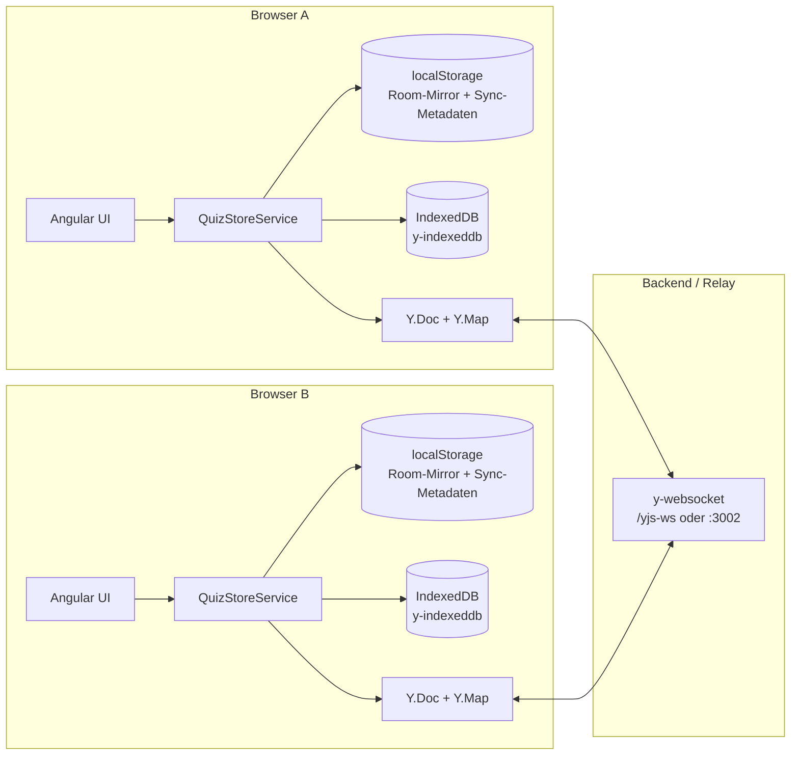
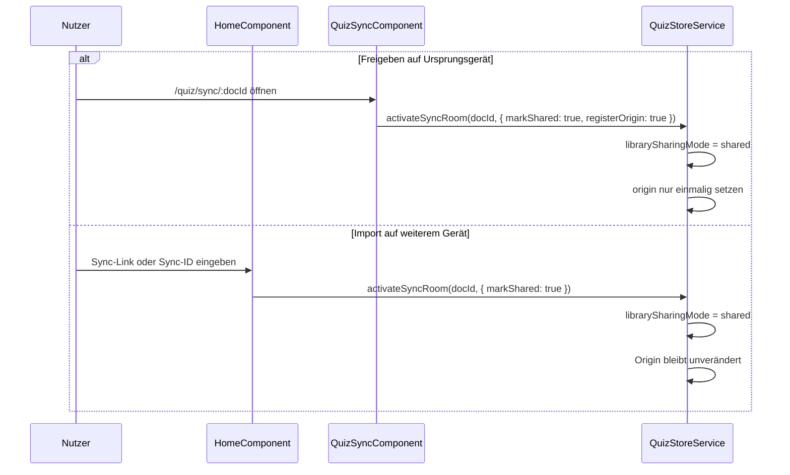
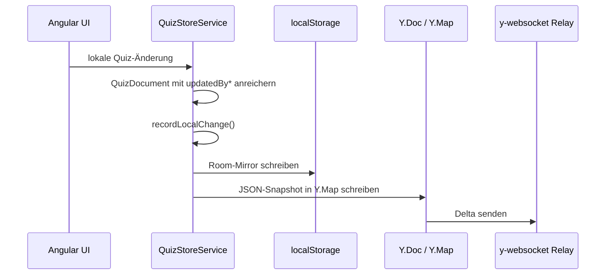
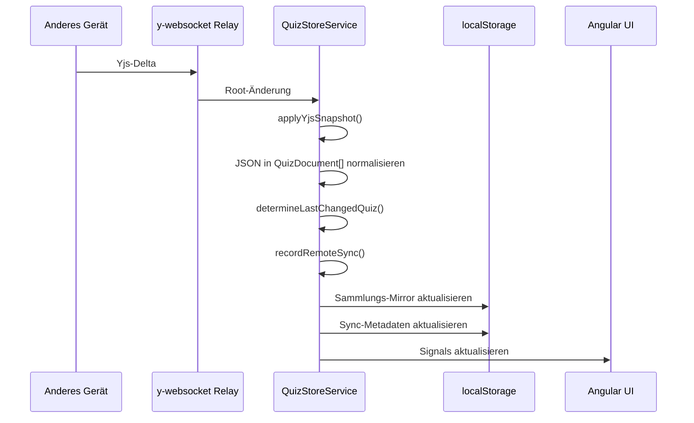
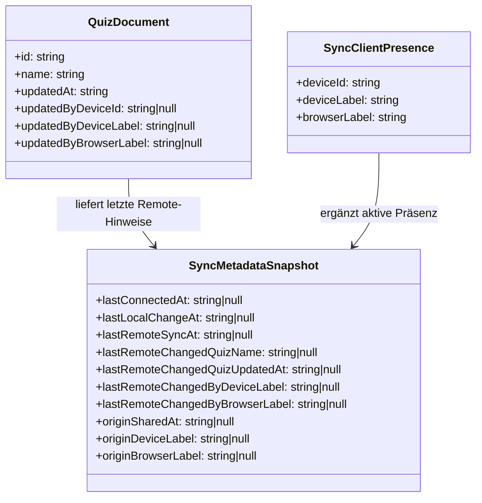

<!-- markdownlint-disable MD013 -->

# Quiz-Sammlung – Synchronisierung

**Zielgruppe:** Entwicklerinnen, Entwickler und technisch interessierte Personen  
**Stand:** 2026-04-01  
**Status:** Living Document

## 1. Zweck

Dieses Dokument beschreibt die Synchronisierung der **Quiz-Sammlung** in `arsnova.eu`.

Im Zentrum stehen drei Anforderungen:

- **Local-First:** Die dauerhafte Quelle der Quiz-Sammlung liegt im Browser, nicht auf dem Server.
- **Zero-Knowledge:** Der Server speichert keine dauerhafte Kopie der Sammlung.
- **Multi-Device-Sync ohne Account:** Eine Quiz-Sammlung kann über Sync-Link oder Sync-ID auf mehreren Geräten genutzt werden.

Dieses Dokument ergänzt insbesondere:

- [ADR-0004: Nutzung von Yjs (CRDTs) für Local-First Speicherung](./decisions/0004-use-yjs-for-local-first-storage.md)
- [Architektur-Handbuch](./handbook.md)
- [Diagramme: arsnova.eu](../diagrams/diagrams.md)

## 2. Begriffe

- **Quiz-Sammlung:** Die lokal gehaltene Sammlung aller Quizzes eines Geräts.
- **Sync-Raum:** Der logische Yjs-Raum, in dem mehrere Geräte dieselbe Sammlung teilen.
- **Sync-ID:** Die technische Raum-ID, aus der im UI ein kurzer Code abgeleitet wird.
- **Sync-Link:** URL auf `quiz/sync/:docId`, über die ein Gerät gezielt in einen Sync-Raum einsteigt.
- **Origin / Ursprungsgerät:** Das Gerät, auf dem eine Sammlung erstmals bewusst für andere Geräte freigegeben wurde.
- **Remote-Änderung:** Eine Änderung, die über Yjs von einem anderen Gerät übernommen wird.
- **Awareness:** Flüchtige Präsenzdaten von `y-websocket`, etwa Gerätetyp und Browser anderer aktiver Clients.

## 3. Architekturüberblick

Die Synchronisierung ist vollständig frontendgetrieben. Das Backend stellt nur den Yjs-WebSocket-Relay bereit.

## 4. Technische Bausteine

### 4.1 Frontend Store

Die Kernlogik liegt in `apps/frontend/src/app/features/quiz/data/quiz-store.service.ts`.

Wesentliche Aufgaben des Stores:

- lokale Quiz-Sammlung halten
- Änderungen lokal persistieren
- Yjs initialisieren und beenden
- Room-Wechsel durchführen
- Remote-Snapshots anwenden
- Sync-Metadaten und Vertrauenssignale pflegen

### 4.2 Persistenzschichten

Die Sammlung wird bewusst auf mehreren Ebenen gehalten:

- **Signals im Speicher:** aktive Arbeitskopie der UI
- **localStorage Room-Mirror:** serialisierte Sammlung pro Raum, plus Legacy-Mirror
- **IndexedDB via `y-indexeddb`:** lokale Yjs-Persistenz
- **Yjs Relay:** Übertragung der Deltas zwischen Geräten

### 4.3 WebSocket-Ziele

Die URL wird im Frontend bestimmt:

- lokal: `ws://127.0.0.1:3002`
- produktionsnah: `wss://<host>/yjs-ws`

Damit kann dieselbe Frontend-Logik lokal und hinter Reverse Proxy betrieben werden.

## 5. Einstiegswege in die Synchronisierung

Es gibt aktuell zwei fachlich unterschiedliche Einstiegswege:

1. **Sammlung freigeben**
   über `quiz/sync/:docId`
2. **Sammlung importieren / auf diesem Gerät weiterführen**
   über das Eingabefeld auf der Startseite

Der Unterschied ist wichtig, weil nur beim ersten Weg das **Ursprungsgerät** registriert wird.

## 6. Room-Aktivierung und lokale Wiederaufnahme

Bei `activateSyncRoom()` passiert in komprimierter Form:

1. Sync-ID normalisieren und validieren
2. optional Sammlung als `shared` markieren
3. vorhandene Yjs-Instanz sauber abbauen
4. neuen Raum aktiv setzen und lokal merken
5. Sync-Metadaten für diesen Raum laden
6. falls nötig Origin einmalig registrieren
7. Sammlung aus lokalem Room-Mirror laden
8. Yjs + IndexedDB + Awareness starten

Das ist wichtig für die UX:

- Ein Gerätewechsel fühlt sich wie das Öffnen derselben Sammlung an.
- Ein Raumwechsel ist ein echter Kontextwechsel mit separatem Mirror und separaten Metadaten.

## 7. Datenfluss bei lokalen Änderungen

Lokale Änderungen entstehen etwa bei:

- Quiz anlegen
- Quiz-Metadaten ändern
- Fragen hinzufügen, ändern, löschen, sortieren
- Quiz importieren oder duplizieren

Bei jeder lokalen Änderung ergänzt der Store Geräte-Metadaten am betroffenen `QuizDocument`:

- `updatedByDeviceId`
- `updatedByDeviceLabel`
- `updatedByBrowserLabel`

Danach läuft die Persistenzkette:

## 8. Datenfluss bei Remote-Übernahme

Wenn ein anderes Gerät schreibt, empfängt der aktuelle Client über Yjs einen neuen Snapshot.

Wichtige Ableitungen dabei:

- **letzte übernommene Änderung**
- **betroffenes Quiz**
- **Gerät der letzten Remote-Änderung**
- **Zeitpunkt der letzten Remote-Übernahme**

## 9. Sync-Metadatenmodell

Neben der Sammlung selbst speichert das Frontend pro Raum ein separates Metadatenobjekt.

### Semantik

- **Origin-Felder** sind stabil und werden nur einmalig gesetzt.
- **Remote-Felder** sind laufende Diagnose- und Vertrauensinformationen.
- **Awareness-Daten** sind flüchtig und gelten nur für aktuell verbundene Geräte.

## 10. UI-Sicht auf die Synchronisierung

Die Quiz-Sammlungsseite zeigt die Synchronisierung bewusst nicht als rein technischen Debug-Block, sondern als Vertrauenssignal.

Der Expander in `QuizListComponent` zeigt:

- Verbindungsstatus
- Sync-ID
- aktuelles Gerät
- weitere aktive Geräte
- Ursprungsgerät und Freigabezeitpunkt
- letzte übernommene Änderung
- Gerät der letzten Remote-Änderung
- letzte lokale Änderung

Ziel dieser Darstellung:

- nachvollziehbar machen, **ob** die Sammlung geteilt ist
- sichtbar machen, **woher** Änderungen kommen
- ohne Accountsystem trotzdem **Vertrauen** schaffen

## 11. Was der Server weiß und was nicht

Das ist für Architektur und Datenschutz zentral:

### Der Server weiß

- dass Clients über denselben Yjs-Raum verbunden sind
- die flüchtigen Yjs-Deltas für die Übertragung
- WebSocket-Verbindungszustände während der Laufzeit

### Der Server weiß nicht dauerhaft

- wem eine Sammlung gehört
- welche Person hinter einem Gerät steht
- eine dauerhafte Klartext-Kopie der kompletten Quiz-Sammlung

Die Vertrauensinformationen im UI stammen deshalb **nicht** aus einem Benutzerkonto, sondern aus lokaler Metadatenpflege plus Awareness.

## 12. Sicherheitskonzept

### 12.1 Aktuelles Schutzmodell

Das aktuelle Sync-Feature folgt einem einfachen **Bearer-Secret-Modell**:

- Der Besitz des **Sync-Links** beziehungsweise der zugrunde liegenden **Room-ID** ist der Zugriffsschlüssel.
- Es gibt **keine Benutzerkonten**, keine serverseitige Eigentümerprüfung und keine getrennten Rollen für Lesen/Bearbeiten.
- Der Yjs-Relay dient als Transportpfad; er prüft aktuell nicht fachlich, **wer** auf einen Raum zugreifen darf.

Das Modell ist bewusst niedrigschwellig und passt zum Local-First-Ansatz, ist aber sicherheitlich nur so stark wie die Geheimhaltung des Links.

### 12.2 Was bereits abgesichert ist

Für Eingaben und Fehlbedienungen existieren bereits grundlegende Schutzmechanismen:

- Sync-Raum-IDs werden nur in einem engen Zeichenraum akzeptiert (`[a-zA-Z0-9_-]`, Länge `8..128`).
- Die Startseite extrahiert nur explizit erlaubte Sync-URLs (`/quiz/sync/:docId`) oder rohe IDs im erlaubten Format.
- Ungültige Werte werden früh zurückgewiesen und nicht an den Store übergeben.
- Die Raum-ID-Erzeugung basiert auf `crypto.randomUUID()` sofern verfügbar.

### 12.3 Sicherheitsgrenzen des aktuellen Modells

Trotz dieser Validierung gibt es klare Grenzen:

1. **Besitz des Links ist Besitz des Zugriffs.**  
   Wer den Link kennt, kann die Sammlung auf einem anderen Gerät öffnen.

2. **Die kurze angezeigte Sync-ID ist kein eigener Sicherheitsmechanismus.**  
   Die nutzerfreundliche Darstellung darf nicht mit einem eigenständigen, verifizierten Share-Code verwechselt werden.

3. **Geräte- und Herkunftsinformationen sind Vertrauenssignale, keine Beweise.**  
   `deviceLabel`, `browserLabel` und Awareness-Daten stammen aus Clientangaben und sind nicht als manipulationssichere Nachweise zu verstehen.

4. **Es gibt derzeit keine serverseitige Raumautorisierung.**  
   Weder Signaturen noch Ablaufdaten oder Rotation schützen einen geleakten Link.

### 12.4 Sicherheitsziel des Features

Das realistische Sicherheitsziel ist derzeit:

- versehentliche Fehleingaben robust abweisen
- Sync-Räume schwer erratbar machen
- Herkunft und Aktivität transparent machen
- ohne Benutzerkonto trotzdem eine nachvollziehbare Freigabelogik bieten

Nicht Ziel des aktuellen Modells ist:

- starke Identitätsprüfung
- personenbezogene Eigentümerbindung
- forensisch belastbare Auditierung

### 12.5 Empfohlene Härtungsstufen

#### Stufe A: kurzfristig

- **Sync-Link als primären Zugangspfad kommunizieren**  
  Die UI sollte klar sagen, dass der Link selbst der Zugriffsschlüssel ist.

- **Security-Wording ergänzen**  
  Zum Beispiel: „Wer den Sync-Link hat, kann diese Sammlung auf einem anderen Gerät öffnen.“

- **Kurz-ID semantisch bereinigen**  
  Entweder nur noch als Anzeigehilfe, oder später durch einen echten auflösbaren Kurzcode ersetzen.

#### Stufe B: mittelfristig

- **Rate-Limits für Sync-Raum-Zugriffe**  
  Schutz gegen massenhafte Join-Versuche oder Raumtests.

- **Signiertes Share-Token statt nackter Raum-ID**  
  Zugriff über `roomId + token` oder vergleichbares Share-Modell.

- **Link-Rotation**  
  Möglichkeit, alte Freigaben ungültig zu machen.

#### Stufe C: langfristig

- **Ablaufzeiten für Freigaben**
- **getrennte Rollen für Öffnen und Bearbeiten**
- **stärkerer serverseitiger Schutz für Share-Auflösung**

### 12.6 Empfehlung für weitere Entwicklung

Die nächste sinnvolle Sicherheitsinvestition ist nicht ein Vollumbau, sondern:

1. UI-Semantik des Links schärfen
2. kurze Sync-ID fachlich bereinigen
3. danach Share-Token und Rotation konzipieren

So bleibt das Feature verständlich und gewinnt schrittweise an Schutz, ohne den Local-First-Ansatz aufzugeben.

### 12.7 Sicherheit und Performance als Spannungsfeld

Für dieses Feature gilt ausdrücklich:

- **Maximale Sicherheit** und **maximale Performance** sind hier nicht gleichzeitig in voller Stärke erreichbar.
- Jede zusätzliche Sicherheitsmaßnahme erzeugt meist mehr Prüf-, Speicher- oder Netzwerkaufwand.
- Jede radikale Performance-Optimierung reduziert oft Prüftiefe, Widerrufbarkeit oder Nachvollziehbarkeit.

Typische Zielkonflikte:

1. **Serverseitige Autorisierung vs. direkte Sync-Geschwindigkeit**  
   Signierte Share-Tokens, Rotation, TTLs und serverseitige Prüfpfade erhöhen den Schutz, kosten aber zusätzliche Roundtrips, Cache-Lookups oder Validierungsarbeit.

2. **Widerrufbarkeit vs. Local-First-Unabhängigkeit**  
   Je stärker ein Zugriff jederzeit widerrufbar sein soll, desto stärker muss der Server in den Zugriffspfad eingebunden werden. Das steht im Spannungsfeld zum Ziel, Sammlungen lokal, offlinefähig und mit minimaler Serverkenntnis nutzbar zu halten.

3. **Vertrauenssignale vs. Schreiblast**  
   Herkunftsinformationen, Zeitstempel und Gerätehinweise erhöhen Transparenz und damit Sicherheitsempfinden, erzeugen aber zusätzliche lokale Persistenz und Vergleichslogik.

4. **Kurze Token-Lebensdauer vs. Bedienfluss**  
   Kurze TTLs und häufige Rotation reduzieren das Schadensfenster bei geleakten Links, erhöhen aber Reibung, Reconnect-Komplexität und potenziell sichtbare Unterbrechungen.

5. **Mehr Auditierbarkeit vs. Zero-Knowledge-Prinzip**  
   Mehr Sicherheitsnachweise verlangen meist mehr serverseitige Spuren, was der gewollt schlanken, datensparsamen und local-first-orientierten Architektur entgegenläuft.

Die Konsequenz ist: Optimierung darf hier nie eindimensional erfolgen. Wer Sicherheit erhöht, muss die Performance-Folgen mitdenken. Wer Performance optimiert, muss ausdrücklich benennen, welche Sicherheits- oder Kontrolltiefe dadurch begrenzt wird.

## 13. Grenzen und bewusste Nicht-Ziele

### 13.1 Keine rückwirkende Herkunft für Altbestände

Sammlungen, die schon geteilt waren, bevor `originSharedAt` und `originDevice*` eingeführt wurden, können ihre ursprüngliche Quelle nicht rückwirkend zuverlässig rekonstruieren.

### 13.2 Keine personenbezogene Identität

Das System erkennt nur neutrale Geräte-/Browserlabels wie:

- `Mac`
- `iPhone`
- `Firefox`
- `Chrome`

Es gibt bewusst keine Nutzerkonten und keine persönliche Autorenzuordnung.

### 13.3 Kein Audit-Log des kompletten Änderungsverlaufs

Aktuell wird **der letzte sichtbare Zustand** dokumentiert, nicht eine vollständige Historie aller Änderungen.

## 14. Typische Fehlerszenarien

### Verbindung steht nicht

Mögliche Ursachen:

- Yjs-WebSocket nicht erreichbar
- falsche lokale Host-Konfiguration
- zweites Gerät nutzt lokale `127.0.0.1`-Entwicklung statt Produktion

Symptome:

- Status bleibt auf `connecting` oder `offline`
- keine Awareness-Peers sichtbar
- Remote-Änderungen erscheinen nicht

### Quiz-Sammlung wirkt veraltet

Mögliche Ursachen:

- falscher Sync-Raum aktiv
- anderer Raum-Mirror in `localStorage`
- Origin/Remote-Metadaten vorhanden, aber keine neue Remote-Änderung

### Herkunft unbekannt

Mögliche Ursachen:

- Altbestand ohne Origin-Metadaten
- Sammlung wurde importiert, aber nie auf der Share-Seite erzeugt

## 15. Hinweise für Weiterentwicklung

Wer das Feature erweitert, sollte folgende Regeln einhalten:

1. **Origin nicht überschreiben.**  
   Ursprung bleibt stabil, auch wenn später weitere Geräte dieselbe Sammlung öffnen.

2. **Remote- und Origin-Semantik nicht vermischen.**  
   `lastRemoteChangedBy...` ist nicht dasselbe wie `originDevice...`.

3. **Lokale Änderungen immer mit Geräte-Metadaten anreichern.**  
   Sonst verliert die UI ihre Vertrauenssignale.

4. **UI-Texte und Übersetzungen immer gemeinsam pflegen.**  
   Das Feature lebt stark von verständlicher Sprache.

5. **Bei neuen Sync-Signalen zwischen dauerhaft und flüchtig unterscheiden.**  
   `Awareness` ist live, aber nicht historisch belastbar.

## 16. Performance und Skalierung

### 16.1 Aktuelle Risiken

Die aktuelle Architektur ist für normale Sammlungsgrößen gut geeignet, hat aber klare Lasttreiber:

- die Sammlung wird als JSON-Snapshot in Yjs gehalten
- größere Sammlungen erzeugen teurere Serialisierung
- `localStorage` läuft synchron auf dem Main Thread
- lokale Vertrauensmetadaten erzeugen zusätzliche Schreibvorgänge

### 16.2 Kurzfristige Optimierungen, die bereits umgesetzt wurden

Folgende Quick Wins wurden bereits umgesetzt:

- **Serialisierung pro Änderung nur noch einmal:** derselbe JSON-Snapshot wird für lokalen Mirror und Yjs weiterverwendet
- **Snapshot-Cache statt erneuter Vollserialisierung beim Vergleich:** eingehende Remote-Snapshots werden gegen den zuletzt bekannten serialisierten Zustand verglichen
- **Gebündelte Persistenz von Sync-Metadaten:** Zeitstempel und Herkunftsinformationen werden leicht verzögert zusammen in `localStorage` geschrieben

Diese Maßnahmen ändern die Architektur nicht grundlegend, senken aber unnötige CPU- und Main-Thread-Arbeit.

### 16.3 Nächste sinnvolle Optimierungsstufe

Wenn die Sammlungen größer werden oder mehrere Geräte intensiver parallel arbeiten, sind dies die nächsten Hebel:

1. **Legacy-Mirror schrittweise zurückbauen**  
   Der zusätzliche `QUIZ_STORAGE_LEGACY_KEY` verdoppelt einen Teil der lokalen Schreibarbeit.

2. **Room-Mirror weiter reduzieren**  
   Langfristig sollte `localStorage` nur noch kleine Metadaten halten, nicht die eigentliche Sammlung.

3. **Messpunkte einbauen**  
   Sinnvoll sind Logging oder Telemetrie für:
   - Größe des serialisierten Sammlungs-Snapshots
   - Dauer von Mirror-Writes
   - Dauer von Yjs-Writes
   - Anzahl der Schreibvorgänge pro Nutzeraktion

4. **Yjs granular statt als JSON-Blob nutzen**  
   Der größte Architekturhebel ist ein Umbau auf `Y.Map`/`Y.Array` pro Quiz, Frage und Antwort.
   Dann würden nicht mehr komplette Sammlungen neu serialisiert, sondern nur echte Teiländerungen.

### 16.4 Empfohlene Reihenfolge

Für die Weiterentwicklung ist diese Reihenfolge sinnvoll:

1. bestehende Quick Wins stabil halten
2. Legacy-Mirror abbauen
3. reale Messwerte mit größeren Sammlungen sammeln
4. erst danach über den Umbau auf granulare Yjs-Strukturen entscheiden

### 16.5 Abhängigkeiten und Widersprüche zu Sicherheitszielen

Die wichtigsten Wechselwirkungen zwischen Performance und Sicherheit:

1. **Weniger lokale Mirror = besser für Performance, schlechter für Diagnose und Recovery**  
   Wenn lokale Spiegel reduziert werden, sinkt Main-Thread-Last. Gleichzeitig werden Fehlersuche, Vertrauenssignale und Wiederanlaufpfade dünner.

2. **Granulare Yjs-Strukturen = besser für Performance, aber aufwendiger in Validierung und Schutzmodell**  
   Feingranulare CRDTs reduzieren Vollserialisierung, vergrößern aber die Zahl der veränderbaren Teilobjekte. Das erhöht die Anforderungen an Konsistenzregeln, Validierung und Sicherheitsreview.

3. **Mehr Security-Gates = mehr Latenz auf Hotpaths**  
   Rate-Limits, Token-Prüfungen, Share-Auflösung und Rotation schützen den Zugriff, fügen aber zusätzliche Prüfungen in genau die Pfade ein, die für ein „fühlt sich sofort an“ besonders kritisch sind.

4. **Mehr Metadaten = mehr Transparenz, aber auch mehr Schreibaufwand**  
   Alles, was Herkunft und letzte Änderungen sichtbarer macht, verbessert Vertrauen. Gleichzeitig erhöht es die Zahl der lokalen Persistenzvorgänge.

5. **Mehr Serverwissen = bessere Kontrolle, aber schwächeres Zero-Knowledge-Profil**  
   Stärkere Zugriffskontrolle oder Auditierung brauchen meist mehr serverseitigen Zustand. Das verbessert Sicherheit, verschiebt aber die Architektur weg vom reinen Relay-Modell.

Deshalb gilt als Leitregel:

- **Zuerst das minimale notwendige Sicherheitsniveau sauber definieren.**
- **Dann innerhalb dieser Sicherheitsgrenzen performen.**
- **Nicht umgekehrt.**

Für arsnova.eu bedeutet das konkret:

- Bei Host-/Moderatorzugängen hat **serverseitig prüfbare Autorisierung** Vorrang vor maximaler Bequemlichkeit.
- Bei der Quiz-Sammlung hat **Local-First mit nachvollziehbarem Vertrauensmodell** Vorrang vor maximal aggressiver Optimierung.
- Performance-Maßnahmen sind bevorzugt dort sinnvoll, wo sie **keine** Autorisierung, Widerrufbarkeit oder Transparenz abbauen.

## 17. TL;DR

Die Synchronisierung der Quiz-Sammlung ist in `arsnova.eu` ein **frontendzentriertes Local-First-System**:

- Yjs liefert konfliktfreie Multi-Device-Synchronisierung
- IndexedDB und lokale Mirror machen die Sammlung offlinefähig
- der Server ist Relay, nicht dauerhafte Datenquelle
- zusätzliche lokale Metadaten machen Herkunft, letzte Änderungen und aktive Geräte nachvollziehbar

Genau diese Kombination macht das Feature technisch anspruchsvoll: Es verbindet CRDT-Sync, Offline-Persistenz, bewusst geringe Serverkenntnis und vertrauensbildende UX ohne Benutzerkonto.
