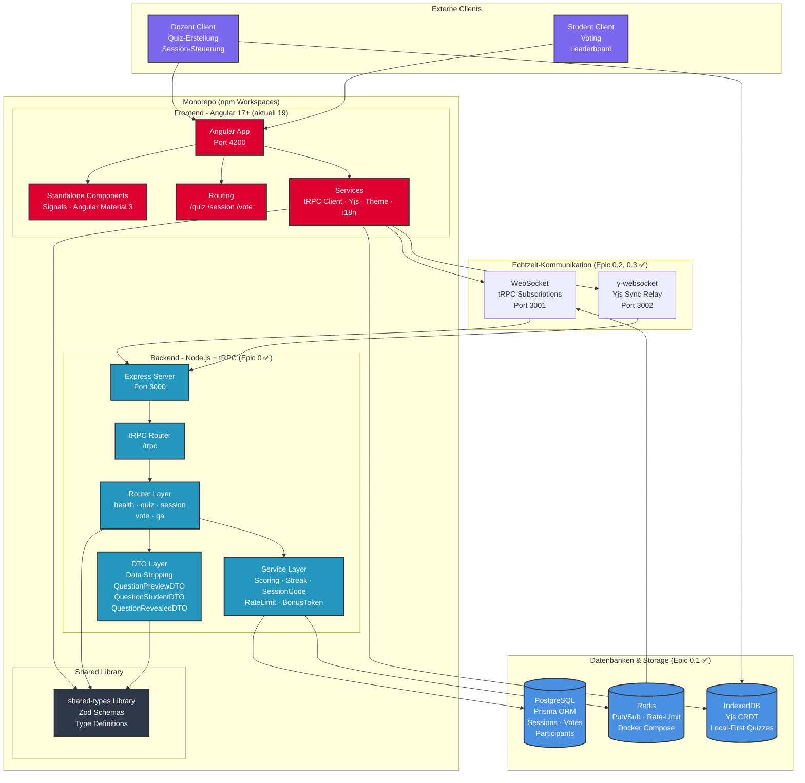
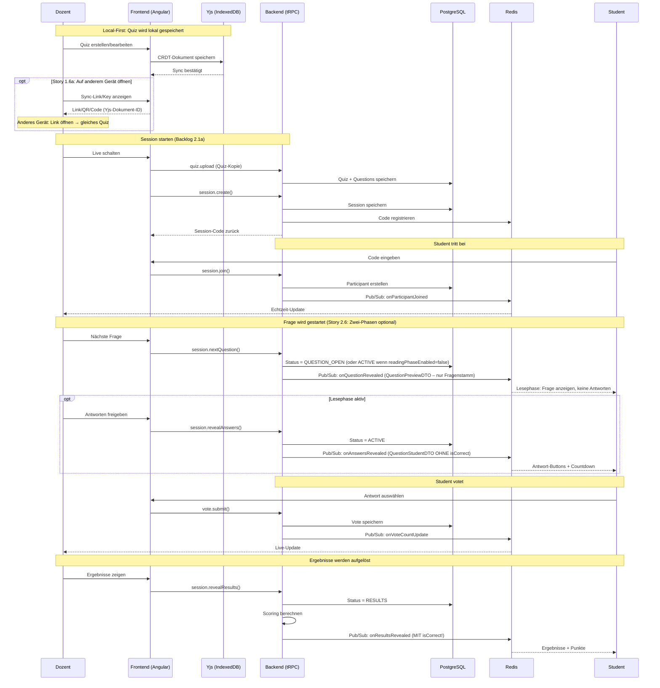
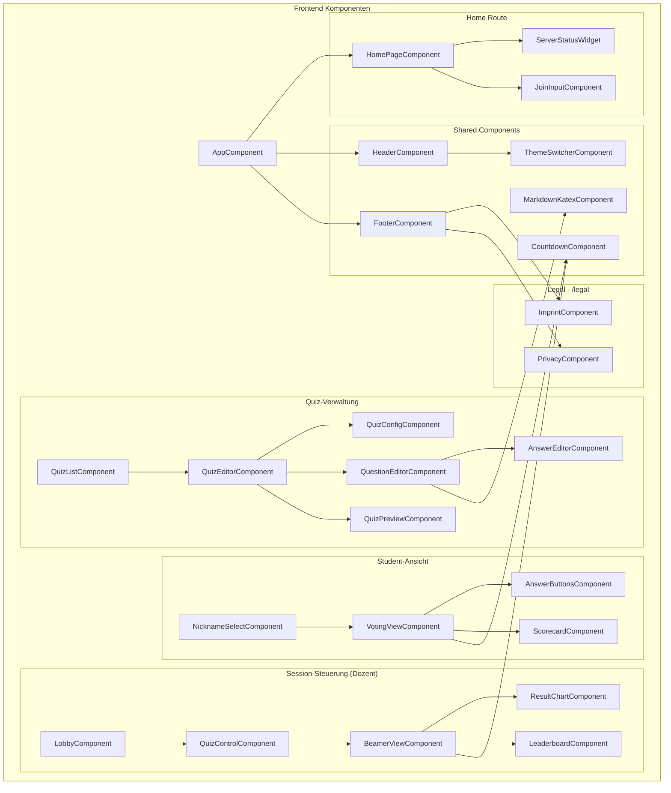
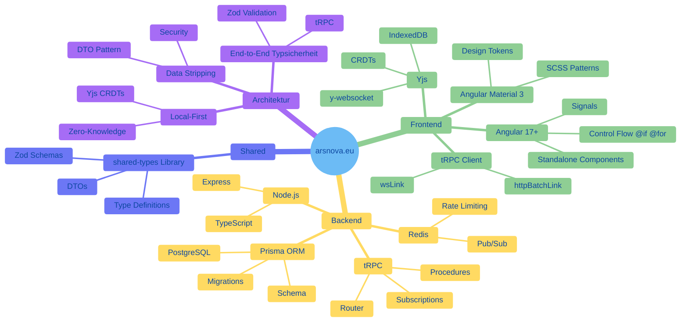
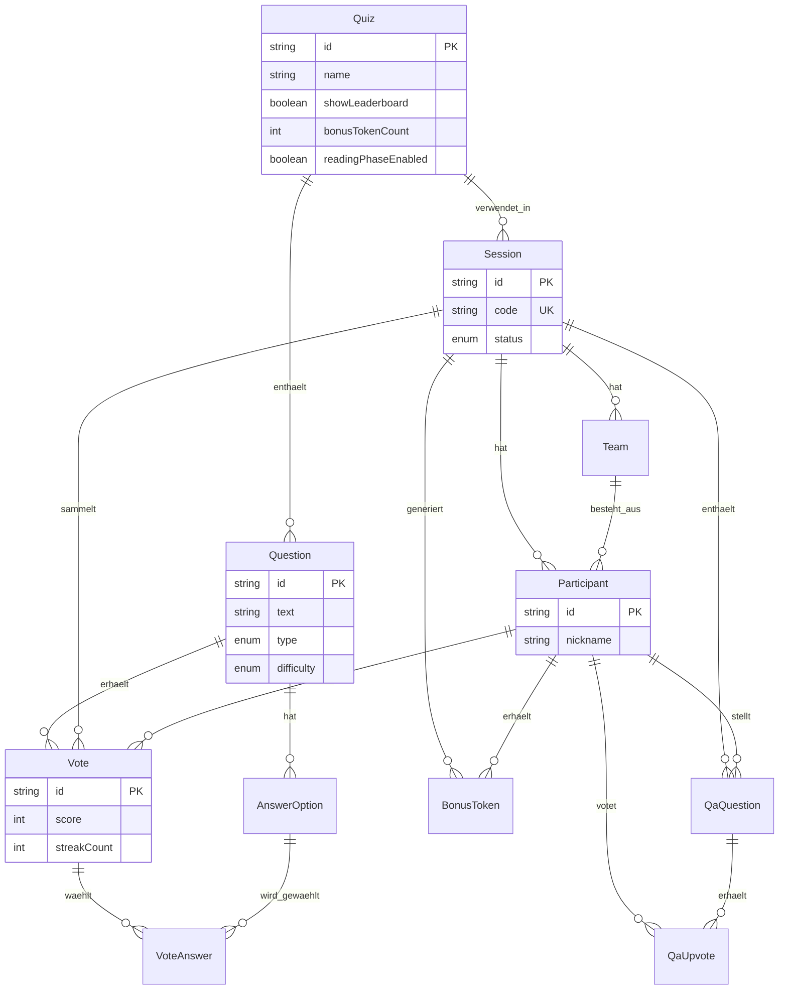
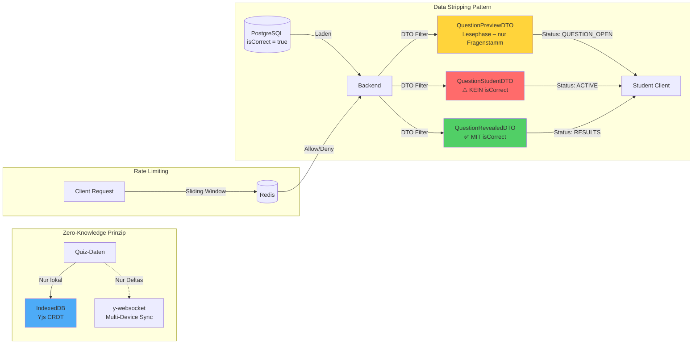

# 🏗️ Architektur-Übersicht: arsnova.eu

**Erstellt:** 2026-02-20  
**Zuletzt aktualisiert:** 2026-02-23  
**Zweck:** Visualisierung der gesamten Codebasis-Struktur und Architektur  

**Epic 0 abgeschlossen:** Redis (Docker + Health-Check), tRPC WebSocket (Port 3001, health.ping), Yjs WebSocket (Port 3002), Server-Status (health.stats, Widget auf Startseite), Rate-Limiting (Redis Sliding-Window), CI/CD (GitHub Actions).

## System-Architektur-Diagramm

## Datenfluss-Diagramm

## Komponenten-Hierarchie

## Technologie-Stack Übersicht

## Datenbank-Schema Übersicht

Session-Status (Story 2.6): `LOBBY`, `QUESTION_OPEN` (Lesephase), `ACTIVE`, `RESULTS`, `PAUSED`, `FINISHED`.

## Sicherheits-Architektur

---

**Weitere Diagramme:** Detaillierte Backend- und Frontend-Komponenten, Datenbank-Schema, Kommunikation Dozent/Student sowie Aktivitätsablauf finden sich in [diagrams.md](./diagrams.md) (Mermaid, von GitHub gerendert).

**Hinweis:** Diese Diagramme sind eine **vereinfachte Übersicht** (Living Documentation). Die vollständige Komponentenliste und alle DTOs finden sich in [diagrams.md](./diagrams.md). Bei größeren Architekturänderungen sollten beide Dateien aktualisiert werden.
