<!-- markdownlint-disable MD013 -->

# 🏗️ Architektur-Übersicht: arsnova.eu

**Erstellt:** 2026-02-20  
**Zuletzt aktualisiert:** 2026-04-03  
**Zweck:** Visualisierung der gesamten Codebasis-Struktur und Architektur

**Status:** Epics 0–5, 7.1, 8, 9, **10 (MOTD)** umgesetzt · Epic 6 größtenteils umgesetzt (6.5, 6.6 offen) · Plattformstatistik Rekordteilnehmer (`PlatformStatistic`) in `health.stats` · Host-Härtung, Feedback-Host-Token und besitzgebundene Quiz-Historie umgesetzt · geplante Markdown-Stories 1.7a/1.7b siehe [ADR-0015](../architecture/decisions/0015-markdown-images-url-only-and-lightbox.md), [ADR-0016](../architecture/decisions/0016-markdown-katex-editor-split-view-and-md3-toolbar.md), [ADR-0017](../architecture/decisions/0017-markdown-editor-ui-scope-and-ki-import-paste-field.md) (Geltungsbereich Editor vs. KI-Paste). Blitzlicht ist als Startseiten-Shortcut und Session-Kanal konsolidiert. Rollen/Routen/Autorisierung inkl. Admin, Host-Härtung und MOTD siehe [ADR-0006](../architecture/decisions/0006-roles-routes-authorization-host-admin.md), [ADR-0019](../architecture/decisions/0019-host-hardening-and-owner-bound-session-access.md), [ADR-0009](../architecture/decisions/0009-unified-live-session-channels.md), [ADR-0010](../architecture/decisions/0010-blitzlicht-as-core-live-mode.md), [ADR-0018](../architecture/decisions/0018-message-of-the-day-platform-communication.md), [ROUTES_AND_STORIES.md](../ROUTES_AND_STORIES.md).

## System-Architektur-Diagramm

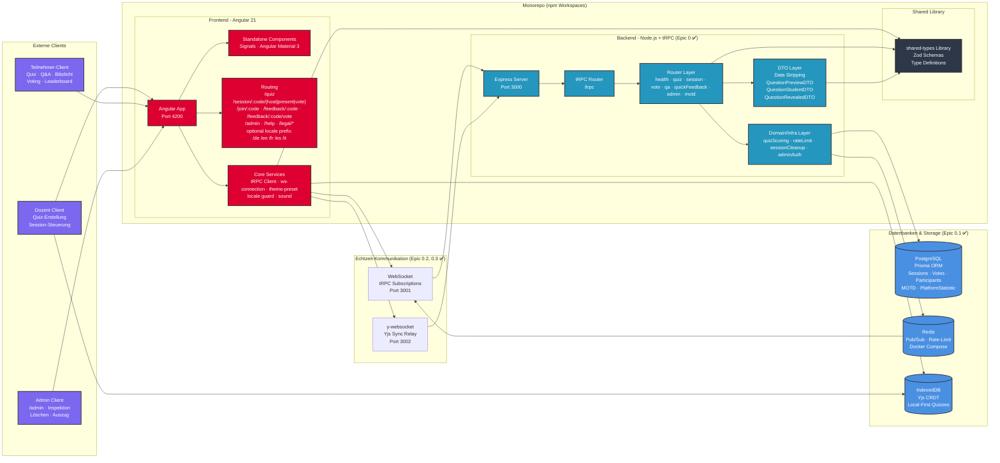

## Datenfluss-Diagramm

```mermaid
sequenceDiagram
    participant D as Dozent
    participant FE as Frontend (Angular)
    participant YJS as Yjs (IndexedDB)
    participant BE as Backend (tRPC)
    participant PG as PostgreSQL
    participant R as Redis
    participant S as Student

    Note over D,YJS: Local-First: Quiz wird lokal gespeichert
    D->>FE: Quiz erstellen/bearbeiten
    FE->>YJS: CRDT-Dokument speichern
    YJS-->>FE: Sync bestätigt
    opt Story 1.6a: Auf anderem Gerät öffnen
        D->>FE: Sync-Link/Room-ID anzeigen
        FE-->>D: Link/QR/Code (Yjs-Dokument-ID)
        Note over D: Anderes Gerät: Link öffnen → gleiches Quiz
    end

    Note over D,BE: Session starten (Backlog 2.1a)
    D->>FE: Live schalten
    FE->>BE: quiz.upload (Quiz-Kopie)
    BE->>PG: Quiz + Questions speichern
    FE->>BE: session.create()
    BE->>PG: Session speichern
    BE->>R: Code registrieren
    BE-->>FE: Session-Code zurück

    Note over S,BE: Student tritt bei
    S->>FE: Code eingeben
    FE->>BE: session.join()
    BE->>PG: Participant erstellen
    BE->>R: Pub/Sub: onParticipantJoined
    R-->>D: Echtzeit-Update

    Note over D,S: Frage wird gestartet (Story 2.6: Zwei-Phasen optional)
    D->>FE: Nächste Frage
    FE->>BE: session.nextQuestion()
    BE->>PG: Status = QUESTION_OPEN (oder ACTIVE wenn readingPhaseEnabled=false)
    BE->>R: Pub/Sub: onQuestionRevealed (QuestionPreviewDTO – nur Fragenstamm)
    R-->>S: Lesephase: Frage anzeigen, keine Antworten

    opt Lesephase aktiv
        D->>FE: Antworten freigeben
        FE->>BE: session.revealAnswers()
        BE->>PG: Status = ACTIVE
        BE->>R: Pub/Sub: onAnswersRevealed (QuestionStudentDTO OHNE isCorrect)
        R-->>S: Antwort-Buttons + Countdown
    end

    Note over S,BE: Student votet
    S->>FE: Antwort auswählen
    FE->>BE: vote.submit()
    BE->>PG: Vote speichern
    BE->>R: Pub/Sub: onVoteCountUpdate
    R-->>D: Live-Update

    Note over D,S: Ergebnisse werden aufgelöst
    D->>FE: Ergebnisse zeigen
    FE->>BE: session.revealResults()
    BE->>PG: Status = RESULTS
    BE->>BE: Scoring berechnen
    BE->>R: Pub/Sub: onResultsRevealed (MIT isCorrect!)
    R-->>S: Ergebnisse + Punkte

    Note over D,S: Zwischen Fragen: PAUSED, dann erneut nextQuestion; Session-Ende: session.end → FINISHED
```

### Admin-Datenfluss (Epic 9)

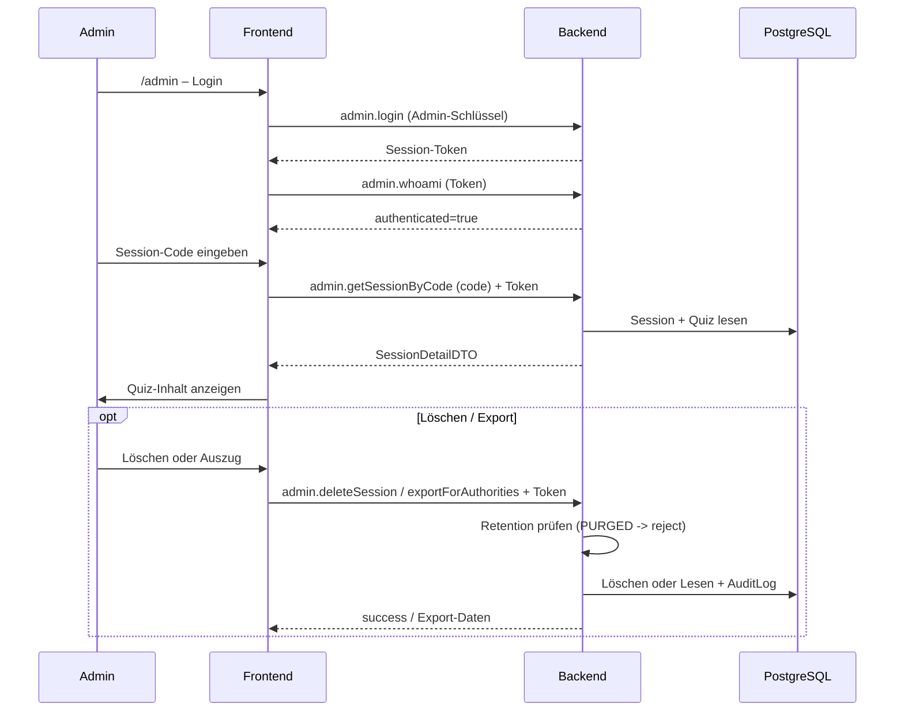

## Komponenten-Hierarchie

### 1) App-Shell und globale Bausteine

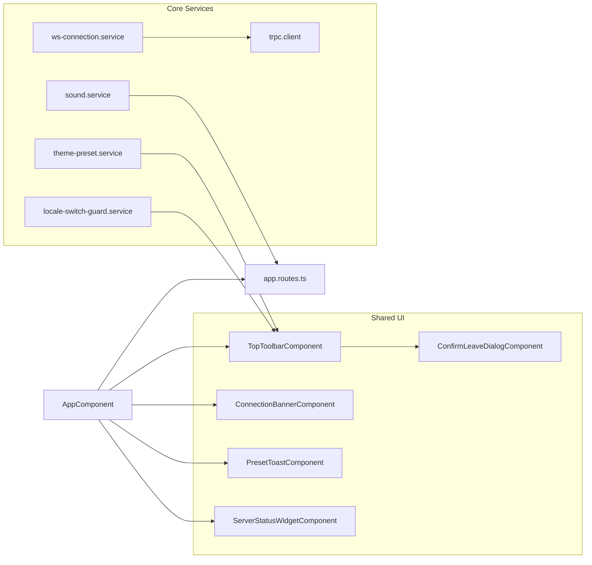

### 2) Feature-Routen (grober Zuschnitt)

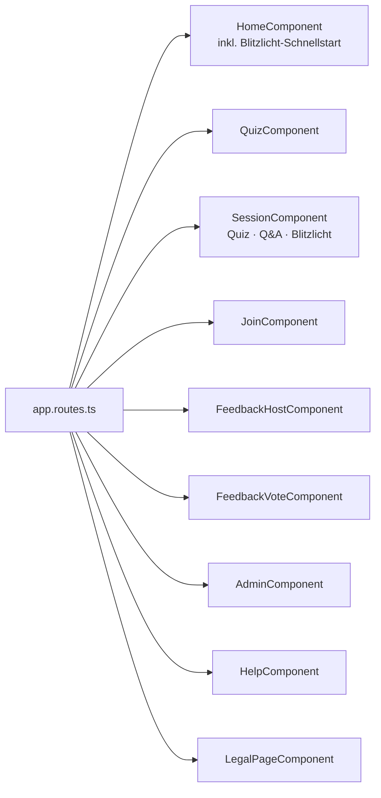

### 3) Detail-Hierarchie: Quiz, Session, Admin

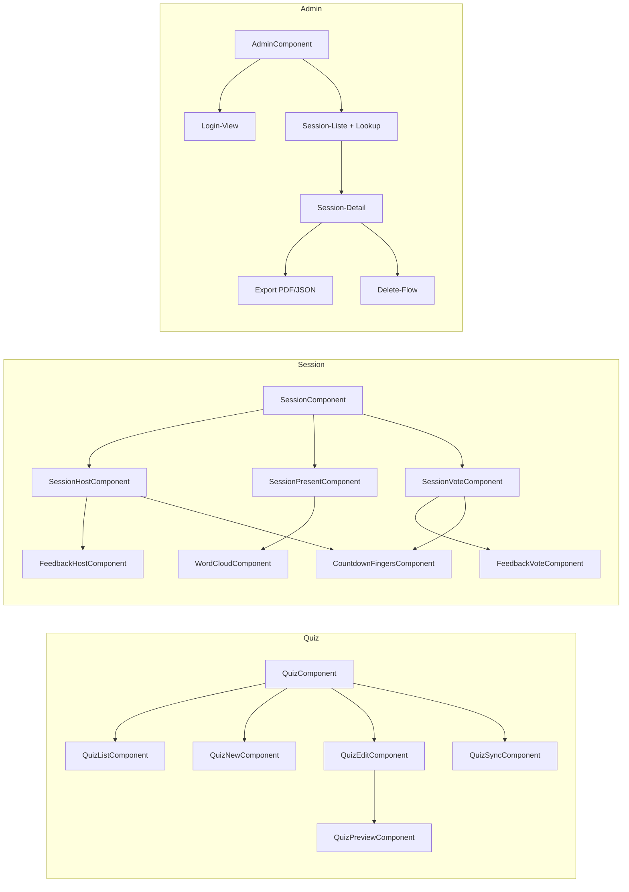

## Technologie-Stack Übersicht

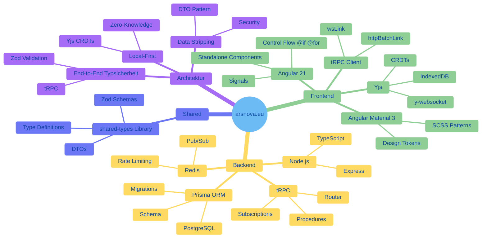

## Datenbank-Schema Übersicht

Session-Status (Story 2.6): `LOBBY`, `QUESTION_OPEN` (Lesephase), `ACTIVE`, `RESULTS`, `PAUSED`, `FINISHED`.

### Kernsicht (Quiz, Session, Votes)

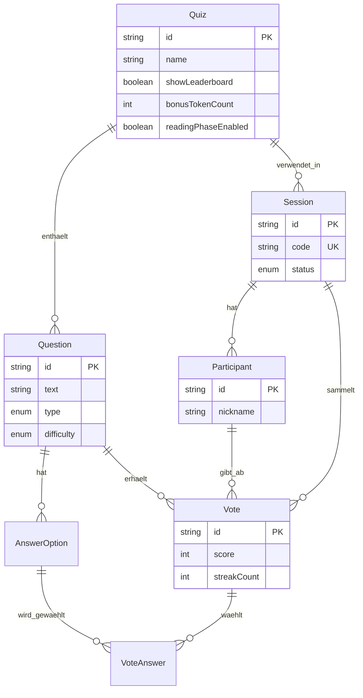

### Erweiterungen (Team, Bonus, Q&A, Session-Kanaele, Admin)

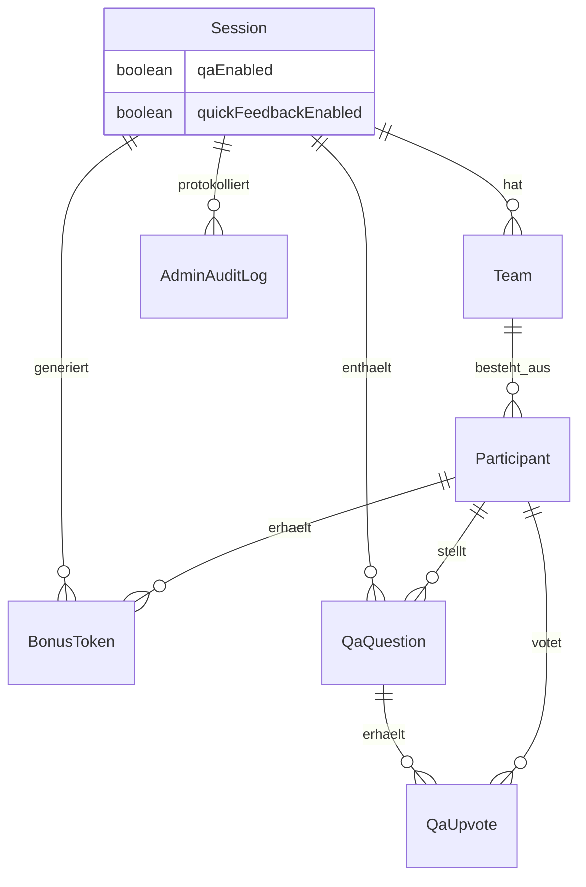

## Sicherheits-Architektur

### 1) Zero-Knowledge / Local-First

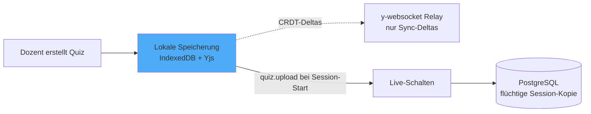

### 2) Data-Stripping entlang des Session-Status

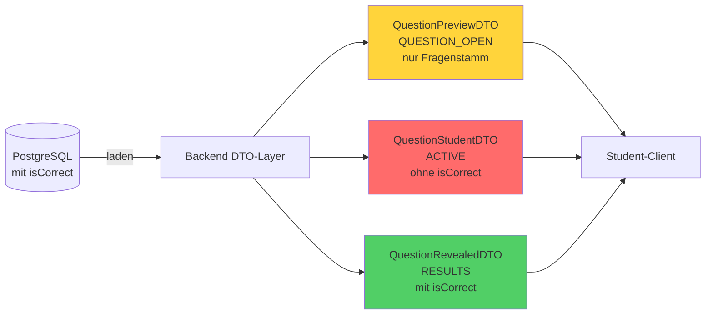

### 3) Rollen-Autorisierung und Rate-Limiting

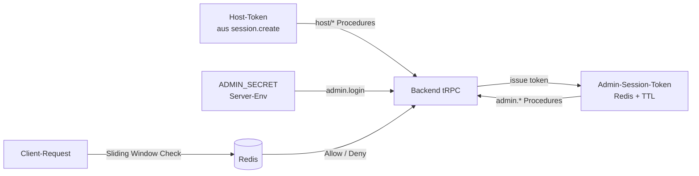

---

**Weitere Diagramme:** Detaillierte Backend- und Frontend-Komponenten, Datenbank-Schema, Kommunikation Dozent/Student sowie Aktivitätsablauf finden sich in [diagrams.md](./diagrams.md) (Mermaid, von GitHub gerendert).

**Hinweis:** Diese Diagramme sind eine **vereinfachte Übersicht** (Living Documentation). Die vollständige Komponentenliste und alle DTOs finden sich in [diagrams.md](./diagrams.md). Bei größeren Architekturänderungen sollten beide Dateien aktualisiert werden.
