<!-- markdownlint-disable MD013 -->

# Diagramme: arsnova.eu

Alle Diagramme sind in Mermaid geschrieben und werden von GitHub nativ gerendert.
**Stand:** 2026-06-17 · **Epics 0–5 inkl. 5.4a, 7.1, 8.1–8.4, 8.6/8.7, 9, 10 (MOTD) umgesetzt;** Epic 6 größtenteils umgesetzt (**6.5 Barrierefreiheit** und **6.6 Thinking Aloud** noch offen). Plattformstatistik Rekordteilnehmer und Tagesrekorde laufen über `health.footerBundle` / `health.stats` (`PlatformStatistic`, `DailyStatistic`). Kurzantwort (`SHORT_TEXT`) inkl. numerischer Bewertung, numerische Schätzfragen (`NUMERIC_ESTIMATE`) inkl. Zwei-Runden-Flow/Statistik und die Effective-Vote-Regel für Peer Instruction sind umgesetzt. Markdown-Erweiterungen **1.7a** und **1.7b** umgesetzt ([ADR-0015](../architecture/decisions/0015-markdown-images-url-only-and-lightbox.md), [ADR-0016](../architecture/decisions/0016-markdown-katex-editor-split-view-and-md3-toolbar.md)). `Blitzlicht` ist als Startseiten-Shortcut und Session-Kanal konsolidiert. `FINISHED` beendet die Session fuer Vote-Clients kanaluebergreifend und raeumt Live-Kanal-Subscriptions ab. Rollen/Routen/Autorisierung siehe [ADR-0006](../architecture/decisions/0006-roles-routes-authorization-host-admin.md), [ADR-0009](../architecture/decisions/0009-unified-live-session-channels.md), [ADR-0010](../architecture/decisions/0010-blitzlicht-as-core-live-mode.md), [ADR-0018](../architecture/decisions/0018-message-of-the-day-platform-communication.md), [ROUTES_AND_STORIES.md](../ROUTES_AND_STORIES.md).

> **VS Code:** Mermaid wird in der Standard-Markdown-Vorschau nicht gerendert. Bitte die Erweiterung **„Markdown Preview Mermaid Support“** (`bierner.markdown-mermaid`) installieren. Siehe [README.md](./README.md) in diesem Ordner.

---

## 1. Backend-Architektur (Komponenten)

Express · tRPC v11 · Prisma 7.4.x · Redis · WebSocket · Yjs (Epic 0 umgesetzt; health.footerBundle, health.stats, ping, Rate-Limit, y-websocket)

### 1.1 Entry, Router und Module

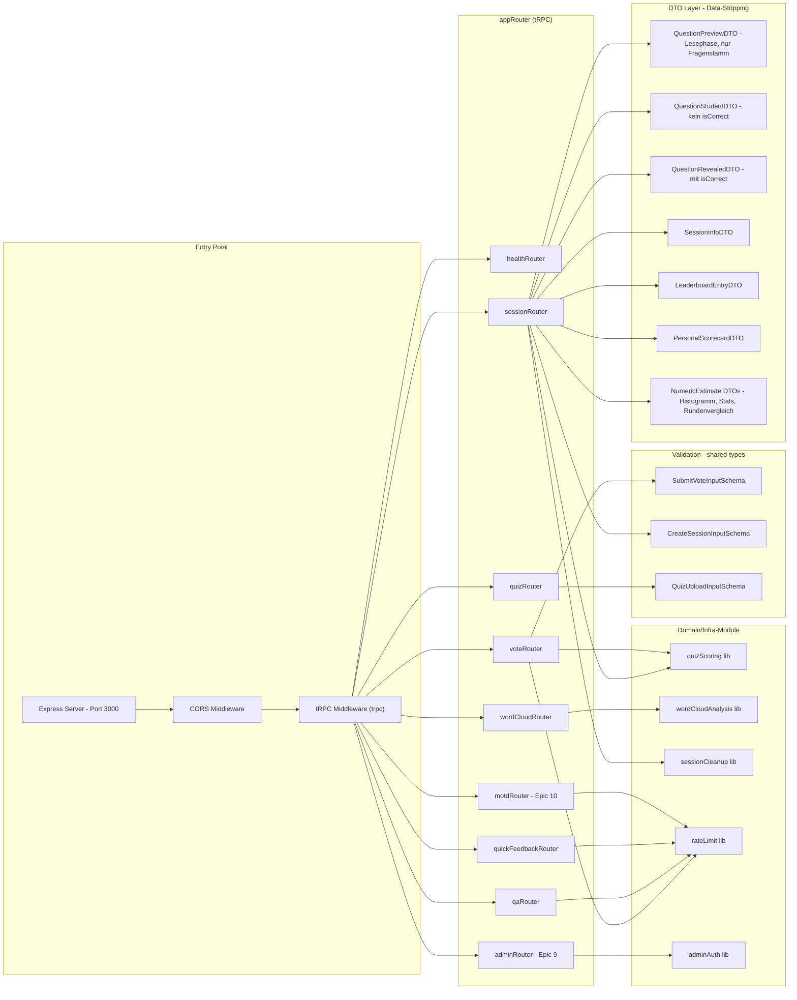
```mermaid
%%{init: {'flowchart': {'curve': 'basis', 'nodeSpacing': 64, 'rankSpacing': 92, 'padding': 20}}}%%
graph LR
    subgraph Entry["Entry Point"]
        express[Express Server - Port 3000]
        cors[CORS Middleware]
        trpcmw["tRPC Middleware (trpc)"]
    end

    subgraph Router["appRouter (tRPC)"]
        health[healthRouter]
        quiz[quizRouter]
        session[sessionRouter]
        vote[voteRouter]
        qa[qaRouter]
        quickfb[quickFeedbackRouter]
        wordcloud[wordCloudRouter]
        admin[adminRouter - Epic 9]
        motd[motdRouter - Epic 10]
    end

    subgraph Modules["Domain/Infra-Module"]
        scoring[quizScoring lib]
        wordcloudanalysis[wordCloudAnalysis lib]
        cleanup[sessionCleanup lib]
        ratelimit[rateLimit lib]
        adminauth[adminAuth lib]
    end

    subgraph DTO["DTO Layer - Data-Stripping"]
        prevdto["QuestionPreviewDTO - Lesephase, nur Fragenstamm"]
        studdto[QuestionStudentDTO - kein isCorrect]
        revdto[QuestionRevealedDTO - mit isCorrect]
        sessiondto[SessionInfoDTO]
        lbdto[LeaderboardEntryDTO]
        scoredto[PersonalScorecardDTO]
        numericdto[NumericEstimate DTOs - Histogramm, Stats, Rundenvergleich]
    end

    subgraph Validation["Validation - shared-types"]
        submitvote[SubmitVoteInputSchema]
        createsession[CreateSessionInputSchema]
        quizupload[QuizUploadInputSchema]
    end

    express --> cors --> trpcmw
    trpcmw --> health
    trpcmw --> quiz
    trpcmw --> session
    trpcmw --> vote
    trpcmw --> qa
    trpcmw --> quickfb
    trpcmw --> wordcloud
    trpcmw --> admin
    trpcmw --> motd

    session --> scoring
    session --> cleanup
    vote --> scoring
    wordcloud --> wordcloudanalysis
    vote --> ratelimit
    qa --> ratelimit
    quickfb --> ratelimit
    admin --> adminauth
    motd --> ratelimit

    session --> prevdto
    session --> studdto
    session --> revdto
    session --> sessiondto
    session --> lbdto
    session --> scoredto
    session --> numericdto
    vote --> submitvote
    quiz --> quizupload
    session --> createsession
```

### 1.2 Persistenz und Realtime

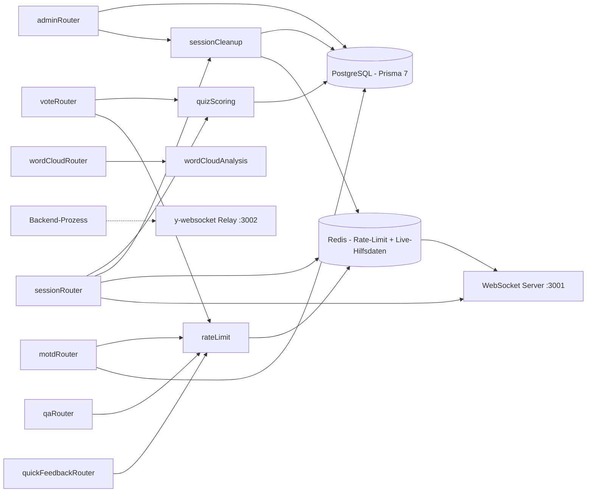
```mermaid
%%{init: {'flowchart': {'curve': 'basis', 'nodeSpacing': 64, 'rankSpacing': 92, 'padding': 20}}}%%
graph LR
    BACKEND_PROC[Backend-Prozess]
    SESSION[sessionRouter]
    VOTE[voteRouter]
    QA[qaRouter]
    QUICKFB[quickFeedbackRouter]
    WORDCLOUD[wordCloudRouter]
    ADMIN[adminRouter]
    MOTD[motdRouter]
    CLEANUP[sessionCleanup]
    RATELIMIT[rateLimit]
    SCORING[quizScoring]
    WCANALYSIS[wordCloudAnalysis]

    PG[(PostgreSQL - Prisma 7)]
    REDIS[(Redis - Rate-Limit + Live-Hilfsdaten)]
    WSS[WebSocket Server :3001]
    YWS[y-websocket Relay :3002]

    SESSION --> SCORING
    SESSION --> CLEANUP
    VOTE --> SCORING
    WORDCLOUD --> WCANALYSIS
    VOTE --> RATELIMIT
    QA --> RATELIMIT
    QUICKFB --> RATELIMIT
    MOTD --> RATELIMIT

    SCORING --> PG
    CLEANUP --> PG
    CLEANUP --> REDIS
    RATELIMIT --> REDIS
    SESSION --> REDIS
    SESSION --> WSS
    ADMIN --> PG
    ADMIN --> CLEANUP
    MOTD --> PG
    REDIS --> WSS
    BACKEND_PROC -.-> YWS

```

---

## 2. Frontend-Architektur (Komponenten)

Angular 21.2.x · Standalone Components · Signals · Angular Material 3 + SCSS-Patterns

### 2.1 App-Shell und globale Bausteine

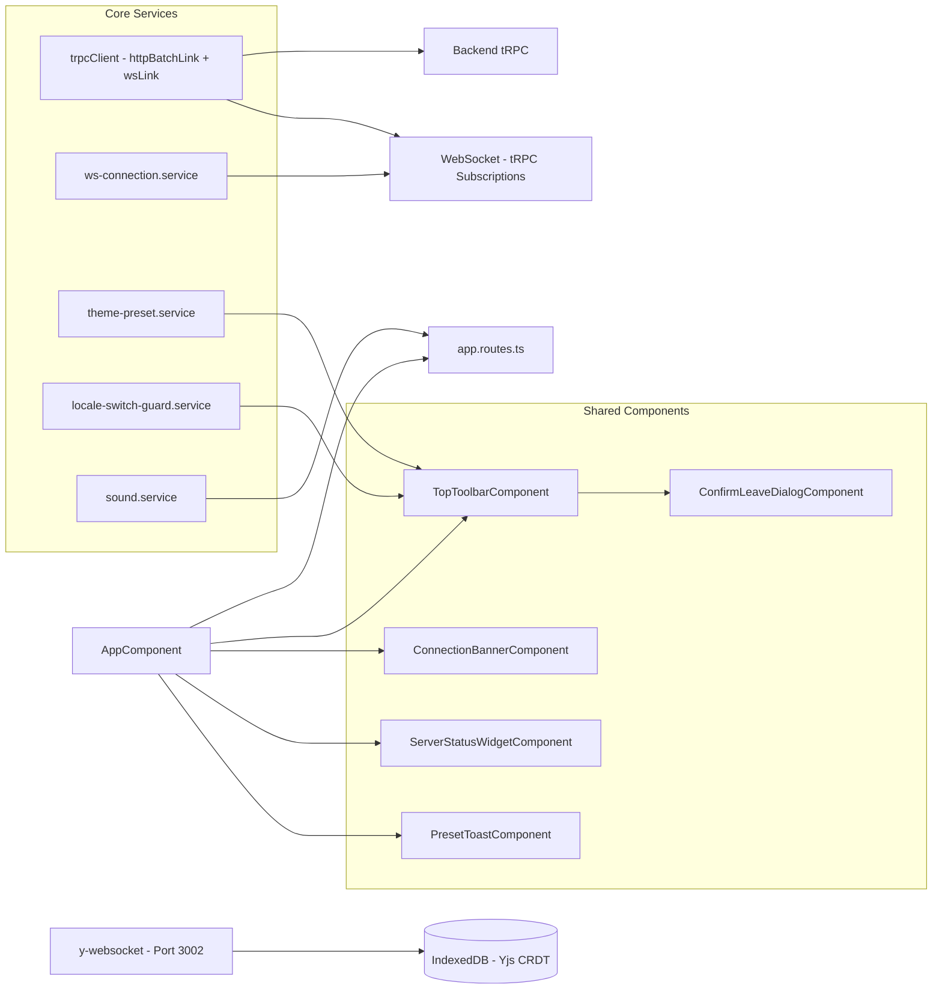
```mermaid
%%{init: {'flowchart': {'curve': 'basis', 'nodeSpacing': 64, 'rankSpacing': 96, 'padding': 20}}}%%
graph LR
    APP[AppComponent]
    ROUTES[app.routes.ts]

    subgraph Shared["Shared Components"]
        TOOLBAR[TopToolbarComponent]
        STATUS[ServerStatusWidgetComponent]
        PRESET[PresetToastComponent]
        BANNER[ConnectionBannerComponent]
        CONFIRM[ConfirmLeaveDialogComponent]
    end

    subgraph Core["Core Services"]
        TRPC[trpcClient - httpBatchLink + wsLink]
        WSCONN[ws-connection.service]
        THEME[theme-preset.service]
        LOCALE[locale-switch-guard.service]
        SOUND[sound.service]
    end

    BACKEND[Backend tRPC]
    WS[WebSocket - tRPC Subscriptions]
    YWS[y-websocket - Port 3002]
    IDB[(IndexedDB - Yjs CRDT)]

    APP --> ROUTES
    APP --> TOOLBAR
    APP --> BANNER
    APP --> STATUS
    APP --> PRESET
    TOOLBAR --> CONFIRM

    TRPC --> BACKEND
    TRPC --> WS
    WSCONN --> WS
    THEME --> TOOLBAR
    LOCALE --> TOOLBAR
    SOUND --> ROUTES
    YWS --> IDB
```

### 2.2 Feature-Routen (kompakt)

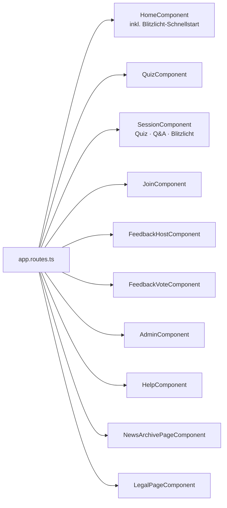
```mermaid
%%{init: {'flowchart': {'curve': 'basis', 'nodeSpacing': 66, 'rankSpacing': 100, 'padding': 20}}}%%
graph LR
    ROUTES[app.routes.ts]
    HOME[HomeComponent<br/>inkl. Blitzlicht-Schnellstart]
    QUIZ[QuizComponent]
    SESSION[SessionComponent<br/>Quiz · Q&A · Blitzlicht]
    JOIN[JoinComponent]
    FBHOST[FeedbackHostComponent]
    FBVOTE[FeedbackVoteComponent]
    ADMIN[AdminComponent]
    HELP[HelpComponent]
    NEWS[NewsArchivePageComponent]
    LEGAL[LegalPageComponent]

    ROUTES --> HOME
    ROUTES --> QUIZ
    ROUTES --> SESSION
    ROUTES --> JOIN
    ROUTES --> FBHOST
    ROUTES --> FBVOTE
    ROUTES --> ADMIN
    ROUTES --> HELP
    ROUTES --> NEWS
    ROUTES --> LEGAL
```

### 2.3 Detail-Hierarchie (Quiz, Session, Admin)

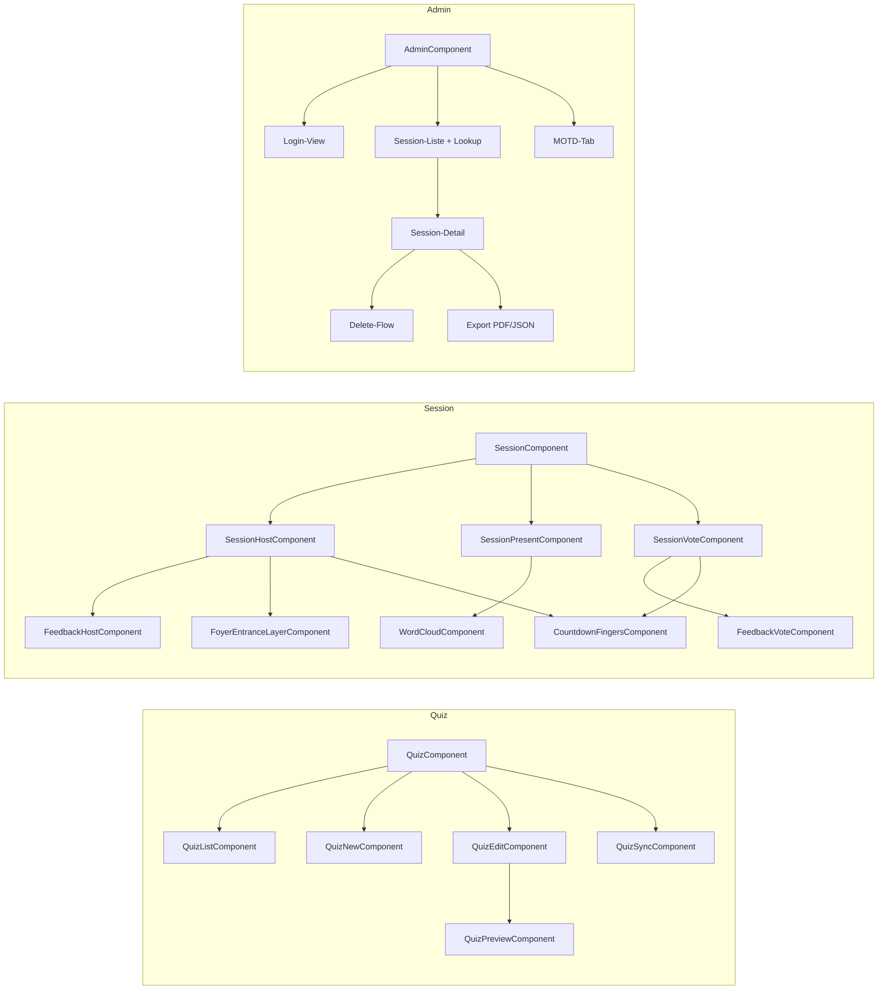
```mermaid
%%{init: {'flowchart': {'curve': 'basis', 'nodeSpacing': 60, 'rankSpacing': 90, 'padding': 18}}}%%
graph LR
    subgraph Quiz["Quiz"]
        QSHELL[QuizComponent]
        QLIST[QuizListComponent]
        QNEW[QuizNewComponent]
        QEDIT[QuizEditComponent]
        PREVIEW[QuizPreviewComponent]
        QSYNC[QuizSyncComponent]
        QSHELL --> QLIST
        QSHELL --> QNEW
        QSHELL --> QEDIT
        QEDIT --> PREVIEW
        QSHELL --> QSYNC
    end

    subgraph Session["Session"]
        SROOT[SessionComponent]
        SHOST[SessionHostComponent]
        SPRESENT[SessionPresentComponent]
        SVOTE[SessionVoteComponent]
        FBHOST[FeedbackHostComponent]
        FBVOTE[FeedbackVoteComponent]
        WCLOUD[WordCloudComponent]
        FOYER[FoyerEntranceLayerComponent]
        COUNTDOWN[CountdownFingersComponent]
        SROOT --> SHOST
        SROOT --> SPRESENT
        SROOT --> SVOTE
        SHOST --> FBHOST
        SVOTE --> FBVOTE
        SHOST --> FOYER
        SPRESENT --> WCLOUD
        SHOST --> COUNTDOWN
        SVOTE --> COUNTDOWN
    end

    subgraph Admin["Admin"]
        AROOT[AdminComponent]
        ALOGIN[Login-View]
        ALIST[Session-Liste + Lookup]
        ADETAIL[Session-Detail]
        ADELETE[Delete-Flow]
        AEXPORT[Export PDF/JSON]
        AMOTD[MOTD-Tab]
        AROOT --> ALOGIN
        AROOT --> ALIST
        ALIST --> ADETAIL
        ADETAIL --> ADELETE
        ADETAIL --> AEXPORT
        AROOT --> AMOTD
    end
```

---

## 3. Datenbank-Schema (PostgreSQL / Prisma)

Die Diagramme zeigen eine fachlich lesbare Auswahl der wichtigsten Felder. Vollständige Quelle bleibt [`prisma/schema.prisma`](../../prisma/schema.prisma).

### 3.1 Kernsicht (Quiz, Session, Votes)

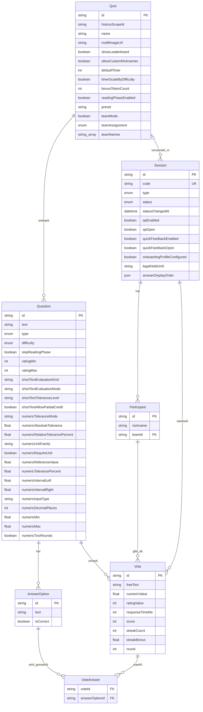
```mermaid
%%{init: {'flowchart': {'nodeSpacing': 48, 'rankSpacing': 72, 'padding': 14}}}%%
erDiagram
    Quiz ||--o{ Question : enthaelt
    Quiz |o--o{ Session : verwendet_in
    Question ||--o{ AnswerOption : hat
    Question ||--o{ Vote : erhaelt
    Session ||--o{ Participant : hat
    Session ||--o{ Vote : sammelt
    Participant ||--o{ Vote : gibt_ab
    Vote ||--o{ VoteAnswer : waehlt
    AnswerOption ||--o{ VoteAnswer : wird_gewaehlt

    Quiz {
        string id PK
        string historyScopeId
        string name
        string motifImageUrl
        boolean showLeaderboard
        boolean allowCustomNicknames
        int defaultTimer
        boolean timerScaleByDifficulty
        int bonusTokenCount
        boolean readingPhaseEnabled
        string preset
        boolean teamMode
        enum teamAssignment
        string_array teamNames
    }
    Question {
        string id PK
        string text
        enum type
        enum difficulty
        boolean skipReadingPhase
        int ratingMin
        int ratingMax
        string shortTextEvaluationKind
        string shortTextEvaluationMode
        string shortTextToleranceLevel
        boolean shortTextAllowPartialCredit
        string numericToleranceMode
        float numericAbsoluteTolerance
        float numericRelativeTolerancePercent
        string numericUnitFamily
        boolean numericRequireUnit
        float numericReferenceValue
        float numericTolerancePercent
        float numericIntervalLeft
        float numericIntervalRight
        string numericInputType
        int numericDecimalPlaces
        float numericMin
        float numericMax
        boolean numericTwoRounds
    }
    AnswerOption {
        string id PK
        string text
        boolean isCorrect
    }
    Session {
        string id PK
        string code UK
        enum type
        enum status
        datetime statusChangedAt
        boolean qaEnabled
        boolean qaOpen
        boolean quickFeedbackEnabled
        boolean quickFeedbackOpen
        boolean onboardingProfileConfigured
        string legalHoldUntil
        json answerDisplayOrder
    }
    Participant {
        string id PK
        string nickname
        string teamId FK
    }
    Vote {
        string id PK
        string freeText
        float numericValue
        int ratingValue
        int responseTimeMs
        int score
        int streakCount
        float streakBonus
        int round
    }
    VoteAnswer {
        string voteId FK
        string answerOptionId FK
    }
```

### 3.2 Session-Erweiterungen (Team, Bonus, Feedback, Q&A, Audit)

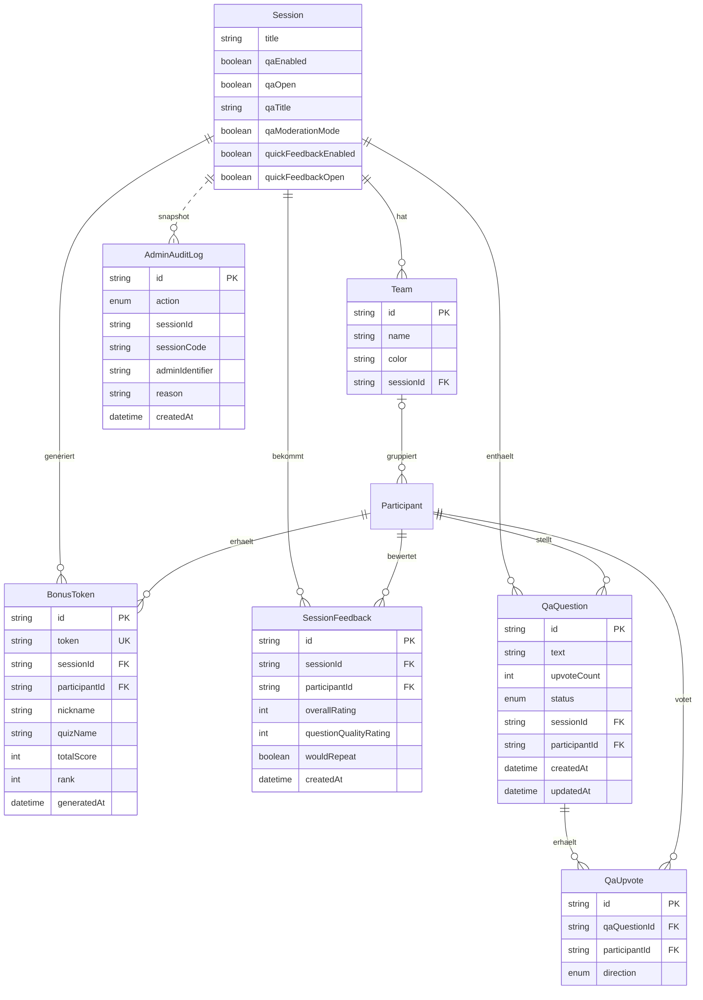
```mermaid
%%{init: {'flowchart': {'nodeSpacing': 48, 'rankSpacing': 72, 'padding': 14}}}%%
erDiagram
    Session ||--o{ Team : hat
    Team |o--o{ Participant : gruppiert
    Session ||--o{ BonusToken : generiert
    Participant ||--o{ BonusToken : erhaelt
    Session ||--o{ SessionFeedback : bekommt
    Participant ||--o{ SessionFeedback : bewertet
    Session ||--o{ QaQuestion : enthaelt
    Participant ||--o{ QaQuestion : stellt
    QaQuestion ||--o{ QaUpvote : erhaelt
    Participant ||--o{ QaUpvote : votet
    Session ||..o{ AdminAuditLog : snapshot

    Team {
        string id PK
        string name
        string color
        string sessionId FK
    }
    BonusToken {
        string id PK
        string token UK
        string sessionId FK
        string participantId FK
        string nickname
        string quizName
        int totalScore
        int rank
        datetime generatedAt
    }
    SessionFeedback {
        string id PK
        string sessionId FK
        string participantId FK
        int overallRating
        int questionQualityRating
        boolean wouldRepeat
        datetime createdAt
    }
    QaQuestion {
        string id PK
        string text
        int upvoteCount
        enum status
        string sessionId FK
        string participantId FK
        datetime createdAt
        datetime updatedAt
    }
    QaUpvote {
        string id PK
        string qaQuestionId FK
        string participantId FK
        enum direction
    }
    AdminAuditLog {
        string id PK
        enum action
        string sessionId
        string sessionCode
        string adminIdentifier
        string reason
        datetime createdAt
    }

    Session {
        string title
        boolean qaEnabled
        boolean qaOpen
        string qaTitle
        boolean qaModerationMode
        boolean quickFeedbackEnabled
        boolean quickFeedbackOpen
    }
```

### 3.3 Plattformdaten und MOTD

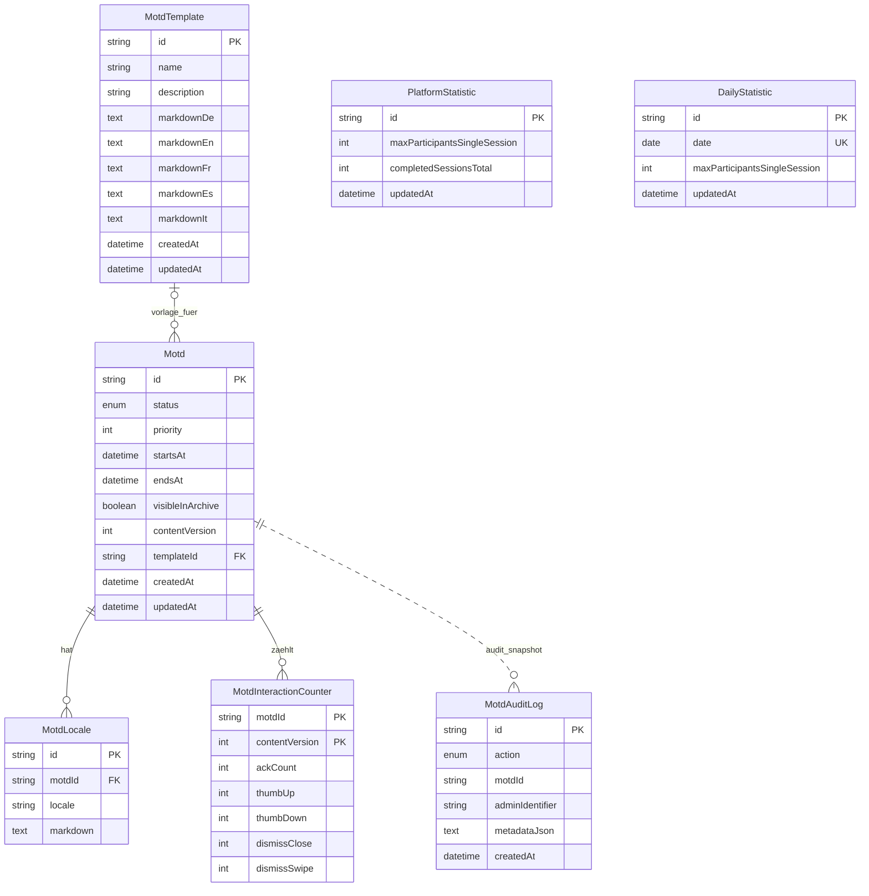
```mermaid
%%{init: {'flowchart': {'nodeSpacing': 48, 'rankSpacing': 72, 'padding': 14}}}%%
erDiagram
    MotdTemplate |o--o{ Motd : vorlage_fuer
    Motd ||--o{ MotdLocale : hat
    Motd ||--o{ MotdInteractionCounter : zaehlt
    Motd ||..o{ MotdAuditLog : audit_snapshot

    PlatformStatistic {
        string id PK
        int maxParticipantsSingleSession
        int completedSessionsTotal
        datetime updatedAt
    }
    DailyStatistic {
        string id PK
        date date UK
        int maxParticipantsSingleSession
        datetime updatedAt
    }
    MotdTemplate {
        string id PK
        string name
        string description
        text markdownDe
        text markdownEn
        text markdownFr
        text markdownEs
        text markdownIt
        datetime createdAt
        datetime updatedAt
    }
    Motd {
        string id PK
        enum status
        int priority
        datetime startsAt
        datetime endsAt
        boolean visibleInArchive
        int contentVersion
        string templateId FK
        datetime createdAt
        datetime updatedAt
    }
    MotdLocale {
        string id PK
        string motdId FK
        string locale
        text markdown
    }
    MotdInteractionCounter {
        string motdId PK
        int contentVersion PK
        int ackCount
        int thumbUp
        int thumbDown
        int dismissClose
        int dismissSwipe
    }
    MotdAuditLog {
        string id PK
        enum action
        string motdId
        string adminIdentifier
        text metadataJson
        datetime createdAt
    }
```

**Hinweis (Data-Stripping):** `AnswerOption.isCorrect` wird im Status ACTIVE niemals an Studenten gesendet; erst nach RESULTS-Auflösung (`QuestionRevealedDTO`). Bei `NUMERIC_ESTIMATE` werden während `ACTIVE` nur neutrale Fortschrittsdaten gezählt; Histogramm, Rohwerte, Statistik, Toleranztreffer und Lösungsnähe werden erst nach Ergebnisfreigabe ausgeliefert.
**Session-Status:** `LOBBY → QUESTION_OPEN` (Lesephase, nur Fragenstamm) → `ACTIVE` → `RESULTS` → `PAUSED` oder `DISCUSSION` → … → `FINISHED`. Optional überspringbar: bei `readingPhaseEnabled=false` geht „Nächste Frage" direkt zu `ACTIVE`.

---

## 4. Kommunikation Dozent-Client ↔ Backend

### 4.1 Vorbereitung und Session-Start

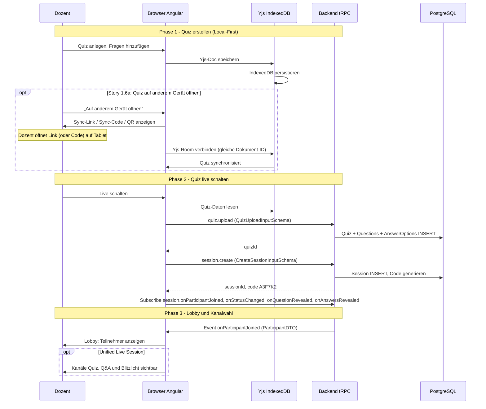
```mermaid
sequenceDiagram
    participant D as Dozent
    participant FE as Browser Angular
    participant YJS as Yjs IndexedDB
    participant BE as Backend tRPC
    participant PG as PostgreSQL

    Note over D,BE: Phase 1 - Quiz erstellen (Local-First)
    D->>FE: Quiz anlegen, Fragen hinzufügen
    FE->>YJS: Yjs-Doc speichern
    YJS->>YJS: IndexedDB persistieren

    opt Story 1.6a: Quiz auf anderem Gerät öffnen
        D->>FE: „Auf anderem Gerät öffnen“
        FE->>D: Sync-Link / Sync-Code / QR anzeigen
        Note over D: Dozent öffnet Link (oder Code) auf Tablet
        FE->>YJS: Yjs-Room verbinden (gleiche Dokument-ID)
        YJS->>FE: Quiz synchronisiert
    end

    Note over D,BE: Phase 2 - Quiz live schalten
    D->>FE: Live schalten
    FE->>YJS: Quiz-Daten lesen
    FE->>BE: quiz.upload (QuizUploadInputSchema)
    BE->>PG: Quiz + Questions + AnswerOptions INSERT
    BE-->>FE: quizId
    FE->>BE: session.create (CreateSessionInputSchema)
    BE->>PG: Session INSERT, Code generieren
    BE-->>FE: sessionId, code A3F7K2
    FE->>BE: Subscribe session.onParticipantJoined, onStatusChanged, onQuestionRevealed, onAnswersRevealed

    Note over D,BE: Phase 3 - Lobby und Kanalwahl
    BE->>FE: Event onParticipantJoined (ParticipantDTO)
    FE->>D: Lobby: Teilnehmer anzeigen
    opt Unified Live Session
        FE->>D: Kanäle Quiz, Q&A und Blitzlicht sichtbar
    end
```

### 4.2 Fragezyklus (Lesephase, ACTIVE, RESULTS)

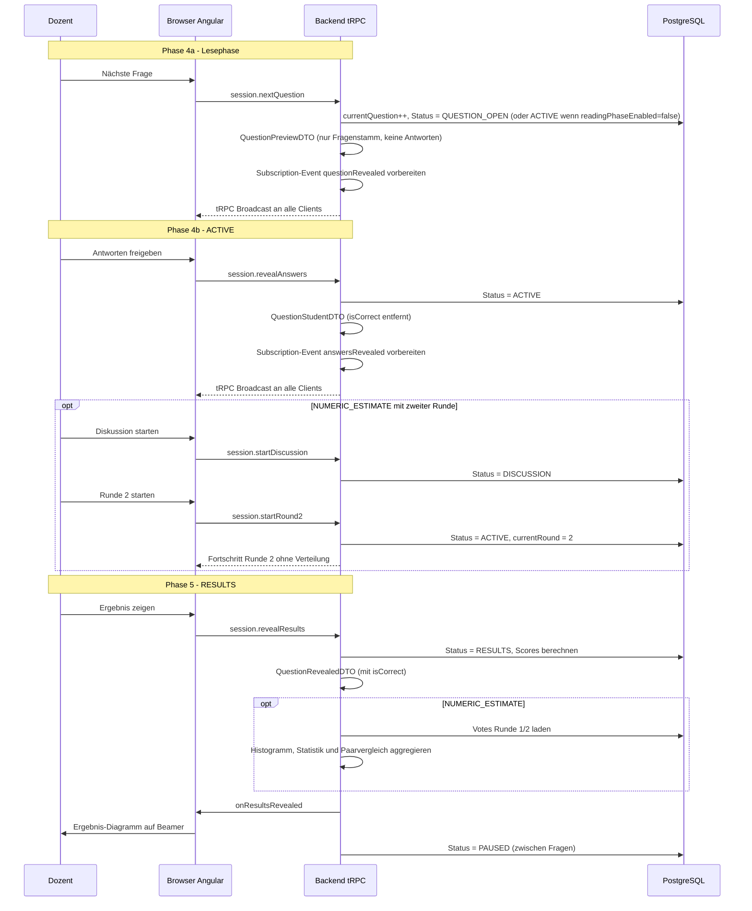
```mermaid
sequenceDiagram
    participant D as Dozent
    participant FE as Browser Angular
    participant BE as Backend tRPC
    participant PG as PostgreSQL

    Note over D,BE: Phase 4a - Lesephase
    D->>FE: Nächste Frage
    FE->>BE: session.nextQuestion
    BE->>PG: currentQuestion++, Status = QUESTION_OPEN (oder ACTIVE wenn readingPhaseEnabled=false)
    BE->>BE: QuestionPreviewDTO (nur Fragenstamm, keine Antworten)
    BE->>BE: Subscription-Event questionRevealed vorbereiten
    BE-->>FE: tRPC Broadcast an alle Clients

    Note over D,BE: Phase 4b - ACTIVE
    D->>FE: Antworten freigeben
    FE->>BE: session.revealAnswers
    BE->>PG: Status = ACTIVE
    BE->>BE: QuestionStudentDTO (isCorrect entfernt)
    BE->>BE: Subscription-Event answersRevealed vorbereiten
    BE-->>FE: tRPC Broadcast an alle Clients

    opt NUMERIC_ESTIMATE mit zweiter Runde
        D->>FE: Diskussion starten
        FE->>BE: session.startDiscussion
        BE->>PG: Status = DISCUSSION
        D->>FE: Runde 2 starten
        FE->>BE: session.startRound2
        BE->>PG: Status = ACTIVE, currentRound = 2
        BE-->>FE: Fortschritt Runde 2 ohne Verteilung
    end

    Note over D,BE: Phase 5 - RESULTS
    D->>FE: Ergebnis zeigen
    FE->>BE: session.revealResults
    BE->>PG: Status = RESULTS, Scores berechnen
    BE->>BE: QuestionRevealedDTO (mit isCorrect)
    opt NUMERIC_ESTIMATE
        BE->>PG: Votes Runde 1/2 laden
        BE->>BE: Histogramm, Statistik und Paarvergleich aggregieren
    end
    BE->>FE: onResultsRevealed
    FE->>D: Ergebnis-Diagramm auf Beamer
    BE->>PG: Status = PAUSED (zwischen Fragen)
```

### 4.3 Session-Ende, Bonus und Export

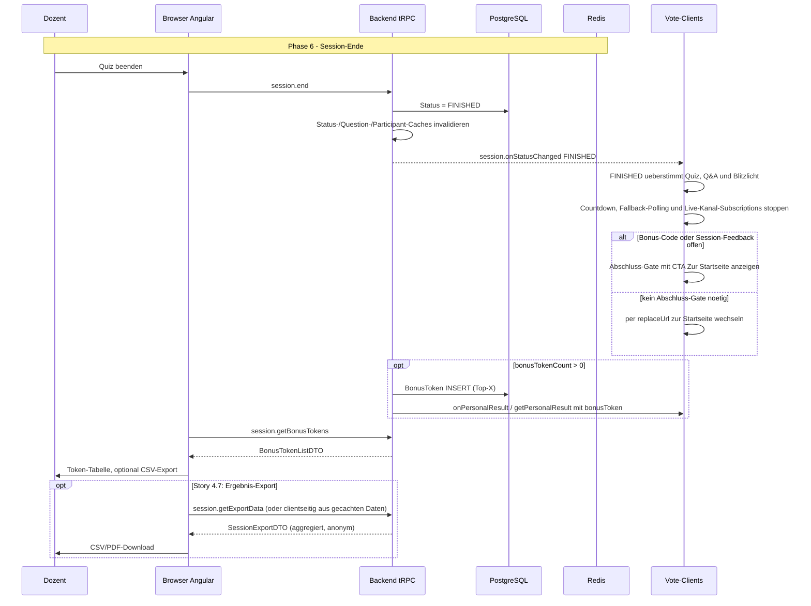
```mermaid
sequenceDiagram
    participant D as Dozent
    participant FE as Browser Angular
    participant BE as Backend tRPC
    participant PG as PostgreSQL
    participant R as Redis
    participant V as Vote-Clients

    Note over D,R: Phase 6 - Session-Ende
    D->>FE: Quiz beenden
    FE->>BE: session.end
    BE->>PG: Status = FINISHED
    BE->>BE: Status-/Question-/Participant-Caches invalidieren
    BE-->>V: session.onStatusChanged FINISHED
    V->>V: FINISHED ueberstimmt Quiz, Q&A und Blitzlicht
    V->>V: Countdown, Fallback-Polling und Live-Kanal-Subscriptions stoppen
    alt Bonus-Code oder Session-Feedback offen
        V->>V: Abschluss-Gate mit CTA Zur Startseite anzeigen
    else kein Abschluss-Gate noetig
        V->>V: per replaceUrl zur Startseite wechseln
    end
    opt bonusTokenCount > 0
        BE->>PG: BonusToken INSERT (Top-X)
        BE->>V: onPersonalResult / getPersonalResult mit bonusToken
    end
    FE->>BE: session.getBonusTokens
    BE-->>FE: BonusTokenListDTO
    FE->>D: Token-Tabelle, optional CSV-Export
    opt Story 4.7: Ergebnis-Export
        FE->>BE: session.getExportData (oder clientseitig aus gecachten Daten)
        BE-->>FE: SessionExportDTO (aggregiert, anonym)
        FE->>D: CSV/PDF-Download
    end
```

---

## 5. Kommunikation Student-Client ↔ Backend

### 5.1 Join und Fragezyklus

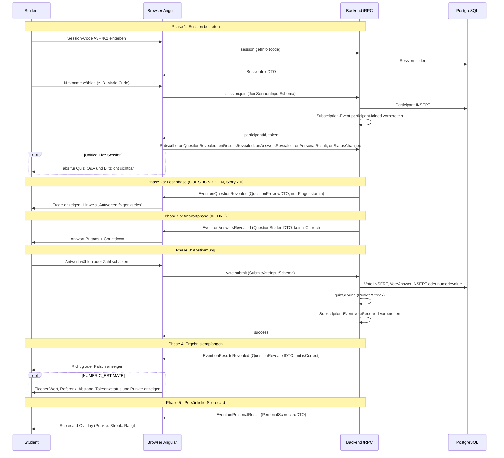
```mermaid
sequenceDiagram
    participant S as Student
    participant FE as Browser Angular
    participant BE as Backend tRPC
    participant PG as PostgreSQL

    Note over S,BE: Phase 1: Session beitreten
    S->>FE: Session-Code A3F7K2 eingeben
    FE->>BE: session.getInfo (code)
    BE->>PG: Session finden
    BE-->>FE: SessionInfoDTO
    S->>FE: Nickname wählen (z. B. Marie Curie)
    FE->>BE: session.join (JoinSessionInputSchema)
    BE->>PG: Participant INSERT
    BE->>BE: Subscription-Event participantJoined vorbereiten
    BE-->>FE: participantId, token
    FE->>BE: Subscribe onQuestionRevealed, onResultsRevealed, onAnswersRevealed, onPersonalResult, onStatusChanged
    opt Unified Live Session
        FE->>S: Tabs für Quiz, Q&A und Blitzlicht sichtbar
    end

    Note over S,BE: Phase 2a: Lesephase (QUESTION_OPEN, Story 2.6)
    BE->>FE: Event onQuestionRevealed (QuestionPreviewDTO, nur Fragenstamm)
    FE->>S: Frage anzeigen, Hinweis „Antworten folgen gleich"

    Note over S,BE: Phase 2b: Antwortphase (ACTIVE)
    BE->>FE: Event onAnswersRevealed (QuestionStudentDTO, kein isCorrect)
    FE->>S: Antwort-Buttons + Countdown

    Note over S,BE: Phase 3: Abstimmung
    S->>FE: Antwort wählen oder Zahl schätzen
    FE->>BE: vote.submit (SubmitVoteInputSchema)
    BE->>PG: Vote INSERT, VoteAnswer INSERT oder numericValue
    BE->>BE: quizScoring (Punkte/Streak)
    BE->>BE: Subscription-Event voteReceived vorbereiten
    BE-->>FE: success

    Note over S,BE: Phase 4: Ergebnis empfangen
    BE->>FE: Event onResultsRevealed (QuestionRevealedDTO, mit isCorrect)
    FE->>S: Richtig oder Falsch anzeigen
    opt NUMERIC_ESTIMATE
        FE->>S: Eigener Wert, Referenz, Abstand, Toleranzstatus und Punkte anzeigen
    end

    Note over S,BE: Phase 5 - Persönliche Scorecard
    BE->>FE: Event onPersonalResult (PersonalScorecardDTO)
    FE->>S: Scorecard Overlay (Punkte, Streak, Rang)
```

### 5.2 Session-Ende, Bonus und Ranking

```mermaid
sequenceDiagram
    participant S as Student
    participant FE as Browser Angular
    participant BE as Backend tRPC

    Note over S,BE: Phase 6 - Session-Ende
    BE->>FE: onStatusChanged FINISHED
    FE->>FE: Aktiven Kanal verlassen (Quiz, Q&A oder Blitzlicht)
    FE->>FE: Countdown, Fallback-Polling, Q&A-Sub und Blitzlicht-Sub stoppen
    opt Top-X
        BE->>FE: onPersonalResult mit bonusToken
        FE->>S: Bonus-Token anzeigen, Kopieren
    end
    opt Bonus-Code oder Session-Feedback offen
        FE->>S: Abschluss-Gate mit CTA Zur Startseite
    else kein Abschluss-Gate noetig
        FE->>S: Startseite per replaceUrl
    end
```

---

## 5b. Kommunikation Admin-Client ↔ Backend (Epic 9)

Admin-Rolle: Inspektion, Löschen, Auszug für Behörden. Autorisierung über Admin-Schlüssel (ADMIN_SECRET), dann Session-Token. Siehe [ADR-0006](../architecture/decisions/0006-roles-routes-authorization-host-admin.md).

### 5b.1 Login und Recherche

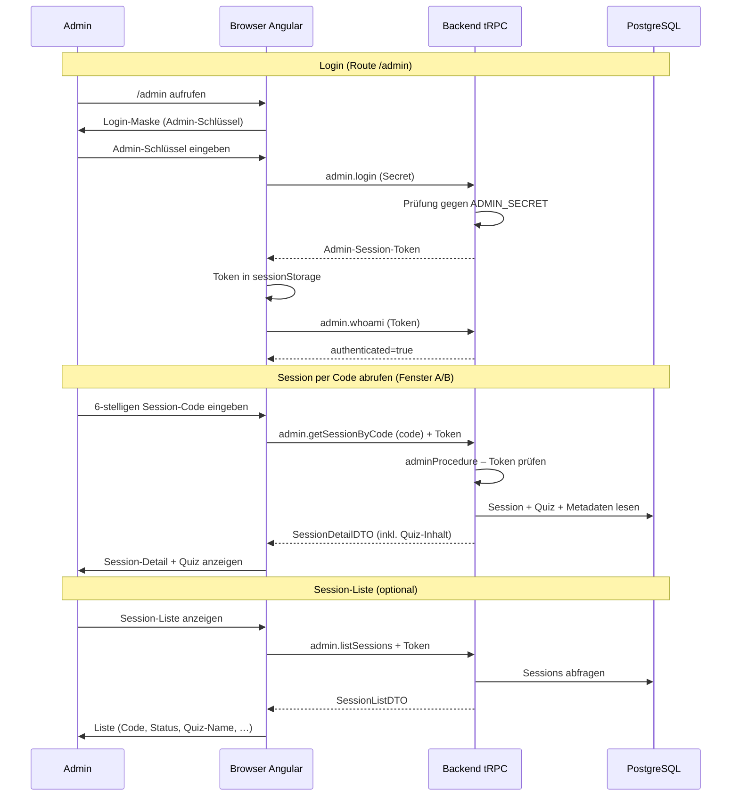
```mermaid
sequenceDiagram
    participant A as Admin
    participant FE as Browser Angular
    participant BE as Backend tRPC
    participant PG as PostgreSQL

    Note over A,PG: Login (Route /admin)
    A->>FE: /admin aufrufen
    FE->>A: Login-Maske (Admin-Schlüssel)
    A->>FE: Admin-Schlüssel eingeben
    FE->>BE: admin.login (Secret)
    BE->>BE: Prüfung gegen ADMIN_SECRET
    BE-->>FE: Admin-Session-Token
    FE->>FE: Token in sessionStorage
    FE->>BE: admin.whoami (Token)
    BE-->>FE: authenticated=true

    Note over A,PG: Session per Code abrufen (Fenster A/B)
    A->>FE: 6-stelligen Session-Code eingeben
    FE->>BE: admin.getSessionByCode (code) + Token
    BE->>BE: adminProcedure – Token prüfen
    BE->>PG: Session + Quiz + Metadaten lesen
    BE-->>FE: SessionDetailDTO (inkl. Quiz-Inhalt)
    FE->>A: Session-Detail + Quiz anzeigen

    Note over A,PG: Session-Liste (optional)
    A->>FE: Session-Liste anzeigen
    FE->>BE: admin.listSessions + Token
    BE->>PG: Sessions abfragen
    BE-->>FE: SessionListDTO
    FE->>A: Liste (Code, Status, Quiz-Name, …)
```

### 5b.2 Rechtsaktionen: Delete und Export

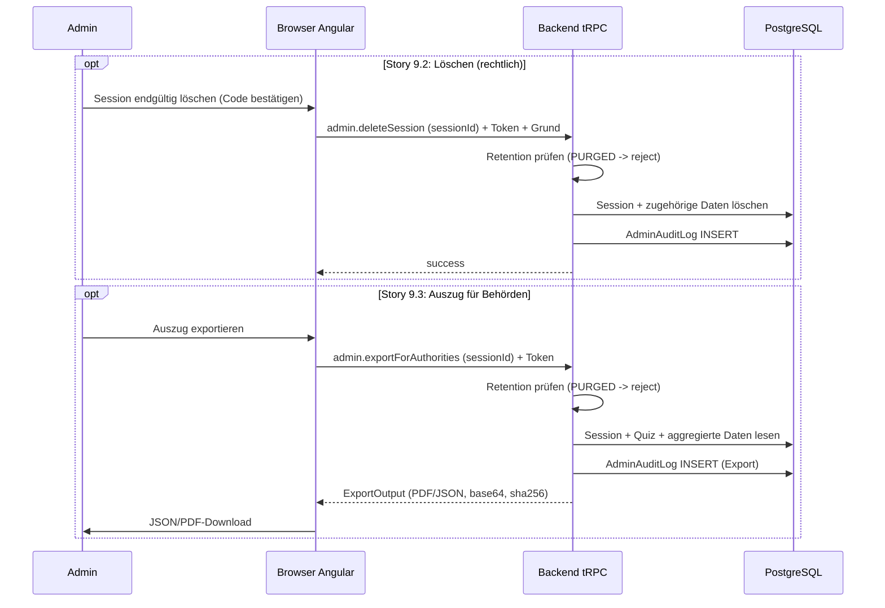
```mermaid
sequenceDiagram
    participant A as Admin
    participant FE as Browser Angular
    participant BE as Backend tRPC
    participant PG as PostgreSQL

    opt Story 9.2: Löschen (rechtlich)
        A->>FE: Session endgültig löschen (Code bestätigen)
        FE->>BE: admin.deleteSession (sessionId) + Token + Grund
        BE->>BE: Retention prüfen (PURGED -> reject)
        BE->>PG: Session + zugehörige Daten löschen
        BE->>PG: AdminAuditLog INSERT
        BE-->>FE: success
    end

    opt Story 9.3: Auszug für Behörden
        A->>FE: Auszug exportieren
        FE->>BE: admin.exportForAuthorities (sessionId) + Token
        BE->>BE: Retention prüfen (PURGED -> reject)
        BE->>PG: Session + Quiz + aggregierte Daten lesen
        BE->>PG: AdminAuditLog INSERT (Export)
        BE-->>FE: ExportOutput (PDF/JSON, base64, sha256)
        FE->>A: JSON/PDF-Download
    end
```

---

## 6. Aktivitätsablauf: Dozent · Student · Server · Admin

### 6.1 Quiz-Lifecycle (Dozent, Student, Server)

```mermaid
%%{init: {'flowchart': {'curve': 'basis', 'nodeSpacing': 64, 'rankSpacing': 96, 'padding': 20}}}%%
flowchart LR
    subgraph Dozent["Dozent"]
        D1[Quiz erstellen - Yjs IndexedDB]
        D1a[Sync-Link/Room-ID für anderes Gerät anzeigen - Story 1.6a]
        D2[Quiz-Preview - Validierung]
        D3[Live schalten - Session erstellen]
        D4[Session-Code + QR anzeigen]
        D5[Nächste Frage klicken]
        D5b[Antworten freigeben - optional bei Lesephase]
        D6[Ergebnis zeigen]
        D7[Live-Balken aktualisieren]
        D8[Quiz beenden]
        D9[Leaderboard + ggf. Bonus-Token-Tabelle]
    end

    subgraph Server["Server"]
        S1["Quiz-Upload validieren, in PG speichern"]
        S2["Session anlegen, Code generieren"]
        S3a["Status QUESTION_OPEN, QuestionPreviewDTO - Lesephase"]
        S3b["Status ACTIVE, QuestionStudentDTO ohne isCorrect"]
        S4["Vote speichern, Scoring, voteCountUpdate"]
        S4n["NUMERIC_ESTIMATE ACTIVE: nur Fortschritt, keine Verteilung"]
        S5["Status RESULTS, QuestionRevealedDTO mit isCorrect"]
        S5n["NUMERIC_ESTIMATE RESULTS: Histogramm, Statistik, Paarvergleich"]
        S5b["Status PAUSED - zwischen Fragen"]
        S6["Status FINISHED, ggf. BonusToken generieren"]
    end

    subgraph Student["Student"]
        ST1["Code eingeben, session.getInfo"]
        ST2["Nickname wählen, session.join"]
        ST3a[Fragenstamm anzeigen - Lesephase]
        ST3b[Antwort-Buttons + Countdown anzeigen]
        ST4[Abstimmung vote.submit]
        ST4n[Zahl schätzen - numericValue]
        ST5[Ergebnis + Scorecard anzeigen]
        ST6["Finales Ranking, ggf. Bonus-Token kopieren"]
    end

    D1 --> D1a
    D1a --> D2 --> D3
    D3 --> S1 --> S2
    S2 --> D4
    D4 --> ST1 --> ST2
    ST2 --> D5
    D5 --> S3a
    D5 -.->|readingPhaseEnabled=false| S3b
    S3a --> ST3a
    ST3a --> D5b
    D5b --> S3b
    S3b --> ST3b --> ST4
    ST3b --> ST4n
    ST4 --> S4
    ST4n --> S4n --> S4
    S4 --> D7
    D7 --> D6
    D6 --> S5
    S5 --> S5n
    S5n --> ST5
    S5 --> ST5
    ST5 --> S5b
    S5b --> D5
    D8 --> S6
    S6 --> ST6
    ST6 --> D9
```

### 6.2 Admin-Lifecycle (Epic 9)

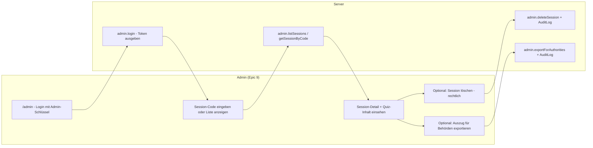
```mermaid
%%{init: {'flowchart': {'curve': 'basis', 'nodeSpacing': 64, 'rankSpacing': 96, 'padding': 20}}}%%
flowchart LR
    subgraph Admin["Admin (Epic 9)"]
        A1["/admin - Login mit Admin-Schlüssel"]
        A2[Session-Code eingeben oder Liste anzeigen]
        A3[Session-Detail + Quiz-Inhalt einsehen]
        A4[Optional: Session löschen - rechtlich]
        A5[Optional: Auszug für Behörden exportieren]
    end

    subgraph Server["Server"]
        S7["admin.login - Token ausgeben"]
        S8["admin.listSessions / getSessionByCode"]
        S9["admin.deleteSession + AuditLog"]
        S10["admin.exportForAuthorities + AuditLog"]
    end

    A1 --> S7
    S7 --> A2 --> S8 --> A3
    A3 --> A4
    A4 --> S9
    A3 --> A5
    A5 --> S10
```

**Legende:**

- **QuestionPreviewDTO (Story 2.6):** In der Lesephase (`QUESTION_OPEN`) nur Fragenstamm, keine Antwortoptionen.
- **QuestionStudentDTO:** `isCorrect` wird serverseitig entfernt (Story 2.4).
- **QuestionRevealedDTO:** `isCorrect` erst nach expliziter Auflösung (`RESULTS`).
- **PAUSED:** Zwischenzustand nach Ergebnis-Anzeige, bevor die nächste Frage gestartet wird.
- **Lesephase:** Bei `readingPhaseEnabled=false` wird `QUESTION_OPEN` übersprungen — „Nächste Frage" wechselt direkt zu `ACTIVE` (D5 → S3b, D5b/ST3a entfallen).
- **Bonus-Token (Story 4.6):** Nur für Top-X, individuell per `onPersonalResult`.
- **Admin (Epic 9):** Eigener Ablauf; Zugriff nur mit Admin-Credentials (ADMIN_SECRET → Session-Token). Route `/admin`; Inspektion, Löschen, Auszug für Behörden; Audit-Log für Lösch- und Export-Aktionen. Siehe ADR-0006.

### 6.3 Blitzlicht-Lifecycle (Startseite oder Session-Kanal)

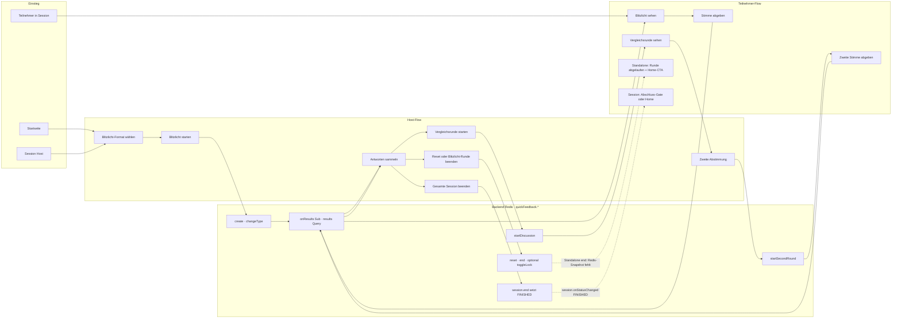
```mermaid
%%{init: {'flowchart': {'curve': 'basis', 'nodeSpacing': 64, 'rankSpacing': 96, 'padding': 20}}}%%
flowchart LR
    subgraph Einstieg["Einstieg"]
        H1[Startseite]
        H2[Session Host]
        H3[Teilnehmer in Session]
    end

    subgraph Host["Host-Flow"]
        F1[Blitzlicht-Format wählen]
        F2[Blitzlicht starten]
        F3[Antworten sammeln]
        F4[Vergleichsrunde starten]
        F5[Zweite Abstimmung]
        F6[Reset oder Blitzlicht-Runde beenden]
        F7[Gesamte Session beenden]
    end

    subgraph Backend["Backend Redis · quickFeedback.*"]
        B1[create · changeType]
        B2[onResults Sub · results Query]
        B3[startDiscussion]
        B4[startSecondRound]
        B5[reset · end · optional toggleLock]
        B6[session.end setzt FINISHED]
    end

    subgraph Vote["Teilnehmer-Flow"]
        V1[Blitzlicht sehen]
        V2[Stimme abgeben]
        V3[Vergleichsrunde sehen]
        V4[Zweite Stimme abgeben]
        V5[Standalone: Runde abgelaufen + Home-CTA]
        V6[Session: Abschluss-Gate oder Home]
    end

    H1 --> F1
    H2 --> F1
    H3 --> V1

    F1 --> F2 --> B1 --> B2
    B2 --> V1
    V1 --> V2 --> B2 --> F3
    F3 --> F4 --> B3 --> V3
    V3 --> F5
    F5 --> B4 --> V4
    V4 --> B2 --> F3
    F3 --> F6 --> B5
    B5 -.->|Standalone end: Redis-Snapshot fehlt| V5
    F3 --> F7 --> B6
    B6 -.->|session.onStatusChanged FINISHED| V6
```

**Hinweis:** Standalone-Blitzlicht (`/feedback/:code`, `/feedback/:code/vote`) und Blitzlicht im Session-Kanal teilen sich denselben Fachkern. Unterschiedlich ist der Endpfad: `quickFeedback.end` loescht die Redis-Runde und der Standalone-Vote zeigt den abgelaufen/geschlossen-Zustand mit Home-CTA; `session.end` setzt dagegen die gesamte Session auf `FINISHED`, der Session-Vote verlaesst jeden aktiven Kanal und stoppt Q&A-/Blitzlicht-Subscriptions. **Technische Procedure-Namen und Tabelle:** [blitzlicht-quickfeedback-api.md](../features/blitzlicht-quickfeedback-api.md). Produktbegriffe (z. B. „Vergleichsrunde“) siehe [ADR-0010](../architecture/decisions/0010-blitzlicht-as-core-live-mode.md) und [BLITZLICHT-GUIDELINES.md](../ui/BLITZLICHT-GUIDELINES.md).
