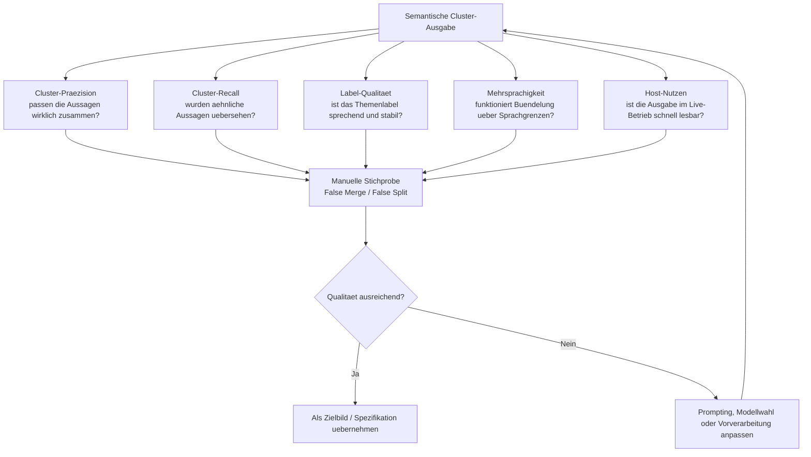

# Dritter Kurs: Data Analytics und NLP (nicht zwingend parallel)

> **Kurs 3** vertieft **NLP und Auswertelogik** rund um den didaktischen Moderationskompass: erklärbare Baselines, semantisches Bündeln von Freitext, optionale Q&A-Klassifikation und später ggf. quellengebundene Zusammenfassungen. Im aktuellen Repo existiert dafür bereits ein deterministischer `wordCloudRouter` mit `wordCloudAnalysis` als erklärbare Baseline; der Kurs kann diese Baseline evaluieren oder in Richtung Embeddings, SetFit/klassische Klassifikation und optional on-prem LLM erweitern. Der Kurs muss **nicht** parallel zu Kurs 1 (Entwicklung) und Kurs 2 (SQM) laufen — er eignet sich z. B. als **folgender** oder **eigenständiger** Block, sobald Produktkontext, [ADR-0032](../architecture/decisions/0032-optional-nlp-cascade-for-qa-moderation-signals.md) und Begriffe aus [`BEGRIFFE-FREITEXT-UND-SEMANTIK.md`](../praktikum/BEGRIFFE-FREITEXT-UND-SEMANTIK.md) bekannt sind.

### Ausführliche Praktikumsbeschreibung (studierendenfreundlich)

**→ [`docs/praktikum/PRAKTIKUM-DATA-ANALYTICS.md`](../praktikum/PRAKTIKUM-DATA-ANALYTICS.md)**

---

## Kurzmodell

| Aspekt           | Inhalt                                                                                                                                                                                                                                                           |
| ---------------- | ---------------------------------------------------------------------------------------------------------------------------------------------------------------------------------------------------------------------------------------------------------------- |
| **Produktbezug** | Gleiche Codebasis **arsnova.eu**; Fokus auf **Daten- und Sprachpipeline** für Freitext/Q&A (Host-Auswertung), nicht auf komplette Feature-Implementierung im Monorepo — es sei denn, die Betreuung koppelt explizit an Kurs 1.                                   |
| **Schwerpunkt**  | **Modellvergleich und Evaluation** entlang der Storys **8.9a–8.9c**: deterministische Baseline, klassische NLP-/Klassifikationsansätze, mehrsprachige Encoder/Embeddings und optional lokale generative Zusammenfassung.                                         |
| **Synergie**     | Optional: Ergebnisse (Evaluationsprotokoll, JSON-Schema-Vorschläge, Modell-/Prompt-Bibliothek) können **Kurs 1** als Spezifikation dienen; **Kurs 2** kann Qualitätskriterien und Nachvollziehbarkeit der Evaluierung prüfen — **kein** Muss für den Kursablauf. |

## Zielbild: Semantische Cluster statt Tokenwolke

Die Kurs-3-Perspektive verschiebt den Fokus von einer rein lexikalischen Wortwolke hin zu einer semantischen Begriffwolke: gleiche oder ähnliche Aussagen sollen zu stabilen Themenclustern zusammengeführt, sprechend gelabelt und für Hosts nachvollziehbar aufbereitet werden.

```mermaid
%%{init: {'flowchart': {'curve': 'basis', 'nodeSpacing': 58, 'rankSpacing': 86, 'padding': 18}}}%%
flowchart LR
	subgraph Input[Freitext-Eingaben]
		QA[Q&A-Fragen]
		FT[Quiz-Freitextantworten]
	end

	PRE[Vorverarbeitung<br/>Sprache erkennen<br/>Unicode + Tokenisierung<br/>Stopwoerter + Normalisierung]
	ROUTER[wordCloudRouter<br/>AnalyzeWordCloudInput/Output]
	BASE[Repo-Baseline<br/>deterministische wordCloudAnalysis<br/>lexikalisch + Themenanker]
	EXT[Optionale Kurs-3-Erweiterung<br/>Lemma / POS / spaCy]
	SEM[Semantische Analyse<br/>Embeddings / SetFit / optional on-prem LLM<br/>Aehnlichkeiten und Paraphrasen]
	CLUSTER[Clusterbildung<br/>Synonyme · Varianten<br/>aehnliche Aussagen]
	LABEL[Themenlabeling<br/>sprechende Begriffe statt Tokens]
	VIEW[Host-Ausgabe<br/>semantische Begriffwolke<br/>Themenkarten + Drill-down]
	EVAL[Evaluation<br/>Qualitaetskriterien<br/>Nachvollziehbarkeit + Vergleich]

	QA --> PRE
	FT --> PRE
	PRE --> ROUTER
	ROUTER --> BASE
	BASE --> EXT
	EXT --> SEM
	ROUTER --> SEM
	BASE --> CLUSTER
	SEM --> CLUSTER
	CLUSTER --> LABEL
	LABEL --> VIEW
	CLUSTER --> EVAL
	LABEL --> EVAL
	VIEW --> EVAL
```

Die Zielbild-Screenshots im Screenshot-Ordner illustrieren genau diesen Soll-Zustand:

- [Q&A-Zielbild](../screenshots/QA-Semantische-Begriffwolke-Zielbild.png) zeigt thematische Inseln wie Deskriptive Statistik, Zusammenhaenge und Praxisbezug statt einzelner Fragewoerter.
- [Quiz-Freitext-Zielbild](../screenshots/Quiz-Freitext-Semantische-Begriffwolke-Zielbild.png) zeigt gebuendelte Bedeutungsraeume fuer Interpretation, Validierung und Lerntransfer.
- [Screenshot-README](../screenshots/README.md) dokumentiert alle Vergleichsbilder zwischen heutigem lexikalischem Stand und semantischem Zielbild.

Didaktisch ist diese Skizze fuer Kurs 3 nuetzlich, weil sie drei getrennte Arbeitsstraenge sichtbar macht:

- Baseline und Vorverarbeitung: Was kann klassisches NLP ohne LLM bereits belastbar leisten?
- Semantik und Clusterbildung: Wo beginnt echter Mehrwert durch Embeddings, SetFit, klassische Klassifikation oder selbst gehostete Sprachmodelle?
- Evaluation und Host-Nutzen: Welche Cluster sind stabil, erklaerbar und im Live-Betrieb wirklich hilfreich?

## Evaluationssicht: Wann ist ein Cluster wirklich gut?

Neben der Architektur der Pipeline braucht Kurs 3 auch ein gemeinsames Raster fuer die Beurteilung der Clusterqualitaet. Die Bewertungslogik muss sowohl technische Qualitaet als auch didaktischen Nutzen fuer Hosts erfassen.

Fuer die Lehre ist diese zweite Skizze wichtig, weil sie den Unterschied zwischen einem beeindruckenden Demo-Bild und einer belastbaren Auswertelogik sichtbar macht:

- Gute Cluster brauchen nicht nur semantische Aehnlichkeit, sondern auch nachvollziehbare Themenlabels.
- Ein scheinbar schoenes Ergebnis kann didaktisch scheitern, wenn Hosts zu viele False Merges oder zu vage Label sehen.
- Die Rueckkopplung auf Prompting, Modellwahl und Vorverarbeitung macht Evaluation zu einem eigenen Lernziel und nicht nur zu einem Endtest.

Die Synergie von Kurs 1 und 2 bleibt in [`zweiter-kurs-und-agentische-ki.md`](./zweiter-kurs-und-agentische-ki.md) beschrieben; Kurs 3 ergänzt das Modell **optional** inhaltlich, ohne denselben Parallelrhythmus zu erzwingen.
