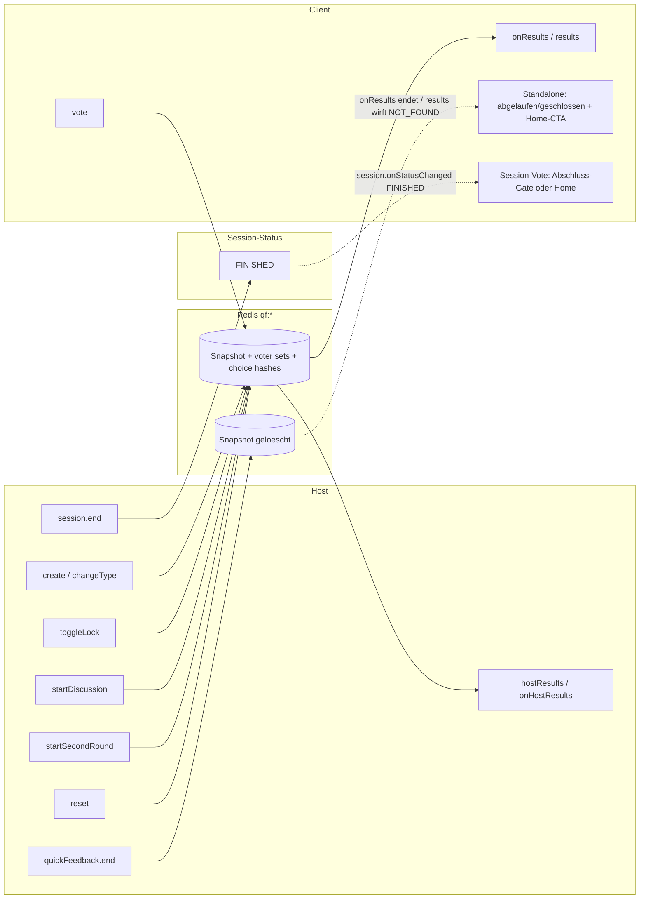

# Blitzlicht · tRPC `quickFeedback` (API-Referenz)

> **Zielgruppe:** Entwickler  
> **Stand:** 2026-06-06 · Abgleich mit `apps/backend/src/routers/quickFeedback.ts`

In der **UI** heißt der Modus **Blitzlicht** ([ADR-0010](../architecture/decisions/0010-blitzlicht-as-core-live-mode.md), [BLITZLICHT-GUIDELINES](../ui/BLITZLICHT-GUIDELINES.md)). Technisch liegt die Domäne im tRPC-Router **`quickFeedback`** (kein Prisma; Zustand in **Redis**, TTL ca. 30 Min.).

---

## Einbettung in Sessions

- Feld **`Session.quickFeedbackEnabled`**: Blitzlicht-Kanal für dieselbe Session ([ADR-0009](../architecture/decisions/0009-unified-live-session-channels.md)).
- **`quickFeedback.create`** mit `sessionCode`: Backend prüft, ob die Session existiert und Blitzlicht aktiviert ist (`assertSessionQuickFeedbackEnabled`).
- **Standalone** (Startseite): `create` ohne Session-Code erzeugt einen neuen 6-stelligen Code und schreibt nur Redis-Keys.
- **Create-Limits:** Standalone-Create nutzt großzügige kombinierte Global-/Shared-NAT-Budgets. Der IP-Key stammt nur aus Express' gemäß `TRUST_PROXY_HOPS` berechnetem `req.ip`, nicht aus rohen Proxy-Headern. Session-Create wird nach erfolgreicher Host-Prüfung pro Session begrenzt (120/Minute im Standardprofil), niemals eng pro Hörsaal-IP.
- **Session-Ende:** `session.end` ist nicht `quickFeedback.end`. Die Session setzt `FINISHED` und der Session-Vote verlaesst jeden aktiven Kanal; `quickFeedback.end` beendet nur die Redis-Runde zum Code.

## Autorisierung

- **Session-gebundenes Blitzlicht:** host-only Mutationen erwarten das normale Session-Host-Token über `x-host-token`.
- **Standalone-Blitzlicht:** host-only Mutationen erwarten ein eigenes **Feedback-Host-Token** über `x-feedback-host-token`.
- **Teilnehmendenpfad:** `/feedback/:code/vote` bleibt ohne Host-Token nutzbar; geschützt werden nur host-only Aktionen wie `changeType`, `toggleLock`, `reset`, `end` oder `startSecondRound`.
- Die Architektur dazu ist in [ADR-0019](../architecture/decisions/0019-host-hardening-and-owner-bound-session-access.md) festgehalten.

---

## Procedures (`quickFeedback.*`)

| Procedure          | Art          | Kurzbeschreibung                                                                                                                                             |
| ------------------ | ------------ | ------------------------------------------------------------------------------------------------------------------------------------------------------------ |
| `create`           | Mutation     | Neue Runde; optional `sessionCode` für eingebettetes Blitzlicht                                                                                              |
| `changeType`       | Mutation     | Formatwechsel im laufenden Code-Kontext; setzt Verteilung/Zähler zurück                                                                                      |
| `reset`            | Mutation     | Stimmen und Runden-Metadaten zurücksetzen, Format bleibt                                                                                                     |
| `end`              | Mutation     | Redis-Keys zum Code entfernen (Standalone-/Blitzlicht-Runde beenden; nicht identisch mit `session.end`)                                                      |
| `toggleLock`       | Mutation     | Abstimmung sperren / entsperren (`locked`)                                                                                                                   |
| `startDiscussion`  | Mutation     | Runde 1 einfrieren (API-Name „Discussion“); UI: **Vergleichsrunde** vorbereiten ([ADR-0010](../architecture/decisions/0010-blitzlicht-as-core-live-mode.md)) |
| `startSecondRound` | Mutation     | Zweite Abstimmung öffnen (`currentRound = 2`)                                                                                                                |
| `isActive`         | Query        | Prüft, ob zum Code ein aktiver Redis-Snapshot existiert                                                                                                      |
| `vote`             | Mutation     | Teilnehmer-Stimme (`voterId`, `value`); klassische Formate einmal pro Runde, `TEMPO` mutable mit Wechsel und Re-Tap-Entfernen                                |
| `results`          | Query        | Aktueller `QuickFeedbackResult` inkl. berechneter Verschiebung (Runde 2) und optionaler `tempoTrend`                                                         |
| `hostResults`      | Query        | Host-Snapshot mit Host-Autorisierung                                                                                                                         |
| `onResults`        | Subscription | Pollt Redis und liefert bei Änderung neuen Snapshot; endet, wenn Redis-Snapshot fehlt oder ein Session-Kanal geschlossen ist                                 |
| `onHostResults`    | Subscription | Host-Subscription mit Host-Autorisierung                                                                                                                     |

Eingaben/Ausgaben: Zod-Schemas in `@arsnova/shared-types` (z. B. `QuickFeedbackVoteInputSchema`, `QuickFeedbackResultSchema`).
Aktuelle Formate: `MOOD`, `YESNO`, `YESNO_BINARY`, `TRUEFALSE_UNKNOWN`, `STARS`, `ABCD`, `TEMPO`.

**Abgrenzung zu UI-Presets:** Blitzlicht-Ergebnisse enthalten kein globales UI-Theme und kein UI-Preset. Host-, Vote- und Present-Clients behalten ihre lokalen Browserwerte aus `ThemePresetService`; das gilt sowohl für `/session/:code/vote` als auch für `/feedback/:code/vote`.

`TEMPO` nutzt eigene Werte (`SPEED_UP`, `FOLLOWING`, `SLOW_DOWN`, `LOST`) und erweitert `QuickFeedbackResult` um `tempoTrend`. Diese Tendenz enthaelt u. a. `activeParticipants`, `tempoVotes`, `requiredVotes`, `windowSeconds` und `bucketSeconds`; die UI benennt die Host-Kennzahlen als `Online` und `Rueckmeldungen`.

---

## Tempo-Sondersemantik

Tempo ist nach [ADR-0029](../architecture/decisions/0029-tempo-as-predefined-blitzlicht-template.md) ein Blitzlicht-Template, kein vierter Session-Kanal.

- `SessionLiveChannelSchema` bleibt bei `quiz | qa | quickFeedback`.
- `quickFeedback.vote` verzweigt fuer `TEMPO` auf ein Redis-Lua-Skript.
- Pro teilnehmender Person wird der aktuelle Zustand in `qf:choices:<CODE>` gehalten.
- Distribution, `totalVotes` und `qf:tempo:buckets:<CODE>` werden in derselben Redis-Mutation aktualisiert.
- Ein Re-Tap auf die aktive Tempo-Option entfernt die Auswahl.
- Klassische Blitzlicht-Typen bleiben bei ihrer Einmal-Vote-Regel.
- Es gibt keinen PostgreSQL-Schreibpfad pro Tempo-Tap und keinen `tempoRouter`.

---

## Ablauf (Host · Teilnehmer · Redis)

Standalone-Vote erkennt eine beendete Runde ueber `onResults`/`results` und zeigt den Fehlerzustand mit `Zur Startseite`. Eingebettete Session-Votes folgen dagegen dem Session-Status: Bei `FINISHED` wird Blitzlicht wie Q&A und Quiz verlassen; Q&A-/Blitzlicht-Subscriptions werden clientseitig gestoppt.

---

## Referenzen im Code

| Bereich              | Pfad                                                                                                    |
| -------------------- | ------------------------------------------------------------------------------------------------------- |
| Router               | `apps/backend/src/routers/quickFeedback.ts`                                                             |
| Registrierung        | `apps/backend/src/routers/index.ts` → `quickFeedback: quickFeedbackRouter`                              |
| Tempo-Tendenz        | `apps/backend/src/lib/quickFeedbackTempo.ts` · [tempo-tendenzberechnung.md](tempo-tendenzberechnung.md) |
| Host-UI              | `apps/frontend/src/app/features/feedback/feedback-host.component.*`                                     |
| Vote-UI              | `apps/frontend/src/app/features/feedback/feedback-vote.component.*`                                     |
| Startseiten-Shortcut | `apps/frontend/src/app/features/home/` (Blitzlicht-Chips)                                               |
