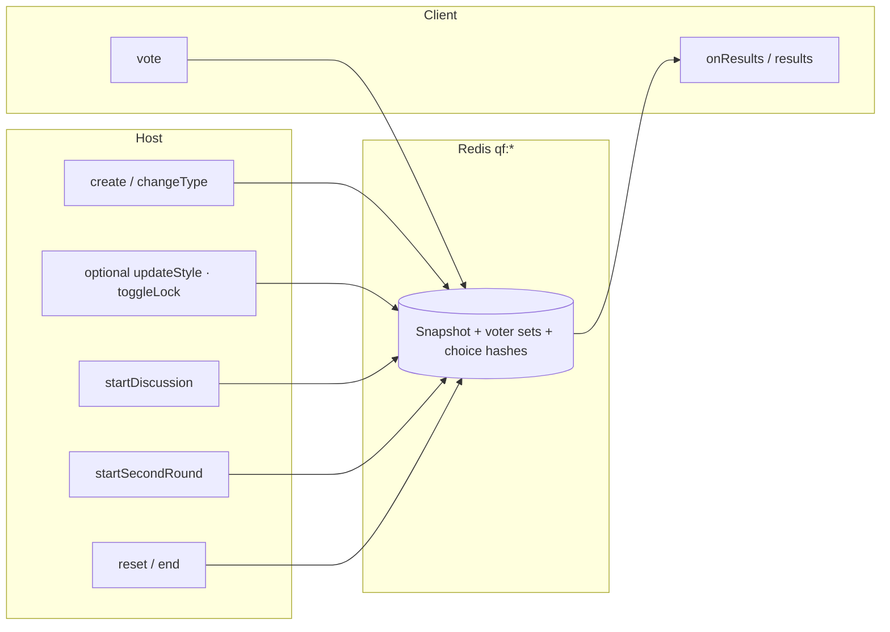

# Blitzlicht · tRPC `quickFeedback` (API-Referenz)

> **Zielgruppe:** Entwickler  
> **Stand:** 2026-04-01 · Abgleich mit `apps/backend/src/routers/quickFeedback.ts`

In der **UI** heißt der Modus **Blitzlicht** ([ADR-0010](../architecture/decisions/0010-blitzlicht-as-core-live-mode.md), [BLITZLICHT-GUIDELINES](../ui/BLITZLICHT-GUIDELINES.md)). Technisch liegt die Domäne im tRPC-Router **`quickFeedback`** (kein Prisma; Zustand in **Redis**, TTL ca. 30 Min.).

---

## Einbettung in Sessions

- Feld **`Session.quickFeedbackEnabled`**: Blitzlicht-Kanal für dieselbe Session ([ADR-0009](../architecture/decisions/0009-unified-live-session-channels.md)).
- **`quickFeedback.create`** mit `sessionCode`: Backend prüft, ob die Session existiert und Blitzlicht aktiviert ist (`assertSessionQuickFeedbackEnabled`).
- **Standalone** (Startseite): `create` ohne Session-Code erzeugt einen neuen 6-stelligen Code und schreibt nur Redis-Keys.

---

## Procedures (`quickFeedback.*`)

| Procedure          | Art          | Kurzbeschreibung                                                                                                                                             |
| ------------------ | ------------ | ------------------------------------------------------------------------------------------------------------------------------------------------------------ |
| `create`           | Mutation     | Neue Runde; optional `sessionCode` für eingebettetes Blitzlicht                                                                                              |
| `changeType`       | Mutation     | Formatwechsel im laufenden Code-Kontext; setzt Verteilung/Zähler zurück                                                                                      |
| `updateStyle`      | Mutation     | `theme` / `preset` anpassen                                                                                                                                  |
| `reset`            | Mutation     | Stimmen und Runden-Metadaten zurücksetzen, Format bleibt                                                                                                     |
| `end`              | Mutation     | Redis-Keys zur Session-Code entfernen (Runde beenden)                                                                                                        |
| `toggleLock`       | Mutation     | Abstimmung sperren / entsperren (`locked`)                                                                                                                   |
| `startDiscussion`  | Mutation     | Runde 1 einfrieren (API-Name „Discussion“); UI: **Vergleichsrunde** vorbereiten ([ADR-0010](../architecture/decisions/0010-blitzlicht-as-core-live-mode.md)) |
| `startSecondRound` | Mutation     | Zweite Abstimmung öffnen (`currentRound = 2`)                                                                                                                |
| `vote`             | Mutation     | Teilnehmer-Stimme (`voterId`, `value`); einmal pro Runde                                                                                                     |
| `results`          | Query        | Aktueller `QuickFeedbackResult` inkl. berechneter Verschiebung (Runde 2)                                                                                     |
| `onResults`        | Subscription | Pollt Redis und liefert bei Änderung neuen Snapshot (aktives vs. idle Intervall)                                                                             |

Eingaben/Ausgaben: Zod-Schemas in `@arsnova/shared-types` (z. B. `QuickFeedbackVoteInputSchema`, `QuickFeedbackResultSchema`).

---

## Ablauf (Host · Teilnehmer · Redis)

---

## Referenzen im Code

| Bereich              | Pfad                                                                       |
| -------------------- | -------------------------------------------------------------------------- |
| Router               | `apps/backend/src/routers/quickFeedback.ts`                                |
| Registrierung        | `apps/backend/src/routers/index.ts` → `quickFeedback: quickFeedbackRouter` |
| Host-UI              | `apps/frontend/src/app/features/session/feedback-host/`                    |
| Vote-UI              | `apps/frontend/src/app/features/session/feedback-vote/`                    |
| Startseiten-Shortcut | `apps/frontend/src/app/features/home/` (Blitzlicht-Chips)                  |
