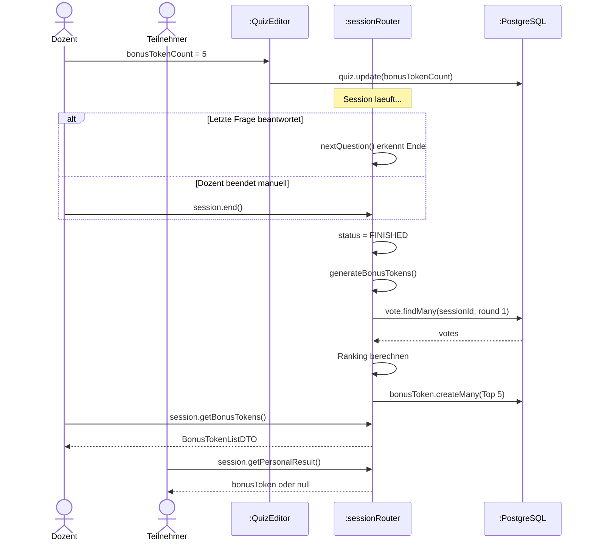
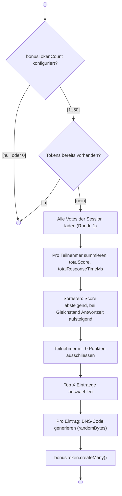
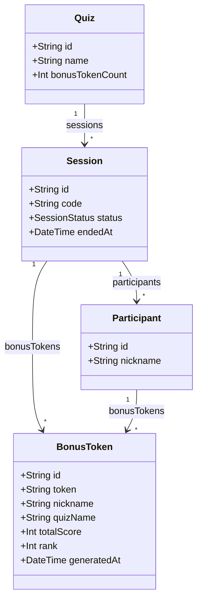
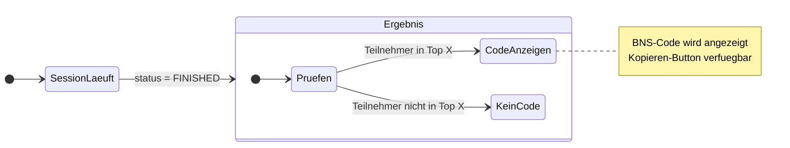
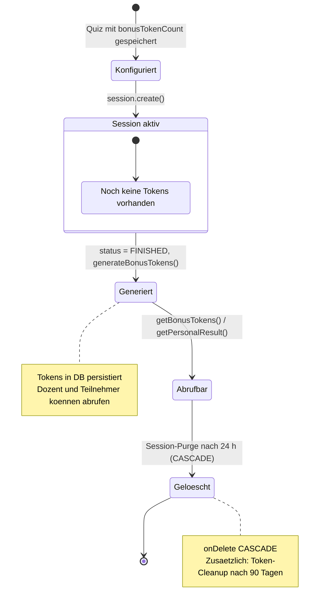
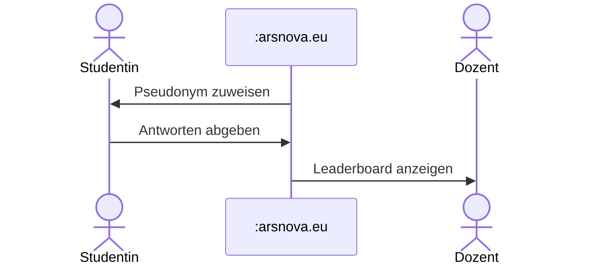
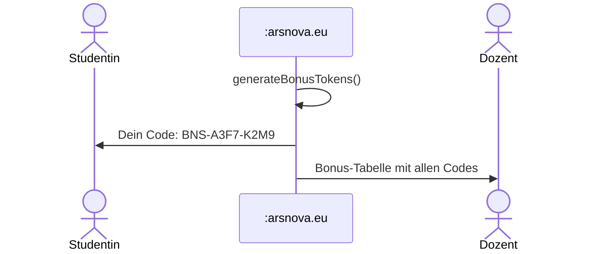
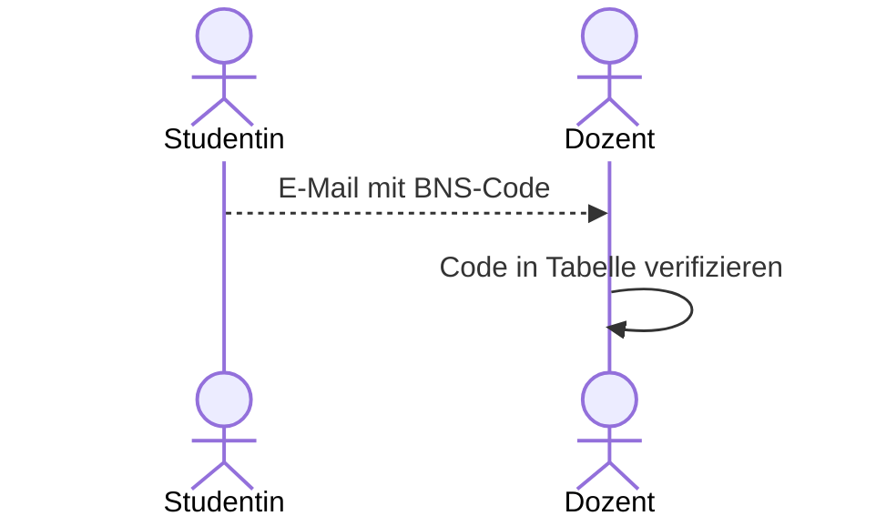

# Bonus-Codes (Story 4.6)

> **Zielgruppe:** Product Owner, Entwickler

## Konzept

Dozenten koennen fuer ein Quiz festlegen, dass die **besten Teilnehmenden automatisch
einen Bonus-Code** erhalten. Der Code wird nach Session-Ende generiert und ist ein
kryptografisch sicherer Token im Format `BNS-XXXX-XXXX`.

Studierende koennen den Code **freiwillig per E-Mail** beim Dozenten einreichen, um
Bonuspunkte zu erhalten. Solange sie das nicht tun, bleibt ihre Identitaet gewahrt
(**Zero-Knowledge-Prinzip**).

---

## Konfiguration

| Parameter          | Feld              | Wertebereich | Standard             |
| ------------------ | ----------------- | ------------ | -------------------- |
| Anzahl Bonus-Codes | `bonusTokenCount` | 1 – 50       | `null` (deaktiviert) |

Der Dozent legt im **Quiz-Editor** fest, wie viele Top-Plaetze einen Code erhalten.
Ohne Wert werden keine Codes vergeben.

---

## Ablauf (Sequenzdiagramm)



---

## Ranking-Algorithmus (Aktivitaetsdiagramm)



| Schritt             | Detail                                                     |
| ------------------- | ---------------------------------------------------------- |
| Score-Summe         | Alle `vote.score`-Werte eines Teilnehmers werden addiert   |
| 0-Punkte-Ausschluss | Teilnehmer mit insgesamt 0 Punkten erhalten keinen Bonus   |
| Tiebreaker          | Bei gleichem Score gewinnt die kuerzere Gesamt-Antwortzeit |
| Idempotenz          | Bereits vorhandene Tokens verhindern doppelte Generierung  |

---

## Code-Format

```
BNS-A3F7-K2M9
```

| Eigenschaft | Wert                                                    |
| ----------- | ------------------------------------------------------- |
| Prefix      | `BNS-`                                                  |
| Zeichenraum | `ABCDEFGHJKLMNPQRSTUVWXYZ23456789` (ohne O, 0, I, 1, L) |
| Laenge      | 4 + 4 Zeichen (durch Bindestrich getrennt)              |
| Entropie    | 8 Bytes via `crypto.randomBytes()`                      |

---

## Datenmodell (Klassendiagramm)



`nickname` und `quizName` im BonusToken sind **Snapshots** – sie werden zum
Generierungszeitpunkt eingefroren und bleiben auch nach Session-Loeschung erhalten.

---

## Sichtbarkeit nach Rolle

### Teilnehmer-Sicht



Teilnehmende sehen auf der Ergebnis-Seite:

- **Falls in Top X:** Ihren persoenlichen BNS-Code mit Kopieren-Button
- **Falls nicht in Top X:** Keinen Bonus-Bereich
- **Hinweistext:** "Sende diesen Code per E-Mail an deinen Dozenten, um Bonuspunkte
  zu erhalten. Deine Anonymitaet bleibt gewahrt, solange du den Code nicht einreichst."

### Dozenten-Sicht

Der Dozent sieht nach Session-Ende eine Tabelle aller Bonus-Codes:

| Spalte   | Inhalt                                  |
| -------- | --------------------------------------- |
| #        | Rang (1-basiert)                        |
| Nickname | Pseudonym zum Zeitpunkt der Generierung |
| Code     | `BNS-XXXX-XXXX` (Monospace)             |
| Punkte   | Gesamt-Score                            |

Dazu ein **CSV-Export-Button** (Dateiname: `bonus-codes-{SESSION-CODE}.csv`).

---

## Lebenszyklus (Zustandsdiagramm)



| Phase          | Zeitpunkt                | Tokens vorhanden?    |
| -------------- | ------------------------ | -------------------- |
| Quiz erstellt  | Konfiguration            | Nein                 |
| Session laeuft | LOBBY bis DISCUSSION     | Nein                 |
| Session endet  | FINISHED                 | Ja (generiert)       |
| Ergebnis-Phase | FINISHED, Abruf moeglich | Ja                   |
| Session-Purge  | 24 h nach Ende           | Geloescht (CASCADE)  |
| Token-Cleanup  | 90 Tage nach Generierung | Geloescht (Fallback) |

---

## Anonymitaets-Konzept (Zero Knowledge)

Die App speichert **keine realen Identitaeten**. Die Verknuepfung zwischen Pseudonym
und realer Person erfolgt ausschliesslich durch den Studierenden selbst.

### Phase 1 – Waehrend der Session



> **Dozent kennt:** Pseudonyme + Scores.
> **Studentin kennt:** eigenen Score.
> **Niemand kennt:** reale Identitaet der Teilnehmenden.

### Phase 2 – Session beendet



> **Dozent kennt:** Pseudonym-Code-Zuordnung (z. B. "Marie Curie" = BNS-A3F7-K2M9).
> **Studentin kennt:** nur den eigenen Code.
> **Identitaet:** noch nicht verknuepft.

### Phase 3 – Freiwillige Einreichung (ausserhalb der App)



> **Erst jetzt** kann der Dozent Code und reale Person verknuepfen.
> Die App ist an diesem Schritt **nicht beteiligt**.

### Wissensmatrix

|                             | App speichert | Dozent kennt          | Student kennt |
| --------------------------- | ------------- | --------------------- | ------------- |
| **Reale Identitaet**        | nie           | erst nach Einreichung | immer         |
| **Pseudonym**               | ja (Snapshot) | ja                    | ja            |
| **Score + Rang**            | ja            | ja                    | eigenen       |
| **BNS-Code**                | ja            | ja (alle Top X)       | nur eigenen   |
| **Zuordnung Code ↔ Person** | nie           | erst nach Einreichung | immer         |

### Sicherheitseigenschaften


| Eigenschaft              | Garantie                                                                   |
| ------------------------ | -------------------------------------------------------------------------- |
| **Keine Login-Pflicht**  | Teilnahme ohne Account moeglich                                            |
| **Pseudonym statt Name** | App vergibt zufaellige Pseudonyme (z. B. Nobelpreistraeger)                |
| **Kein Tracking**        | Keine Session-uebergreifende Wiedererkennung                               |
| **Freiwilligkeit**       | Einreichung ist optional, Nicht-Einreichung hat keinen Nachteil in der App |
| **Code-Sicherheit**      | Kryptografisch sicher (8 Bytes Entropie), nicht erratbar                   |
| **Zeitlich begrenzt**    | Token werden nach 24 h (Session-Purge) bzw. 90 Tagen (Cleanup) geloescht   |

---

## tRPC-Endpunkte

| Endpunkt                    | Typ   | Zugriff    | Beschreibung                       |
| --------------------------- | ----- | ---------- | ---------------------------------- |
| `session.getBonusTokens`    | Query | Dozent     | Liste aller Tokens einer Session   |
| `session.getPersonalResult` | Query | Teilnehmer | Eigener Score, Rang und ggf. Token |
| `session.getExportData`     | Query | Dozent     | Session-Export inkl. Bonus-Tokens  |

---

## Relevante Dateien

| Bereich                | Datei                                                                                      |
| ---------------------- | ------------------------------------------------------------------------------------------ |
| **Zod-Schemas**        | `libs/shared-types/src/schemas.ts` (`BonusTokenEntryDTOSchema`, `BonusTokenListDTOSchema`) |
| **Quiz-Konfiguration** | `libs/shared-types/src/schemas.ts` (`CreateQuizInputSchema.bonusTokenCount`)               |
| **Token-Generierung**  | `apps/backend/src/routers/session.ts` (`generateBonusTokens`, `generateBonusCode`)         |
| **Scoring**            | `apps/backend/src/lib/quizScoring.ts`                                                      |
| **Prisma-Modell**      | `prisma/schema.prisma` (`model BonusToken`)                                                |
| **Token-Cleanup**      | `apps/backend/src/lib/sessionCleanup.ts` (`cleanupExpiredBonusTokens`)                     |
| **Dozenten-Ansicht**   | `apps/frontend/src/app/features/session/session-host/`                                     |
| **Teilnehmer-Ansicht** | `apps/frontend/src/app/features/session/session-vote/`                                     |
| **Quiz-Editor**        | `apps/frontend/src/app/features/quiz/quiz-edit/`                                           |
