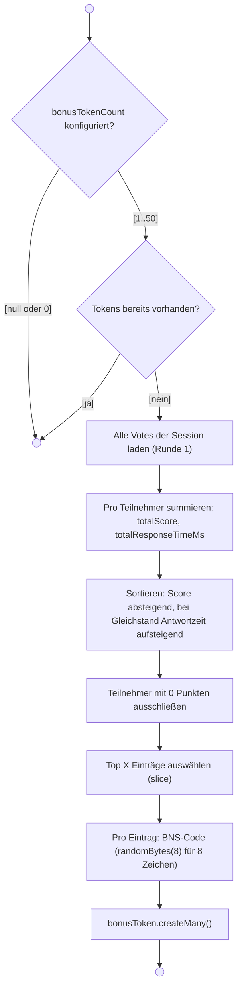
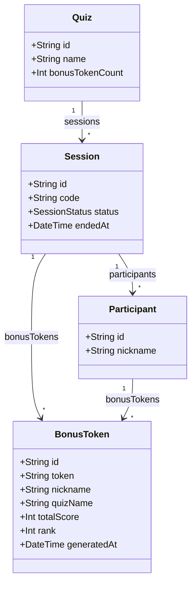
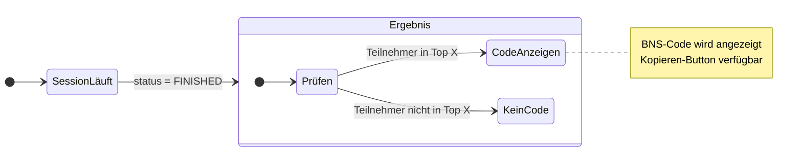
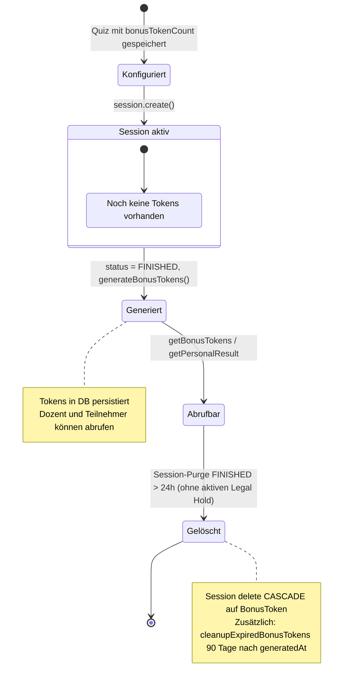
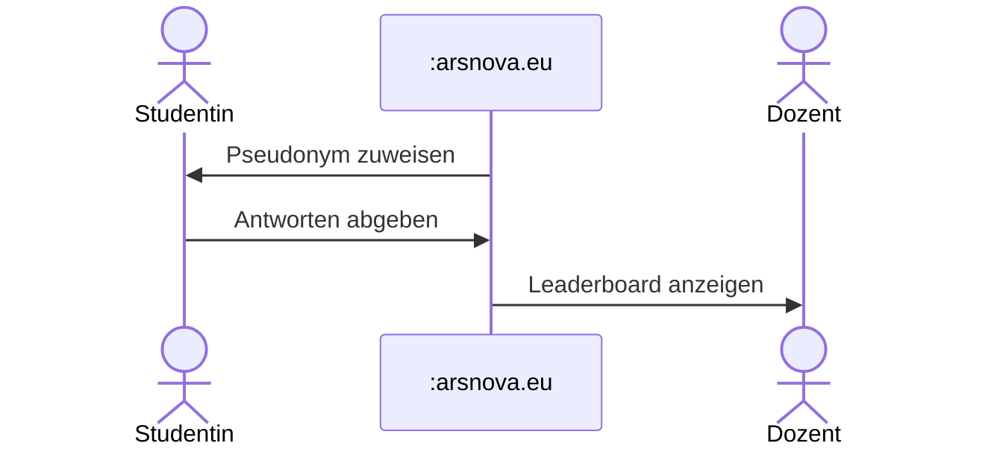
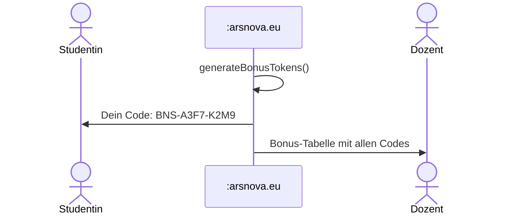
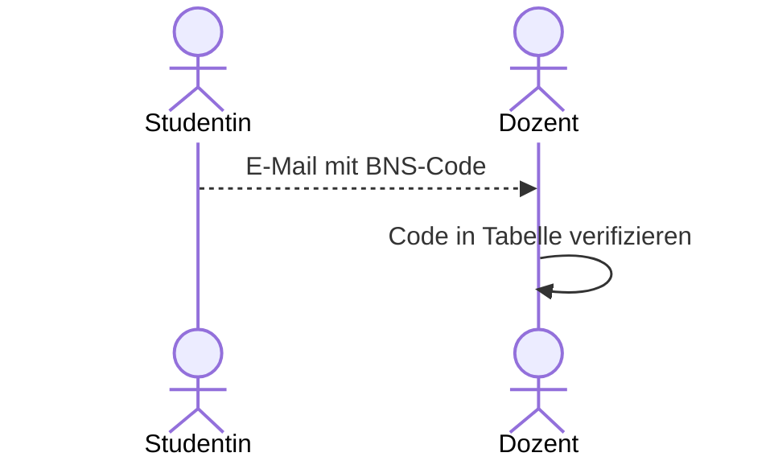
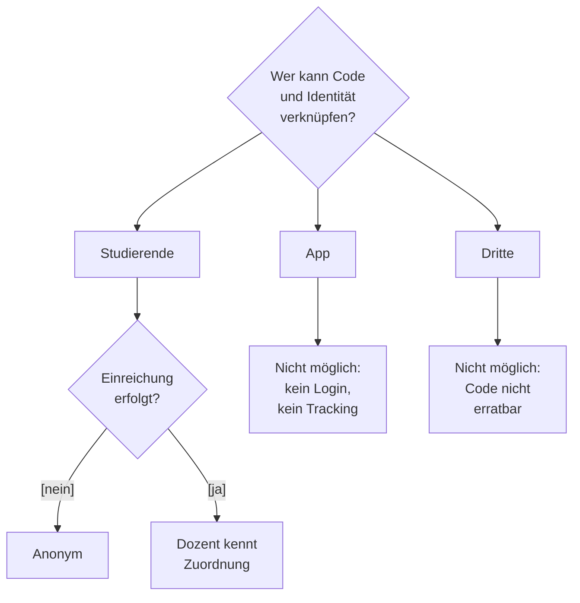

# Bonus-Codes (Story 4.6)

> **Zielgruppe:** Product Owner, Entwickler  
> **Stand:** 2026-04-01 (Abgleich mit `session.ts` `nextQuestion` / `session.end`, `generateBonusTokens`, `getPersonalResult`, `getBonusTokens`, `sessionCleanup.ts`)

## Konzept

Dozenten können für ein Quiz festlegen, dass die **besten Teilnehmenden automatisch
einen Bonus-Code** erhalten. Der Code wird **nach `FINISHED`** generiert und ist ein
kryptografisch sicherer Token im Format `BNS-XXXX-XXXX`.

Studierende können den Code **freiwillig per E-Mail** beim Dozenten einreichen, um
Bonuspunkte zu erhalten. Solange sie das nicht tun, bleibt ihre Identität gewahrt
(**Zero-Knowledge-Prinzip**).

---

## Konfiguration

| Parameter          | Feld              | Wertebereich | Standard             |
| ------------------ | ----------------- | ------------ | -------------------- |
| Anzahl Bonus-Codes | `bonusTokenCount` | 1 – 50       | `null` (deaktiviert) |

Der Wert `bonusTokenCount` liegt im **Quiz** (Editor / Yjs-Local-First) und wird mit
**`quiz.upload`** auf dem Server persistiert. Ohne positiven Wert werden keine Codes vergeben.

---

## Ablauf (Sequenzdiagramm)

```mermaid
sequenceDiagram
  actor Dozent
  actor Teilnehmer
  participant Editor as Quiz-Editor / Yjs
  participant BE as sessionRouter
  participant DB as PostgreSQL

  Dozent ->> Editor: bonusTokenCount z. B. 5 setzen
  Note over Editor,DB: Wert liegt im Quiz; Serverkopie bei quiz.upload

  Note over BE: Session läuft …

  alt Quiz erschöpft
    Dozent ->> BE: session.nextQuestion
    BE ->> BE: nächster Index >= Fragenanzahl
    BE ->> DB: Session status FINISHED, endedAt
    BE ->> BE: generateBonusTokens()
  else Manuell beenden
    Dozent ->> BE: session.end
    BE ->> DB: Session status FINISHED, endedAt
    BE ->> BE: generateBonusTokens()
  end

  BE ->> DB: vote.findMany(sessionId, round 1)
  DB -->> BE: Votes
  BE ->> BE: Ranking Top X, nur Score > 0
  BE ->> DB: bonusToken.createMany

  Dozent ->> BE: session.getBonusTokens
  BE -->> Dozent: BonusTokenListDTO

  Teilnehmer ->> BE: session.getPersonalResult (code, participantId)
  BE -->> Teilnehmer: totalScore, rank, bonusToken oder null
```

---

## Ranking-Algorithmus (Aktivitätsdiagramm)



| Schritt             | Detail                                                                    |
| ------------------- | ------------------------------------------------------------------------- |
| Score-Summe         | Alle `vote.score`-Werte eines Teilnehmers werden addiert                  |
| 0-Punkte-Ausschluss | Teilnehmer mit insgesamt 0 Punkten erhalten keinen Bonus                  |
| Tiebreaker          | Bei gleichem Score: **kleinere** `totalResponseTimeMs` (schneller) zuerst |
| Idempotenz          | Bereits vorhandene Tokens verhindern doppelte Generierung                 |

---

## Code-Format

```
BNS-A3F7-K2M9
```

| Eigenschaft | Wert                                                         |
| ----------- | ------------------------------------------------------------ |
| Prefix      | `BNS-`                                                       |
| Zeichenraum | `ABCDEFGHJKLMNPQRSTUVWXYZ23456789` (ohne O, 0, I, 1, L)      |
| Länge       | 4 + 4 Zeichen (durch Bindestrich getrennt)                   |
| Entropie    | `crypto.randomBytes(8)` für die 8 Positionswahl (Charset 32) |

---

## Datenmodell (Klassendiagramm)



`nickname` und `quizName` im BonusToken sind **Snapshots** – sie werden zum
Generierungszeitpunkt eingefroren und bleiben auch nach Session-Löschung erhalten.

---

## Sichtbarkeit nach Rolle

### Teilnehmer-Sicht



Teilnehmende sehen auf der Ergebnis-Seite:

- **Falls in Top X:** Ihren persönlichen BNS-Code mit Kopieren-Button
- **Falls nicht in Top X:** Keinen Bonus-Bereich
- **Hinweistext:** "Sende diesen Code per E-Mail an deinen Dozenten, um Bonuspunkte
  zu erhalten. Deine Anonymität bleibt gewahrt, solange du den Code nicht einreichst."

### Dozenten-Sicht

Der Dozent sieht nach Session-Ende eine Tabelle aller Bonus-Codes:

| Spalte   | Inhalt                                  |
| -------- | --------------------------------------- |
| #        | Rang (1-basiert)                        |
| Nickname | Pseudonym zum Zeitpunkt der Generierung |
| Code     | `BNS-XXXX-XXXX` (Monospace)             |
| Punkte   | Gesamt-Score                            |

Dazu ein **CSV-Export-Button** (Dateiname: `bonus-codes-{SESSION-CODE}.csv`).

---

## Lebenszyklus (Zustandsdiagramm)



| Phase          | Zeitpunkt                                                      | Tokens vorhanden?   |
| -------------- | -------------------------------------------------------------- | ------------------- |
| Quiz erstellt  | Konfiguration (lokal + Upload)                                 | Nein                |
| Session läuft  | bis FINISHED                                                   | Nein                |
| Session endet  | FINISHED (`nextQuestion` oder `end`)                           | Ja (generiert)      |
| Ergebnis-Phase | FINISHED, Abruf möglich                                        | Ja                  |
| Session-Purge  | beendete Sessions > 24 h, kein `legalHoldUntil` in der Zukunft | CASCADE             |
| Token-Cleanup  | `generatedAt` älter als 90 Tage                                | deleteMany (orphan) |

---

## Anonymitäts-Konzept (Zero Knowledge)

Die App speichert **keine realen Identitäten**. Die Verknüpfung zwischen Pseudonym
und realer Person erfolgt ausschließlich durch den Studierenden selbst.

### Phase 1 – Während der Session



> **Dozent kennt:** Pseudonyme + Scores.
> **Studentin kennt:** eigenen Score.
> **Niemand kennt:** reale Identität der Teilnehmenden.

### Phase 2 – Session beendet



> **Dozent kennt:** Pseudonym-Code-Zuordnung (z. B. "Marie Curie" = BNS-A3F7-K2M9).
> **Studentin kennt:** nur den eigenen Code.
> **Identität:** noch nicht verknüpft.

### Phase 3 – Freiwillige Einreichung (außerhalb der App)



> **Erst jetzt** kann der Dozent Code und reale Person verknüpfen.
> Die App ist an diesem Schritt **nicht beteiligt**.

### Wissensmatrix

|                             | App speichert | Dozent kennt          | Student kennt |
| --------------------------- | ------------- | --------------------- | ------------- |
| **Reale Identität**         | nie           | erst nach Einreichung | immer         |
| **Pseudonym**               | ja (Snapshot) | ja                    | ja            |
| **Score + Rang**            | ja            | ja                    | eigenen       |
| **BNS-Code**                | ja            | ja (alle Top X)       | nur eigenen   |
| **Zuordnung Code ↔ Person** | nie           | erst nach Einreichung | immer         |

### Sicherheitseigenschaften



| Eigenschaft              | Garantie                                                                                        |
| ------------------------ | ----------------------------------------------------------------------------------------------- |
| **Keine Login-Pflicht**  | Teilnahme ohne Account möglich                                                                  |
| **Pseudonym statt Name** | Teilnehmende wählen aus Nickname-Theme, frei oder Anonym (je nach Session)                      |
| **Kein Tracking**        | Keine sessionübergreifende Wiedererkennung                                                      |
| **Freiwilligkeit**       | Einreichung ist optional, Nicht-Einreichung hat keinen Nachteil in der App                      |
| **Code-Sicherheit**      | Kryptografisch sicher (`randomBytes(8)` für die Zeichenwahl), nicht erratbar                    |
| **Zeitlich begrenzt**    | Session-Purge FINISHED > 24 h (CASCADE) bzw. BonusToken > 90 Tage (`cleanupExpiredBonusTokens`) |

---

## tRPC-Endpunkte

| Endpunkt                    | Typ   | Zugriff    | Beschreibung                                            |
| --------------------------- | ----- | ---------- | ------------------------------------------------------- |
| `session.getBonusTokens`    | Query | Dozent     | Liste aller Tokens einer Session                        |
| `session.getPersonalResult` | Query | Teilnehmer | Eigener Score, Rang und ggf. Token (nur bei `FINISHED`) |
| `session.getExportData`     | Query | Dozent     | Session-Export inkl. Bonus-Tokens                       |

---

## Relevante Dateien

| Bereich                | Datei                                                                                                                                                 |
| ---------------------- | ----------------------------------------------------------------------------------------------------------------------------------------------------- |
| **Zod-Schemas**        | `libs/shared-types/src/schemas.ts` (`BonusTokenEntryDTOSchema`, `BonusTokenListDTOSchema`)                                                            |
| **Quiz-Konfiguration** | `libs/shared-types/src/schemas.ts` (`CreateQuizInputSchema.bonusTokenCount`)                                                                          |
| **Token-Generierung**  | `apps/backend/src/routers/session.ts` (`generateBonusTokens`, `generateBonusCode`; Aufruf aus `session.end` und `nextQuestion` wenn keine Folgefrage) |
| **Scoring**            | `apps/backend/src/lib/quizScoring.ts`                                                                                                                 |
| **Prisma-Modell**      | `prisma/schema.prisma` (`model BonusToken`)                                                                                                           |
| **Token-Cleanup**      | `apps/backend/src/lib/sessionCleanup.ts` (`cleanupExpiredBonusTokens`)                                                                                |
| **Dozenten-Ansicht**   | `apps/frontend/src/app/features/session/session-host/`                                                                                                |
| **Teilnehmer-Ansicht** | `apps/frontend/src/app/features/session/session-vote/`                                                                                                |
| **Quiz-Editor**        | `apps/frontend/src/app/features/quiz/quiz-edit/`                                                                                                      |
