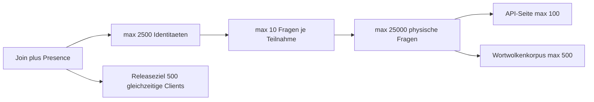

# Q&A-Skalierung, Kontingente und Teilnahmeaggregate

> Stand: 2026-09-16 · Epic #405 abgeschlossen in PR [#418](https://github.com/kqc-real/arsnova.eu/pull/418) · Issues #414 und #415 im Produktcode; der isolierte 500er Release-Lauf bleibt der formale Lastnachweis.

## Kapazitätsgrenzen

- Eine Session unterstützt 2.500 über ihre Laufzeit angesammelte
  Teilnahmeidentitäten; das Releaseziel sind exakt 500 gleichzeitig aktive
  Clients.
- Pro Teilnahme können höchstens 10 Q&A-Fragen erstmalig angelegt werden.
- Pro Session können höchstens 25.000 Fragen gleichzeitig physisch gespeichert
  sein.
- API-Seiten und begrenzte Snapshots enthalten höchstens 100 Einträge. Der
  serverseitig gerankte Wortwolkenkorpus enthält höchstens 500 Fragen.

Die Grenzen werden nicht über IP-Adressen durchgesetzt und bleiben deshalb für
Hörsäle hinter Shared NAT nutzbar.

## Teilnahme

`session.getParticipantSummary` liefert Gesamtzahl, eindeutige Presence-Zahl,
`participantRevision` und höchstens 20 jüngste Ankünfte. Die Host-Subscription
sendet denselben begrenzten Snapshot. `session.searchParticipants` stellt bei
Bedarf revisionsgebundene Keyset-Seiten bereit; ein paralleler Join verwirft
einen alten Cursor mit `CONFLICT`.

Nickname-Kollisionen werden punktuell mit
`session.checkParticipantNickname` geprüft. Der Join-Client lädt keine
periodische Nicknameliste. Im anonymen Modus wird öffentlich keine individuelle
Namensliste ausgegeben. `session.heartbeatParticipantPresence` ist an die
Teilnahme-Capability gebunden; mehrere Tabs und Reconnects derselben Identität
belegen im Drei-Minuten-Fenster nur einen Redis-Sorted-Set-Eintrag.

## Fragen, Stimmen und Ranking

`arsnova_create_qa_question` sperrt nur die betroffene Sessionzeile und führt
Fristprüfung, Capability-vorbereitete Teilnahmeprüfung, beide Kontingente,
Idempotency und Insert in einer PostgreSQL-Transaktion aus. Ein Retry mit
demselben session- und teilnahmegebundenen Schlüssel liefert dieselbe Frage.

Trigger pflegen `qaQuestionCount`, `qaQuestionPeakCount`,
`qaQuestionPeakReachedAt`, `qaQuestionsAcceptedTotal` und
`qaRankingRevision`. Soft-Delete und Archivierung zählen weiterhin als physisch
gespeichert; nur ein erfolgreiches physisches Delete gibt einen Sessionplatz
frei.

`arsnova_change_qa_vote` serialisiert Änderungen je Frage und pflegt positive,
negative und gewichtete Zähler atomar. `qa.list` rankt den vollständigen
berechtigten Bestand in PostgreSQL nach `TOP`, `BEST` oder `CONTROVERSIAL` und
liefert anschließend eine revisionsgebundene Seite. Änderungen an Frage,
Status, Vote oder der für Kontroversität maßgeblichen Teilnahmezahl verhindern
das Mischen verschiedener Ranglistenstände.

## Wortwolke und Nebenlast

`wordCloud.analyzeQa` stellt den Korpus hostautorisiert in PostgreSQL zusammen.
Nur `ACTIVE` und `PINNED` sind berechtigt; »nur hervorgehoben« schränkt auf
`PINNED` ein. Erst nach dem vollständigen serverseitigen Ranking werden exakt
`min(500, eligibleQuestionCount)` Quellen an Lexik-, Lemma-, Phrasen- oder
Themenanalyse übergeben.

Die Analyseantwort bleibt davon unabhängig transportbegrenzt: höchstens 80
Einträge und pro Eintrag ein gekennzeichnetes Erklärbeispiel mit maximal 128
Zeichen. `memberCount` und `membersTruncated` machen sichtbar, dass nur die
Erklärung, nicht der kanonische 500er Analysekorpus gekürzt wurde.

Der Cache-Schlüssel umfasst Korpusrevision, Sortierung, Filter, Variante,
Normalisierung und Sprache. Eine Redis-Lease erlaubt instanzübergreifend
höchstens eine laufende Q&A-Wortwolkenanalyse je Session. Submit, Vote,
Moderation und Realtime warten nicht auf die Analyse.

Q&A-Zusammenfassungen und Moderations-NLP verwenden ebenfalls feste Queue-,
Parallelitäts-, Text- und Quellgrenzen; sie laden keinen 25.000er Vollbestand in
den Node.js-Heap.

## Persistente Plattformprojektion

Die Migration `20260915120000_qa_scale_counters` setzt einen gemeinsamen
Erfassungsbeginn. Vorhandene Sessions werden atomar aus den zu diesem Zeitpunkt
noch physisch vorhandenen Fragen initialisiert. Bereits gelöschte Vorhistorie
kann nicht rekonstruiert werden.

`QaSessionStatisticProjection` ist von der Session-Lebensdauer entkoppelt. Ein
15-sekündiger, per PostgreSQL-Advisory-Lock einzelbelegter Lauf zieht monotone
Sessionaggregate nach und aktualisiert `PlatformStatistic`. Ein
`BEFORE DELETE`-Trigger projiziert den letzten Stand auch beim Session-Purge.
Retention und Legal Hold können bereits projizierte Gesamt- und Rekordwerte
nicht senken.

## Deployment und Rollback

1. Zuerst die Migration anwenden; sie backfillt Zähler und installiert
   Kompatibilitätstrigger für alte Images.
2. Danach Backend- und Frontend-Images ausrollen.
3. Während eines Rolling Deployments halten Trigger auch Inserts, Votes und
   Deletes alter Backendimages konsistent.

Ein Code-Rollback ist mit installierter Migration möglich. Ein Schema-Rollback
ist destruktiv: Er würde neue Zähler, Idempotency-Schlüssel und
Projektionshistorie entfernen und darf erst nach vollständigem Downgrade sowie
expliziter Datensicherungsentscheidung erfolgen.
