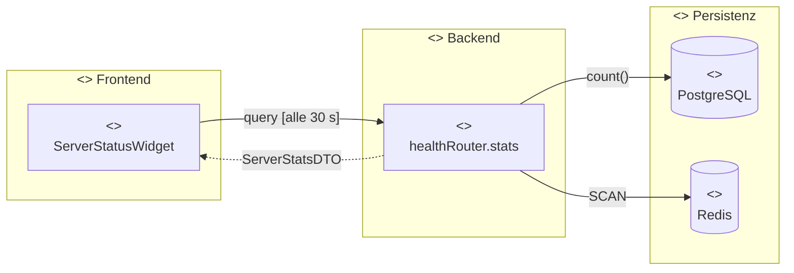
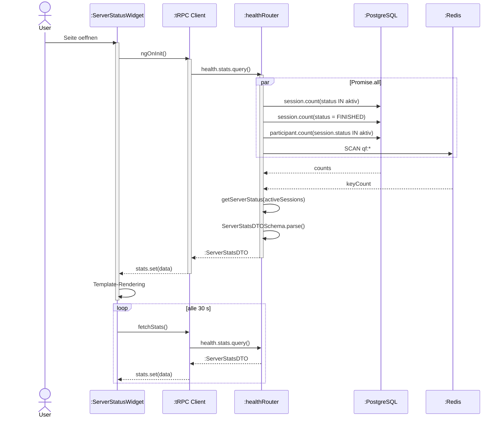
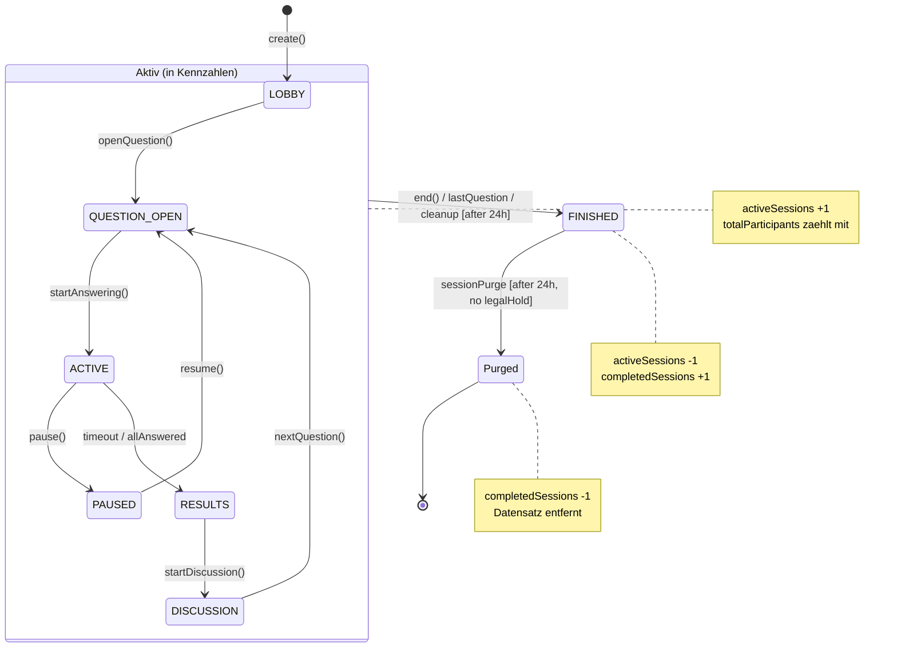
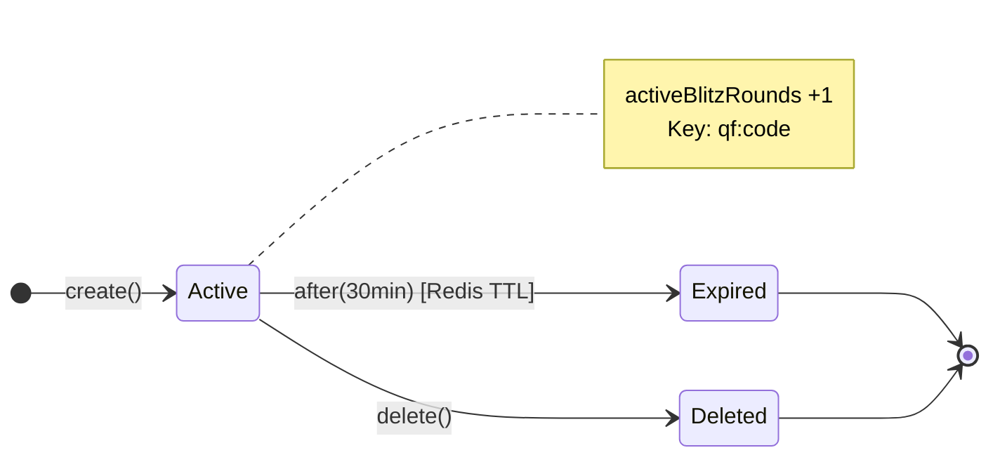
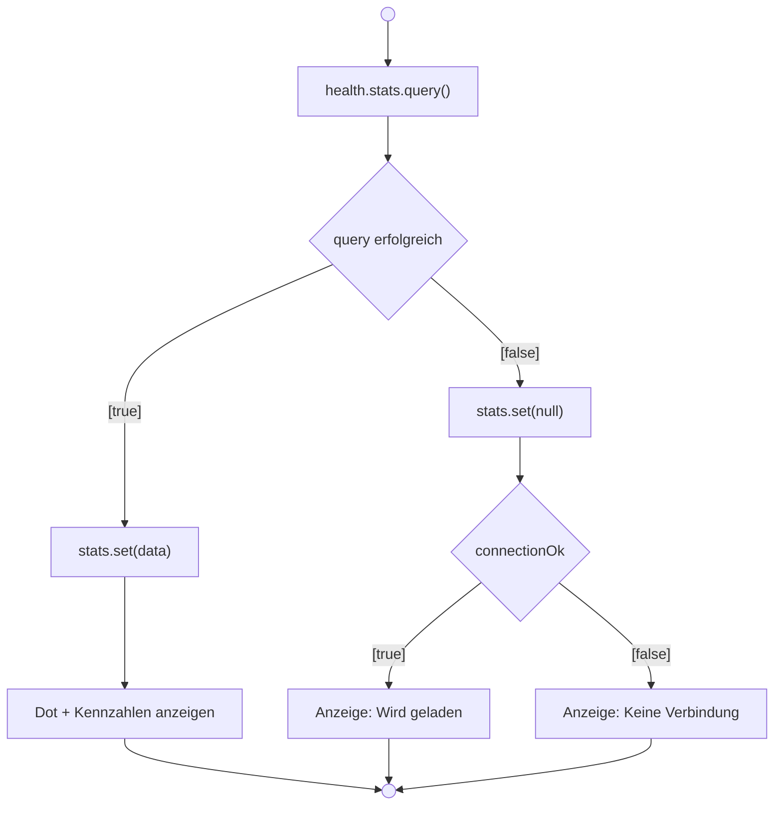
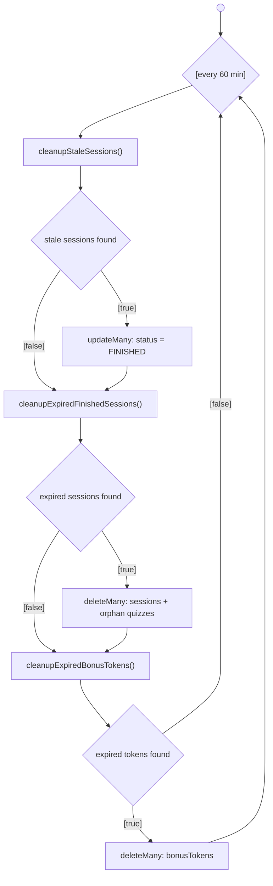

# Server-Status-Widget (Story 0.4)

> **Zielgruppe:** Product Owner, Entwickler

## Was zeigt das Widget?

Das Server-Status-Widget wird im **Footer** der Anwendung angezeigt und gibt Nutzenden
auf einen Blick Auskunft darüber, wie aktiv die Plattform gerade ist. Es werden vier
Kennzahlen und ein farbiger Status-Dot dargestellt:

| Kennzahl | Icon | Bedeutung |
|---|---|---|
| Aktive Sessions | ▶ play_circle | Laufende Quiz-Sessions (Lobby bis Diskussion) |
| Blitz-Runden | ⚡ bolt | Laufende Quick-Feedback-Runden |
| Teilnehmende | 👥 group | Personen in aktiven Sessions |
| Abgeschlossene Quizzes | ✅ check_circle | Bereits beendete Sessions |

### Status-Dot (Ampel)

| Farbe | Bedeutung | Schwellwert |
|---|---|---|
| 🟢 Grün | Gesund | < 50 aktive Sessions |
| 🟡 Gelb | Ausgelastet | 50 – 199 aktive Sessions |
| 🔴 Rot | Überlastet | ≥ 200 aktive Sessions |
| ⚪ Grau | Unbekannt | Daten noch nicht geladen oder Fehler |

---

## Datenfluss (Komponentendiagramm)



### Ablauf (Sequenzdiagramm)



---

## Datenquellen im Detail

### PostgreSQL (via Prisma)

| Kennzahl | Query | Filter |
|---|---|---|
| Aktive Sessions | `prisma.session.count(…)` | Status in: `LOBBY`, `QUESTION_OPEN`, `ACTIVE`, `PAUSED`, `RESULTS`, `DISCUSSION` |
| Abgeschlossene Quizzes | `prisma.session.count(…)` | Status = `FINISHED` |
| Teilnehmende | `prisma.participant.count(…)` | Teilnehmer, deren Session einen der aktiven Status hat |

### Redis

| Kennzahl | Methode | Details |
|---|---|---|
| Blitz-Runden | `SCAN` mit Pattern `qf:*` | Cursor-basiert (kein blockierendes `KEYS`), interne Voter-Sets (`qf:*:voters:*`) werden ignoriert |

---

## Lebenszyklus der Daten (Wann sinken/verschwinden Kennzahlen?)

### Aktive Sessions & Teilnehmende

Eine Session fällt aus der „aktiv"-Zählung, sobald ihr Status auf `FINISHED` wechselt.
Das geschieht durch:

| Auslöser | Beschreibung | Timing |
|---|---|---|
| **Manuell** | Dozent beendet die Session (`session.end`) | Sofort |
| **Automatisch** | Letzte Frage wurde beantwortet → `FINISHED` | Sofort |
| **Cleanup (verwaist)** | Session seit > **24 h** aktiv ohne Aktivität | Stündlicher Cleanup-Job |

Teilnehmende werden nicht einzeln entfernt – sie fallen automatisch aus der Zählung,
sobald ihre zugehörige Session beendet wird.

### Abgeschlossene Quizzes

| Auslöser | Beschreibung | Timing |
|---|---|---|
| **Session Purge** | `FINISHED`-Sessions werden **24 h nach Beendigung** komplett gelöscht | Stündlicher Cleanup-Job |
| **Legal Hold** | Sessions mit `legalHoldUntil` in der Zukunft bleiben erhalten | Bis Ablauf des Holds |

Beim Purge werden auch verwaiste Quizzes gelöscht (Quizzes ohne verbleibende Sessions).

### Blitz-Runden (Redis)

| Auslöser | Beschreibung | Timing |
|---|---|---|
| **TTL** | Alle `qf:*`-Keys haben ein `EXPIRE` von **30 Minuten** | Automatisch durch Redis |
| **Manuell** | Dozent löscht die Runde (`quickFeedback.delete`) | Sofort |

### Lebenszyklus einer Session (Zustandsdiagramm)



### Lebenszyklus einer Blitz-Runde (Zustandsdiagramm)



---

## Fehlerverhalten (Aktivitaetsdiagramm)



| Situation | Backend | Frontend |
|---|---|---|
| DB oder Redis nicht erreichbar | Fallback: alle Werte `0`, Status `healthy` | Zeigt Nullwerte an |
| tRPC-Aufruf schlägt fehl | – | `stats` wird `null` → „Wird geladen…" |
| API-Health-Check fehlgeschlagen | – | `connectionOk = false` → „Keine Verbindung" + grauer Dot |

---

## Darstellungsmodi

Das Widget unterstützt zwei Modi über den `compact`-Input:

| Modus | Verwendung | Darstellung |
|---|---|---|
| **Normal** (`compact = false`) | Eigenständige Anzeige (z. B. Startseite) | Header „Gerade aktiv" + Dot + Statistik-Zeile, Skeleton-Loader |
| **Kompakt** (`compact = true`) | Globaler App-Footer | Nur Dot + Kennzahlen in einer Zeile, kein Header |

Im App-Footer wird immer der kompakte Modus genutzt:

```html
<app-server-status-widget [connectionOk]="!!apiStatus()" [compact]="true" />
```

---

## Cleanup-Scheduler (Hintergrund-Jobs)

Der Scheduler startet mit dem Backend und läuft **jede Stunde** (`sessionCleanup.ts`):

*Aktivitaetsdiagramm*



| Job | Aktion | Schwellwert |
|---|---|---|
| 1. Stale Sessions | Aktive Sessions ohne Aktivität seit > 24 h → `FINISHED` | `STALE_SESSION_HOURS = 24` |
| 2. Session Purge | Beendete Sessions > 24 h nach Ende → komplett gelöscht | `FINISHED_SESSION_RETENTION_HOURS = 24` |
| 3. Bonus-Token Purge | Bonus-Tokens älter als 90 Tage → gelöscht | `BONUS_TOKEN_RETENTION_DAYS = 90` |

---

## Relevante Dateien

| Bereich | Datei |
|---|---|
| **Zod-Schema** | `libs/shared-types/src/schemas.ts` (`ServerStatsDTOSchema`) |
| **Backend Router** | `apps/backend/src/routers/health.ts` (`stats` Query) |
| **Cleanup** | `apps/backend/src/lib/sessionCleanup.ts` |
| **Quick-Feedback TTL** | `apps/backend/src/routers/quickFeedback.ts` (`FEEDBACK_TTL_SECONDS`) |
| **Frontend Widget** | `apps/frontend/src/app/shared/server-status-widget/` |
| **Einbindung Footer** | `apps/frontend/src/app/app.component.html` |
