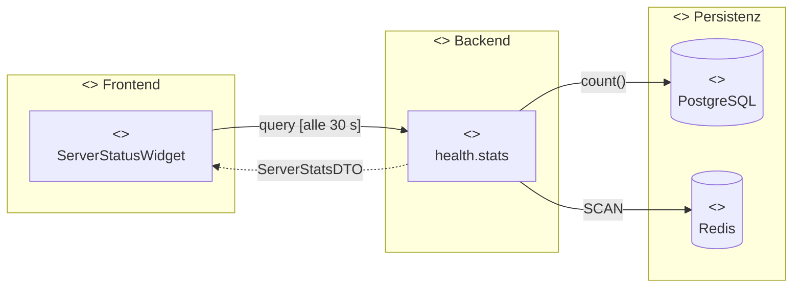
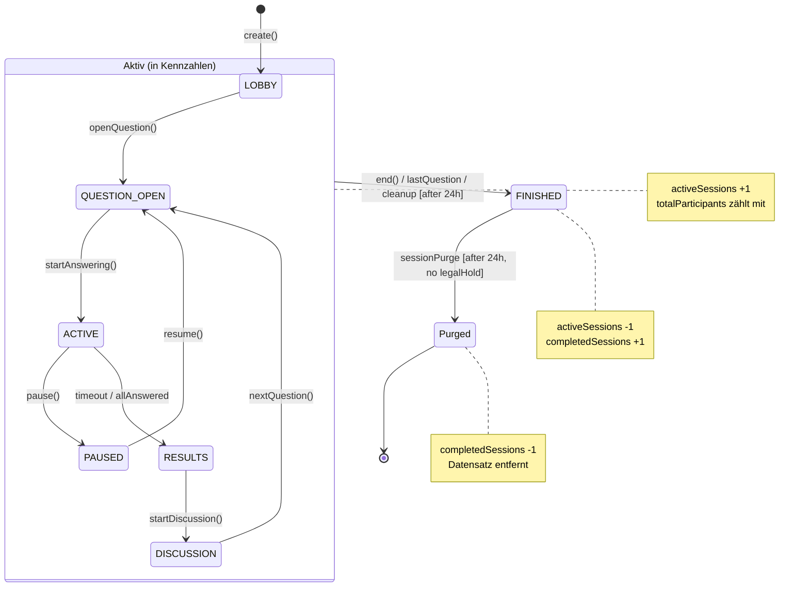
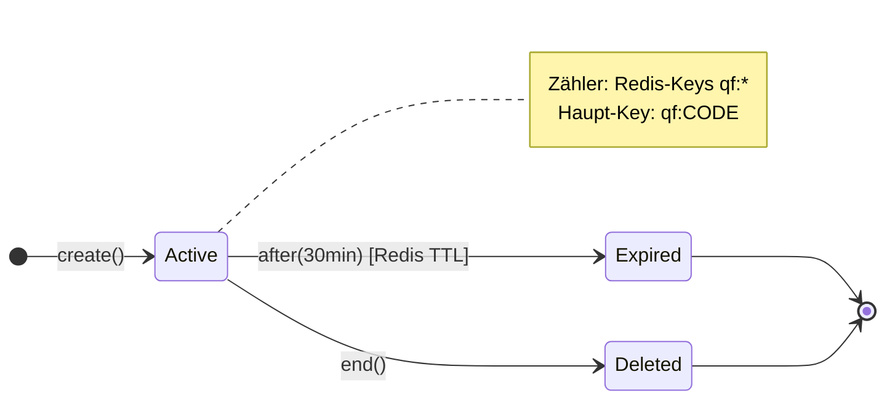
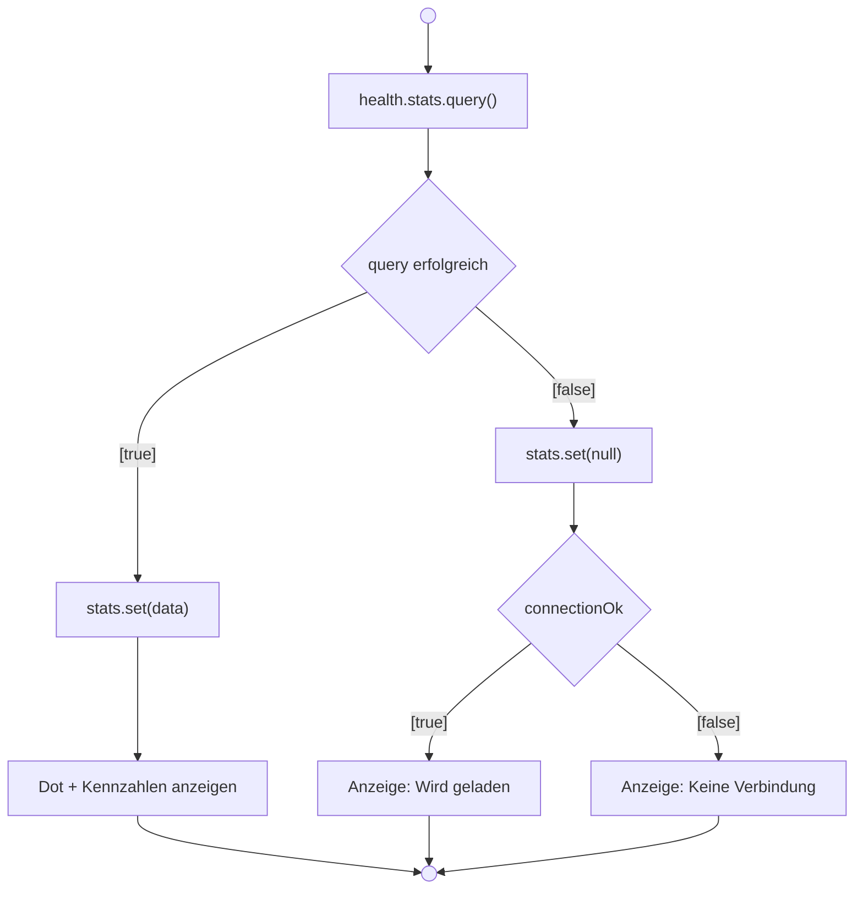
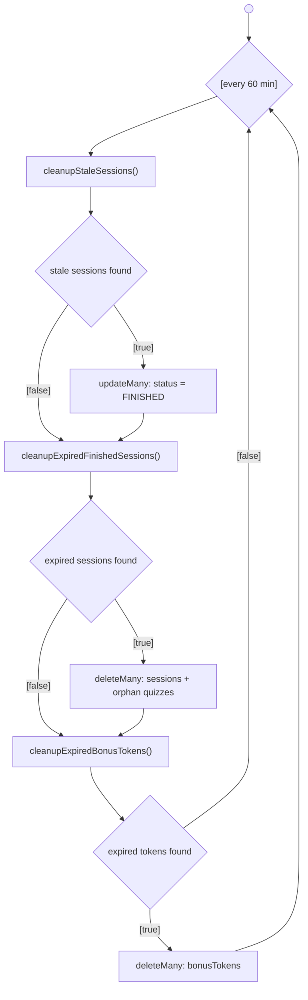

# Server-Status-Widget (Story 0.4)

> **Zielgruppe:** Product Owner, Entwickler  
> **Stand:** 2026-04-01 (Abgleich mit `health.ts` `stats` inkl. `PlatformStatistic` / `maxParticipantsSingleSession`, `server-status-widget.component.ts`, `app.component.html` / `app.component.ts`)

## Was zeigt das Widget?

Das Server-Status-Widget steht im **globalen App-Footer** (`app.component.html`) und gibt Nutzenden
auf einen Blick Auskunft, wie aktiv die Plattform gerade ist. Es werden vier
Kennzahlen und ein farbiger Status-Dot dargestellt. Der Footer (inkl. Widget) wird **nicht** angezeigt auf der **Standalone-Blitzlicht-Route** (`/feedback/...`) und in der **immersiven Host-Ansicht** (`isImmersiveHostView`).

| Kennzahl               | Icon            | Bedeutung                                                                |
| ---------------------- | --------------- | ------------------------------------------------------------------------ |
| Aktive Sessions        | ▶ play_circle   | Laufende Quiz-Sessions (Status `LOBBY` … `DISCUSSION`)                   |
| Blitz-Runden           | ⚡ bolt         | Laufende Blitzlicht-/Quick-Feedback-Runden (Redis `qf:*`, siehe Backend) |
| Teilnehmende           | 👥 group        | Personen in aktiven Sessions                                             |
| Abgeschlossene Quizzes | ✅ check_circle | Sessions mit Status `FINISHED`                                           |

Zusätzlich liefert **`health.stats`** (und ggf. `footerBundle`) die Felder **`maxParticipantsSingleSession`** und **`maxParticipantsStatisticUpdatedAt`** aus **`PlatformStatistic`** — genutzt u. a. im **Hilfe-Dialog** zur Plattform-Rekord-Anzeige, nicht als fünfte Kennzahl im kompakten Footer.

### Status-Dot (Ampel)

| Farbe   | Bedeutung                 | Schwellwert                                                                             |
| ------- | ------------------------- | --------------------------------------------------------------------------------------- |
| 🟢 Grün | Gesund (`healthy`)        | **&lt; 50** aktive Sessions (`SERVER_STATUS_THRESHOLDS.healthy`)                        |
| 🟡 Gelb | Ausgelastet (`busy`)      | **50 – 199** aktive Sessions                                                            |
| 🔴 Rot  | Überlastet (`overloaded`) | **≥ 200** aktive Sessions (`SERVER_STATUS_THRESHOLDS.busy`)                             |
| ⚪ Grau | Unbekannt                 | `stats === null` (laden oder Query-Fehler) bei `connectionOk`, oder Widget ohne Polling |

**Hinweis:** Die Ampel bezieht sich nur auf **`activeSessions`** aus PostgreSQL, nicht auf Blitz-Runden oder Teilnehmerzahl.

---

## Datenfluss (Komponentendiagramm)



### Ablauf (Sequenzdiagramm)

```mermaid
sequenceDiagram
  actor User
  participant App as AppComponent
  participant Widget as ServerStatusWidget
  participant Client as tRPC Client
  participant Router as healthRouter
  participant DB as PostgreSQL
  participant Cache as Redis

  Note over App: Beim Start / Retry: health.check → apiStatus
  App ->> Client: health.check.query()
  Client -->> App: status ok / Fehler

  User ->> Widget: Route mit Footer
  activate Widget
  Note over Widget: connectionOk = apiStatus; bei true startPolling()
  Widget ->> Client: health.stats.query()
  activate Client
  activate Router

  par Promise.all
    Router ->> DB: session.count(aktive Status)
    Router ->> DB: session.count(FINISHED)
    Router ->> DB: participant.count(Session aktiv)
    Router ->> DB: platformStatistic.findUnique (Rekord max. Teilnehmer je Session)
    Router ->> Cache: SCAN MATCH qf:* (ohne Keys mit :voters:)
  end

  DB -->> Router: counts + PlatformStatistic
  Cache -->> Router: Set-Größe activeBlitzRounds

  Router ->> Router: getServerStatus(activeSessions)
  Router ->> Router: ServerStatsDTOSchema.parse
  Router -->> Client: ServerStatsDTO
  deactivate Router
  Client -->> Widget: stats.set(data)
  deactivate Client
  Widget ->> Widget: Template-Rendering
  deactivate Widget

  loop alle 30 s bei connectionOk
    Widget ->> Client: health.stats.query()
    Client -->> Widget: ServerStatsDTO
  end
```

---

## Datenquellen im Detail

### PostgreSQL (via Prisma)

| Kennzahl               | Query                         | Filter                                                                           |
| ---------------------- | ----------------------------- | -------------------------------------------------------------------------------- |
| Aktive Sessions        | `prisma.session.count(…)`     | Status in: `LOBBY`, `QUESTION_OPEN`, `ACTIVE`, `PAUSED`, `RESULTS`, `DISCUSSION` |
| Abgeschlossene Quizzes | `prisma.session.count(…)`     | Status = `FINISHED`                                                              |
| Teilnehmende           | `prisma.participant.count(…)` | Teilnehmer, deren Session einen der aktiven Status hat                           |

### Redis

| Kennzahl     | Methode                 | Details                                                                                                                                                                                                                                             |
| ------------ | ----------------------- | --------------------------------------------------------------------------------------------------------------------------------------------------------------------------------------------------------------------------------------------------- |
| Blitz-Runden | `SCAN` mit `MATCH qf:*` | Cursor-basiert; Keys, die **`":voters:"`** enthalten, zählen nicht (z. B. `qf:voters:…`). Weitere Hilfs-Keys unter `qf:*` können je nach Redis-Bestand die Zahl beeinflussen — Kennzahl ist „gezählte Keys nach Filter“, nicht nur logische Runden. |

---

## Lebenszyklus der Daten (Wann sinken/verschwinden Kennzahlen?)

### Aktive Sessions & Teilnehmende

Eine Session fällt aus der „aktiv"-Zählung, sobald ihr Status auf `FINISHED` wechselt.
Das geschieht durch:

| Auslöser               | Beschreibung                                 | Timing                  |
| ---------------------- | -------------------------------------------- | ----------------------- |
| **Manuell**            | Dozent beendet die Session (`session.end`)   | Sofort                  |
| **Automatisch**        | Letzte Frage wurde beantwortet → `FINISHED`  | Sofort                  |
| **Cleanup (verwaist)** | Session seit > **24 h** aktiv ohne Aktivität | Stündlicher Cleanup-Job |

Teilnehmende werden nicht einzeln entfernt – sie fallen automatisch aus der Zählung,
sobald ihre zugehörige Session beendet wird.

### Abgeschlossene Quizzes

| Auslöser          | Beschreibung                                                          | Timing                  |
| ----------------- | --------------------------------------------------------------------- | ----------------------- |
| **Session Purge** | `FINISHED`-Sessions werden **24 h nach Beendigung** komplett gelöscht | Stündlicher Cleanup-Job |
| **Legal Hold**    | Sessions mit `legalHoldUntil` in der Zukunft bleiben erhalten         | Bis Ablauf des Holds    |

Beim Purge werden auch verwaiste Quizzes gelöscht (Quizzes ohne verbleibende Sessions).

### Blitz-Runden (Redis)

| Auslöser    | Beschreibung                                                       | Timing                  |
| ----------- | ------------------------------------------------------------------ | ----------------------- |
| **TTL**     | Alle `qf:*`-Keys haben ein `EXPIRE` von **30 Minuten**             | Automatisch durch Redis |
| **Manuell** | Host beendet die Runde (`quickFeedback.end` löscht die Redis-Keys) | Sofort                  |

### Lebenszyklus einer Session (Zustandsdiagramm)



### Lebenszyklus einer Blitz-Runde (Zustandsdiagramm)



---

## Fehlerverhalten (Aktivitaetsdiagramm)



| Situation                               | Backend                                    | Frontend                                                                                  |
| --------------------------------------- | ------------------------------------------ | ----------------------------------------------------------------------------------------- |
| DB oder Redis nicht erreichbar          | Fallback: alle Werte `0`, Status `healthy` | Zeigt Nullwerte an                                                                        |
| tRPC `health.stats` schlägt fehl        | –                                          | `stats.set(null)` → „Wird geladen…" (Dot grau solange kein erfolgreicher Snapshot)        |
| `health.check` schlägt fehl / kein `ok` | –                                          | `apiStatus` falsy → `connectionOk=false` → Polling stoppt, „Keine Verbindung", grauer Dot |

---

## Darstellungsmodi

Das Widget unterstützt zwei Modi über den `compact`-Input:

| Modus                          | Verwendung                                        | Darstellung                                                    |
| ------------------------------ | ------------------------------------------------- | -------------------------------------------------------------- |
| **Normal** (`compact = false`) | Template vorgesehen für größere Flächen           | Header „Gerade aktiv“ + Dot + Statistik-Zeile, Skeleton-Loader |
| **Kompakt** (`compact = true`) | **Aktuell einzige Einbindung** im globalen Footer | Nur Dot + Kennzahlen in einer Zeile, kein Header               |

```html
<app-server-status-widget
  class="app-footer__status-widget"
  [connectionOk]="!!apiStatus()"
  [compact]="true"
/>
```

Daneben: **Hilfe-Dialog** (`ServerStatusHelpDialogComponent`) per Icon-Button in derselben Footer-Zeile (`openServerStatusHelp()`).

---

## Cleanup-Scheduler (Hintergrund-Jobs)

Der Scheduler startet mit dem Backend und läuft **jede Stunde** (`sessionCleanup.ts`):

_Aktivitätsdiagramm_



| Job                  | Aktion                                                  | Schwellwert                             |
| -------------------- | ------------------------------------------------------- | --------------------------------------- |
| 1. Stale Sessions    | Aktive Sessions ohne Aktivität seit > 24 h → `FINISHED` | `STALE_SESSION_HOURS = 24`              |
| 2. Session Purge     | Beendete Sessions > 24 h nach Ende → komplett gelöscht  | `FINISHED_SESSION_RETENTION_HOURS = 24` |
| 3. Bonus-Token Purge | Bonus-Tokens älter als 90 Tage → gelöscht               | `BONUS_TOKEN_RETENTION_DAYS = 90`       |

---

## Relevante Dateien

| Bereich                         | Datei                                                                |
| ------------------------------- | -------------------------------------------------------------------- |
| **Zod-Schema**                  | `libs/shared-types/src/schemas.ts` (`ServerStatsDTOSchema`)          |
| **Backend Router**              | `apps/backend/src/routers/health.ts` (`stats`, `check`, `ping`)      |
| **Cleanup**                     | `apps/backend/src/lib/sessionCleanup.ts`                             |
| **Blitzlicht TTL**              | `apps/backend/src/routers/quickFeedback.ts` (`FEEDBACK_TTL_SECONDS`) |
| **Frontend Widget**             | `apps/frontend/src/app/shared/server-status-widget/`                 |
| **Hilfe-Dialog**                | `apps/frontend/src/app/shared/server-status-help-dialog/`            |
| **API-Erreichbarkeit + Footer** | `apps/frontend/src/app/app.component.ts`, `app.component.html`       |
