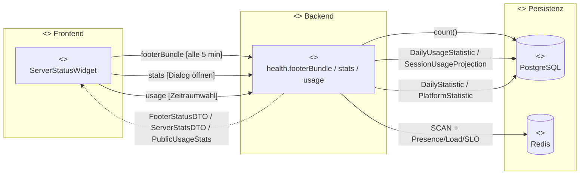
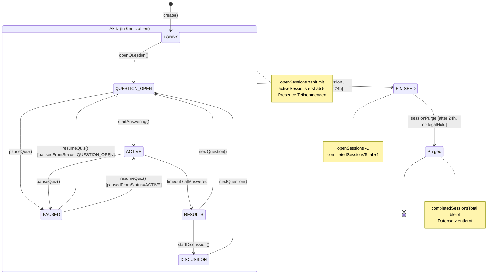
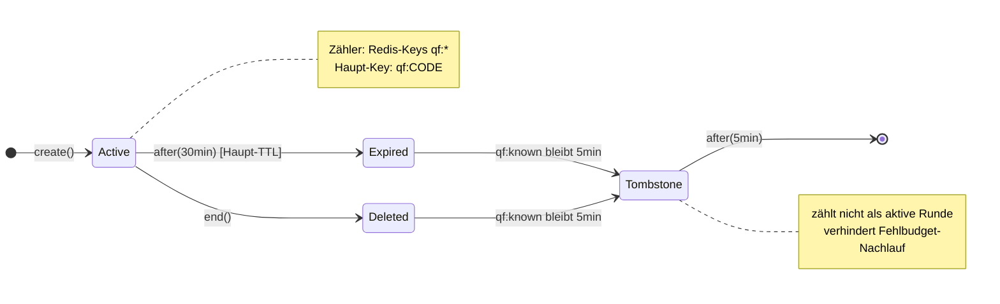
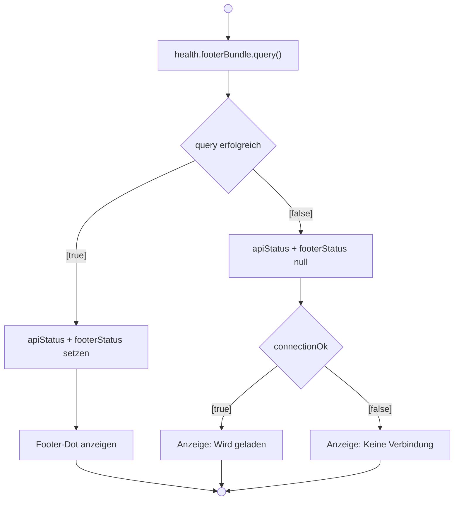
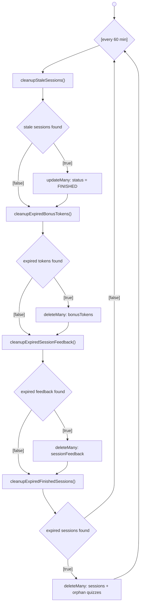

# Betrieb & Nutzung (Story 0.4 / Issue #483)

> **Zielgruppe:** Product Owner, Entwickler  
> **Stand:** 2026-09-30 (öffentliche Ansicht „Betrieb & Nutzung“; getrennter `footerBundle`-Pfad)

## Was zeigt der Einstieg?

**Betrieb & Nutzung** ist im **globalen App-Footer** unter **Mehr → Betrieb & Nutzung**
erreichbar (`app.component.html`) und öffnet denselben öffentlichen Dialog ohne Anmeldung.
Im Menüeintrag werden Label und farbiger Status-Dot angezeigt; die Kennzahlen stehen im
**Dialog** mit den Bereichen **Betrieb** und **Nutzung**.

Bei **gelbem oder rotem** Betriebszustand (`limited` / `critical`) erscheint zusätzlich
ein schmales Warnbanner **unterhalb der Header-Leiste** mit Kurztext und Link
„Mehr erfahren“ auf denselben Dialog. Bei Grün oder Grau (inkl. `unknown` / Messausfall)
bleibt das Banner ausgeblendet.

Der Footer (und damit Status-Einstieg sowie Banner) wird **nicht** angezeigt auf der
**Standalone-Blitzlicht-Route** (`/feedback/...`) und in der **immersiven Host-Ansicht**
(`isImmersiveHostView`). Auf Join- und Session-Live-Routen bleibt der Status-Einstieg
ausgeblendet (Polling unterdrückt).

### Bereich Betrieb

Öffentlicher Betriebsstatus beantwortet: **Funktioniert arsnova.eu gerade zuverlässig?**
`loadStatus` heißt in der UI **Aktuelle Aktivität** und darf die Gesundheit nicht allein bestimmen.

| Kennzahl            | Bedeutung                                                                               |
| ------------------- | --------------------------------------------------------------------------------------- |
| Gesamtzustand       | `stable` / `limited` / `critical` / `unknown` — nie grün bei Messausfall                |
| Kernfunktionen      | API, Datenbank, Redis, Live-Verbindung getrennt                                         |
| Serververkehr       | API-Anfragen/s, Spitze/s, Fehlerrate, p95/p99, Stichprobe — nie isoliert von Qualität   |
| Live-Verbindungen   | offene tRPC-/Yjs-Verbindungen, Neu/geschlossen, Ablehnungen; Zustellung nicht gemessen  |
| Servicequalität     | Stichproben Beitritt, Quizantwort, Q&A lesen/einreichen/bewerten (Abdeckung sichtbar)   |
| Nutzbare Sessions   | `expiresAt` in der Zukunft, nicht host-beendet; inkl. `FINISHED` mit noch joinbarem Q&A |
| Aktive Sessions     | Nutzbare Sessions mit ≥5 Presence-Identitäten                                           |
| Aktive Q&A-Sessions | Nutzbare Q&A-Kanäle inkl. nach Quizende; Presence-Fenster                               |
| Teilnehmende        | Anwesende über nutzbare Sessions (Redis-Presence)                                       |
| Dynamik             | Votes/Q&A/Statuswechsel/Countdowns der letzten Minute                                   |

### Bereich Nutzung

Öffentliche Nutzungskennzahlen beantworten: **Wie häufig und wofür wird arsnova.eu genutzt?**
Kernzahlen (Sessions, Teilnahmen, Quiz/Q&A) stehen zuerst. Tages-/Monatsverlauf und die
**Join-Rekorde (Legacy)** sind standardmäßig eingeklappt, damit sie die neuen Aggregate nicht
überlagern.
| -------------------------- | ------------------------------------------------------------------------------------------------------------------------------------------------------------------------- |
| Zeitraum | `LAST_30_DAYS`, `CURRENT_SEMESTER` oder `CUSTOM` (max. 366 UTC-Tage) über `health.usage` bzw. Default in stats |
| Genutzte Sessions | Purge-sichere Tagesaggregate (`DailyUsageStatistic`) + Session-Projektion (`SessionUsageProjection`) |
| Teilnahmen / Antworten | Erstbeitritte und Quizstimmen; fehlende Tage/`null`, nie als 0 maskiert |
| Q&A / Bewertungen | Akzeptierte Fragen und Rating-Aktionen im Zeitraum |
| Funktionen | Nur Quiz / nur Q&A / kombiniert (Kohorte nach `firstUsedUtcDate`) |
| Größenklassen | XS–XL aus Peak-Teilnahmen; Median/Q1/Q3 linear; bei Cap Zufallsstichprobe (`random()`), nie die kleinsten N |
| Q&A-Fragen gesamt | Monotone, purge-sichere Lifetime-Zählung |
| Join-Rekord / Tagesrekorde | Legacy-`DailyStatistic`: Lebenszeit-Max (kumulierte Erstbeitritte); 100-UTC-Tage-Serie (Lücken/`0` als `null`); Median/IQR/Max + `sampleSize` nur über positive Messwerte |
| Datenqualität | Zeitzone UTC, Erfassungsbeginn, `historyComplete` |

Der Footer ruft alle 5 Minuten **`health.footerBundle`** ab. Dieser Endpoint kombiniert `health.check`
mit einem schlanken `FooterStatusDTO` (`serviceStatus`, `loadStatus`, `measurementAvailable`). Beim Öffnen des Dialogs lädt
die App **`health.stats`** frisch nach (Betrieb + Default-Nutzung `LAST_30_DAYS`). Im Nutzungstab kann der Zeitraum
über **`health.usage`** gewechselt werden (eigener Kurzzeit-Cache).

Der Footer-Pfad berechnet nur `serviceStatus`, `loadStatus` und `measurementAvailable`. Er liest weder die
Q&A-Plattformprojektion noch NLP-/Wortwolkenmetriken. Q&A-Werte werden ausschließlich
beim Öffnen des Detaildialogs über das höchstens 30 Sekunden gecachte `health.stats`
geladen.

Für transiente Q&A-Werte sind Redis-Buckets instanzübergreifend und mit TTL begrenzt.
Nach einer bekannten Erfassungslücke bleiben Minutenwerte 60 Sekunden und Presence-Werte
drei Minuten `null`; der Dialog zeigt währenddessen »Live-Werte werden neu aufgebaut«.
Bei nicht verfügbarer Quelle zeigt er »Derzeit nicht verfügbar« statt einer irreführenden
Null.

### Status-Dot (Ampel)

| Farbe   | Bedeutung                 | Datenbasis                                                          |
| ------- | ------------------------- | ------------------------------------------------------------------- |
| 🟢 Grün | Stabil (`serviceStatus`)  | `serviceStatus = stable` und `measurementAvailable = true`          |
| 🟡 Gelb | Eingeschränkt             | `serviceStatus = limited`                                           |
| 🔴 Rot  | Gestört                   | `serviceStatus = critical`                                          |
| ⚪ Grau | Unbekannt / nicht geladen | `unknown`, `measurementAvailable=false`, Offline oder noch kein DTO |

**Hinweis:** Der Dot ist ein **Betriebszustand** und keine Aussage über Nutzungsaktivität.
`loadStatus` bleibt als Aktivitätskontext im Bereich Betrieb sichtbar und darf die
Gesundheit nicht allein bestimmen.

---

## Datenfluss (Komponentendiagramm)


```mermaid
flowchart LR
  subgraph "<<subsystem>> Frontend"
    W["<<component>>\nServerStatusWidget"]
  end

  subgraph "<<subsystem>> Backend"
    H["<<component>>\nhealth.footerBundle / stats / usage"]
  end

  subgraph "<<subsystem>> Persistenz"
    P[("<<database>>\nPostgreSQL")]
    R[("<<database>>\nRedis")]
  end

  W -- "footerBundle [alle 5 min]" --> H
  W -- "stats [Dialog öffnen]" --> H
  W -- "usage [Zeitraumwahl]" --> H
  H -. "FooterStatusDTO / ServerStatsDTO / PublicUsageStats" .-> W
  H -- "count()" --> P
  H -- "DailyUsageStatistic / SessionUsageProjection" --> P
  H -- "DailyStatistic / PlatformStatistic" --> P
  H -- "SCAN + Presence/Load/SLO" --> R
```

### Ablauf (Sequenzdiagramm)

```mermaid
sequenceDiagram
  actor User
  participant App as AppComponent
  participant Widget as ServerStatusWidget
  participant Client as tRPC Client
  participant Router as healthRouter
  participant DB as PostgreSQL
  participant Cache as Redis

  Note over App: Beim Start / Retry: health.footerBundle → apiStatus + FooterStatusDTO
  App ->> Client: health.footerBundle.query()
  Client -->> App: check + serviceStatus/loadStatus/measurementAvailable

  User ->> Widget: Route mit Footer
  activate Widget
  Note over Widget: connectionOk = apiStatus und Dot aus serviceStatus
  Widget ->> User: Button Betrieb & Nutzung
  User ->> Widget: Dialog öffnen
  Widget ->> Client: health.stats.query()
  activate Client
  activate Router

  par Promise.all
    Router ->> DB: nutzbare Sessions (inkl. FINISHED+offenes Q&A)
    Router ->> DB: PlatformStatistic lesen
    Router ->> DB: DailyStatistic / DailyUsageStatistic lesen
    Router ->> Cache: Presence / Load / SLO
  end

  DB -->> Router: Counts + Platform/Daily/Usage
  Cache -->> Router: Presence + Load/SLO

  Router ->> Router: serviceStatus; unknown bei Messausfall
  Router ->> Router: ServerStatsDTOSchema.parse
  Router -->> Client: ServerStatsDTO
  deactivate Router
  Client -->> Widget: stats.set(data)
  deactivate Client
  Widget ->> Widget: Tabs Betrieb / Nutzung
  User ->> Widget: Zeitraum Semester
  Widget ->> Client: health.usage.query(CURRENT_SEMESTER)
  Client -->> Widget: PublicUsageStats
  deactivate Widget

  loop alle 5 min bei sichtbarem Footer
    App ->> Client: health.footerBundle.query()
    Client -->> App: check + FooterStatusDTO
  end
```

> **Hinweis:** Nutzungsaggregate werden eventgetrieben (erster Join, neue Quizstimme,
> Q&A accept/rate) in `DailyUsageStatistic` und `SessionUsageProjection` geschrieben.
> Session-Purge löscht keine Aggregatzeilen (keine FK). Bis der erste Eventtag vorliegt,
> bleiben Periodenwerte `null` mit `historyComplete=false`.

### Dev-Seed (lokale Metrik-Abdeckung)

Für die Dev-DB (`arsnova_v3_dev`) realistische Aggregate und Demo-Sessions:

```bash
npm run seed:betrieb-nutzung -w @arsnova/backend -- --replace
```

Befüllt u. a. `DailyUsageStatistic` (45 UTC-Tage), `SessionUsageProjection` (XS–XL, Quiz/Q&A/kombiniert),
`DailyStatistic` mit Lückentagen, `PlatformStatistic`-Tracking sowie Live-Codes `BN483Q` /
`BN483A` / `BN483F` (Quiz live, Q&A live, FINISHED mit offenem Q&A).

### Performance & Abfragegrenzen (Issue #483)

| Pfad                      | Strategie                                                                                                                        | Nachweis / Restrisiko                                                                                   |
| ------------------------- | -------------------------------------------------------------------------------------------------------------------------------- | ------------------------------------------------------------------------------------------------------- |
| Schreibpfad Join/Vote/Q&A | `SessionUsageProjection` per `FOR UPDATE` + begrenzte `DailyUsageStatistic`-UPSERTs; `PlatformStatistic.projectedAt` max. 1×/60s | Kein Vollscan; Hot-Row auf Tracking gedrosselt. Lasttest 500 Concurrent noch ausstehend vor Prod-Merge. |
| `health.stats`            | 30s Cache + In-Flight-Coalesce; DailyHighscores auf 100 UTC-Tage begrenzt                                                        | Presence nur für nutzbare Session-IDs.                                                                  |
| `health.usage`            | 30s Cache, max. 64 Keys (TTL-Prune), In-Flight pro Key, Rate-Limit IP+global (`checkHealthUsageRate`)                            | Größenverteilung: `ORDER BY random() LIMIT 5000` — bei sehr großen Kohorten Stichprobe.                 |
| Indizes                   | `DailyUsageStatistic(date)` unique; `SessionUsageProjection(firstUsedUtcDate)`, `(functionClass, firstUsedUtcDate)`              | EXPLAIN gegen Prod-ähnliche Daten vor Go-Live wiederholen.                                              |

### Öffentliche Betriebsüberwachung (Serververkehr & Live)

RPS wird **niemals isoliert** interpretiert. `health.stats` liefert `trafficQuality` und
`liveConnections` zusammen mit Fehlerrate, p95/p99 und WebSocket-Kennzahlen.

#### Erfasst / nicht erfasst

| Kategorie                  | Prozeduren (Allowlist)                                                                                                     | Zählt zu Kernaktions-RPS |
| -------------------------- | -------------------------------------------------------------------------------------------------------------------------- | ------------------------ |
| Session/Beitritt           | `session.join`                                                                                                             | ja                       |
| Quiz/Schnellfeedback       | `vote.submit`, `quickFeedback.vote`                                                                                        | ja                       |
| Q&A                        | `qa.list`, `qa.submit`, `qa.upvote`, `qa.vote`                                                                             | ja                       |
| Präsentationssteuerung     | `session.startQa`, `nextQuestion`, `skipQuestion`, `revealAnswers`, `revealResults`, `startDiscussion`, `startSecondRound` | ja                       |
| Betriebs-/Berichtsabfragen | `health.*`, `session.getInfo`                                                                                              | **nein** (Poll-Schutz)   |

Statische Assets, Crawler und technische Healthchecks liegen außerhalb der tRPC-Allowlist.

#### Formeln und Fenster

- Buckets: **10 s**, Fenster: **60 s** (`WINDOW_BUCKETS = 6`), Redis-TTL **120 s**.
- Schreiben: In-Memory-Zähler pro Instanz, Flush alle **5 s** (`incrby`); Epoch per `SET NX`.
- Mehrinstanz: gemeinsame Redis-Keys summiert; Flush-Retry legt den Batch zurück (kein Doppelzählen).
- **API-Anfragen/s:** `Σ bucketTotals / observedWindowSeconds` (Anlauf: beobachtete Zeit, nicht pauschal 60).
- **Spitze/s:** `max(bucketCount / 10)` über die Fenster-Buckets.
- **Fehlerrate (Gesundheit):** `(server + rateLimit) / total × 100`. Clientfehler getrennt; verschlechtern den Zustand nicht.
- Fehlerklassen: `INTERNAL_SERVER_ERROR`/`TIMEOUT` → server; `TOO_MANY_REQUESTS` → rateLimit; fachliche 4xx → client.
- **p95/p99:** Histogramm-Kanten `[100,200,300,500,800,1000,1500,2000,3000,5000,10000,inf]` ms; **inkl. fehlgeschlagener Requests**. Unter 20 Samples: `insufficientLatencySample`, keine Qualitätsaussage.
- Messzustand: `AVAILABLE` | `WARMING_UP` | `UNAVAILABLE` — nie `0`/„stabil“ bei Ausfall.

#### WebSocket

- Offene tRPC-/Yjs-Verbindungen, Open/Close der letzten Minute, aggregierte Ablehnungen.
- Reconnects und Nachrichtenrate: **nicht belastbar** → `null` / UI „nicht gemessen“.
- Offene Verbindung ≠ erfolgreiche Zustellung (`deliveryNotMeasured: true`).
- Werte gelten **pro Backend-Prozess** (kein Cluster-Scan).

#### Lasttest (500 Concurrent inkl. Shared-NAT)

Baseline und Instrumentierung: `scripts/load/k6-session-hotpaths-500vu.js` sowie
`MODE=ops-monitoring` in `scripts/load/k6-ops-monitoring-500vu.js` (Join, Vote, Q&A,
WebSocket-Reconnects, paralleles `health.stats`-Polling).

Akzeptanz: keine relevante Regression der bestehenden Hotpath-SLOs
(`p95 < 1000 ms`, `p99 < 2000 ms`, Fehlerrate `< 0.5 %` für fachliche Kernaktionen)
gegenüber Baseline ohne neue Flush-Instrumentierung; Telemetrie-Flush-Lag und Redis-Ops
im PR-Bericht dokumentieren.

Lokaler Nachweis (2026-09-30, Docker-k6 gegen Dev-Backend, Session `BN483Q`):

| Lauf             | VUs | Muster                        | join p95 | health.stats p95 | Fehlerrate | Anmerkung                                                |
| ---------------- | --- | ----------------------------- | -------- | ---------------- | ---------- | -------------------------------------------------------- |
| Baseline Hotpath | 500 | `load:k6:hotpaths` Join-Welle | ~3,98 s  | —                | ~1,4 %     | Dev-DB; Schwellen lokal ohnehin verfehlt                 |
| Ops-Monitoring   | 500 | Join-Welle + 50 Poll-VUs      | ~3,96 s  | ~6,4 ms          | 0 %        | `trafficQuality` ok; `opsReporting=0`, `sessionJoin=500` |
| Smoke            | 50  | constant join+poll            | ~111 ms  | ~3 ms            | niedrig    | Join/Status OK                                           |

Fazit: Status-Polling und Flush-Telemetrie erzeugen keine relevante zusätzliche Join-Regression
gegenüber der lokalen Hotpath-Baseline; die p95-Überschreitung ist umgebungsbedingt (Dev), nicht
durch die neue Instrumentierung verursacht. Prod-ähnliche Hardware vor Merge erneut messen.

---

## Legacy-Abschnitt (Detailquellen)

Die folgenden Abschnitte beschreiben weiterhin die bestehenden Datenquellen und
Implementierungsdetails; Kennzahl-Definitionen oben haben Vorrang.

### PostgreSQL (via Prisma)

| Kennzahl                     | Query                                                                 | Filter                                                                                                    |
| ---------------------------- | --------------------------------------------------------------------- | --------------------------------------------------------------------------------------------------------- |
| Kennzahl / Daten             | Query / Quelle                                                        | Filter / Semantik                                                                                         |
| ---------------------------- | --------------------------------------                                | --------------------------------------------------------------------------------------------------        |
| Offene / nutzbare Sessions   | `prisma.session.count/findMany(…)`                                    | `expiresAt` zukunft, nicht host-beendet; inkl. `FINISHED` mit noch joinbarem Q&A                          |
| Aktive Sessions              | Presence ≥5 auf nutzbaren Sessions **ohne** Status `FINISHED`         | Offenes Q&A nach Quizende zählt unter aktiven Q&A-Sessions, nicht als Quizphase                           |
| Abgeschlossene Quizzes       | `PlatformStatistic.completedSessionsTotal` / Fallback `session.count` | monotoner Gesamtzähler, damit Purge den Wert nicht senkt                                                  |
| Allzeit-Rekord               | `PlatformStatistic`                                                   | `maxParticipantsSingleSession`, `updatedAt`                                                               |
| Q&A-Gesamt/-Rekord           | `PlatformStatistic`                                                   | asynchron aus purge-sicheren `QaSessionStatisticProjection`-Zeilen; kein Fragenbestandsscan               |
| Tagesrekord-Verlauf          | `prisma.dailyStatistic.findMany(…)`                                   | letzte 100 UTC-Tage; fehlende/`0`-Tage als `count=null`; Median/IQR/Max + `sampleSize` nur über `count>0` |
| Quiz-/Session-Inhalte        | Session/Quiz-Tabellen                                                 | nur indirekt für Counts; keine Inhalte im Footer-Status                                                   |

### Redis

| Kennzahl                 | Methode                 | Details                                                                                                                     |
| ------------------------ | ----------------------- | --------------------------------------------------------------------------------------------------------------------------- |
| Kennzahl / Signal        | Methode                 | Details                                                                                                                     |
| ------------------------ | ----------------------- | --------------------------------------------------------------------------------------------------------                    |
| Aktive Teilnehmende      | Presence-Keys           | nur offene Sessions; Presence-Fenster siehe Backend `presence`                                                              |
| Aktive Sessions          | Presence pro Session    | nutzbare Sessions **ohne** `FINISHED`, ≥ `ACTIVE_SESSION_MIN_PARTICIPANTS = 5`                                              |
| Blitz-Runden             | `SCAN` mit `MATCH qf:*` | es zählen nur Primärkeys `qf:<code>`, keine `qf:voters:*`, `qf:choices:*`, `qf:choices:r1:*`, `qf:host:*` oder `qf:known:*` |
| Votes / Statuswechsel    | Load-Signale            | Werte der letzten Minute                                                                                                    |
| SLO / Serververkehr      | `sloTelemetry` (Redis)  | Kernaktions-RPS avg/peak, Fehlerrate (Server+Rate-Limit), p95/p99, Gruppen-Allowlist; 10s-Buckets, Flush alle 5s            |
| Live-Verbindungen        | `websocketTelemetry`    | Offene tRPC-/Yjs-Verbindungen, Open/Close, Ablehnungen (pro Prozess); Zustellung nicht gemessen                             |
| Q&A-Minutenwerte         | 1-Sekunden-Buckets      | 60-Sekunden-Fenster, TTL, deduplizierte Erst-Submits und persistierte Bewertungsänderungen                                  |

`qaQuestionsTotal` und `maxQaQuestionsSingleSession` gelten ausdrücklich **seit Beginn
der Erfassung** (`qaStatisticsTrackingStartedAt`). Die beim Rollout noch physisch
vorhandenen Fragen bilden den initialen Backfill; bereits vorher gelöschte Historie kann
nicht rekonstruiert werden. `qaStatisticsProjectedAt` weist den Projektionsstand,
`statsGeneratedAt` den Abschlusszeitpunkt des angezeigten Snapshots aus.

---

## Lebenszyklus der Daten (Wann sinken/verschwinden Kennzahlen?)

### Offene Sessions, aktive Sessions & Teilnehmende

**Nutzbare Sessions** (`openSessions`) bleiben zählbar, solange `expiresAt` in der Zukunft
liegt und die Session nicht host-beendet ist — einschließlich `FINISHED` mit noch offenem Q&A.

**Aktive Sessions** (`activeSessions`) zählen nur nutzbare Sessions mit Status ≠ `FINISHED`
und mindestens 5 Presence-Identitäten. Offenes Q&A nach Quizende erscheint unter
**Aktive Q&A-Sessions**, nicht als laufende Quizphase.

Als **aktive Teilnehmende** zählen Presence-Identitäten über alle nutzbaren Sessions
(inkl. FINISHED+Q&A).

Eine Session fällt aus der nutzbaren Zählung, wenn die Beitrittsfrist abläuft, der Host
beendet, oder (bei FINISHED) der Q&A-Kanal schließt.
Das geschieht durch:

| Auslöser               | Beschreibung                                 | Timing                  |
| ---------------------- | -------------------------------------------- | ----------------------- |
| **Manuell**            | Dozent beendet die Session (`session.end`)   | Sofort                  |
| **Automatisch**        | Letzte Frage wurde beantwortet → `FINISHED`  | Sofort                  |
| **Cleanup (verwaist)** | Session seit > **24 h** aktiv ohne Aktivität | Stündlicher Cleanup-Job |

Teilnehmende werden nicht einzeln aus PostgreSQL entfernt. Für den Live-Status zählt Redis-Presence;
sobald Presence abläuft oder die Session beendet ist, sinken die Live-Zahlen.

### Abgeschlossene Quizzes

| Auslöser          | Beschreibung                                                                                                                                                                | Timing                  |
| ----------------- | --------------------------------------------------------------------------------------------------------------------------------------------------------------------------- | ----------------------- |
| **Session Purge** | `FINISHED`-Sessions werden frühestens **24 h nach Beendigung** gelöscht, aber nur wenn kein aktiver Legal Hold und keine frischen Bonus-Tokens/Session-Feedbacks existieren | Stündlicher Cleanup-Job |
| **Legal Hold**    | Sessions mit `legalHoldUntil` in der Zukunft bleiben erhalten                                                                                                               | Bis Ablauf des Holds    |

Beim Purge werden auch verwaiste Quizzes gelöscht (Quizzes ohne verbleibende Sessions).
Der angezeigte Gesamtwert `completedSessions` sinkt dadurch nicht, weil `completedSessionsTotal`
monoton in `PlatformStatistic` geführt wird.

### Blitz-Runden (Redis)

| Auslöser      | Beschreibung                                                                                                                                          | Timing                  |
| ------------- | ----------------------------------------------------------------------------------------------------------------------------------------------------- | ----------------------- |
| **TTL**       | Haupt- und Rundendaten laufen nach **30 Minuten** ab; `qf:known:<CODE>` lebt als Tombstone fünf Minuten länger und zählt nicht als aktive Blitz-Runde | Automatisch durch Redis |
| **Schreiben** | Mutationen mit erneuter Haupt-TTL erneuern den Tombstone auf **35 Minuten**                                                                           | Mit der Mutation        |
| **Manuell**   | `quickFeedback.end` löscht die Rundendaten sofort und hält den Tombstone noch fünf Minuten, damit Polling/Subscription sauber bei `NOT_FOUND` stoppen | Sofort                  |

### Lebenszyklus einer Session (Zustandsdiagramm)


```mermaid
stateDiagram-v2
  direction TB

  [*] --> LOBBY : create()

  state "Aktiv (in Kennzahlen)" as active {
    LOBBY --> QUESTION_OPEN : openQuestion()
    QUESTION_OPEN --> ACTIVE : startAnswering()
    QUESTION_OPEN --> PAUSED : pauseQuiz()
    ACTIVE --> PAUSED : pauseQuiz()
    PAUSED --> QUESTION_OPEN : resumeQuiz() [pausedFromStatus=QUESTION_OPEN]
    PAUSED --> ACTIVE : resumeQuiz() [pausedFromStatus=ACTIVE]
    ACTIVE --> RESULTS : timeout / allAnswered
    RESULTS --> DISCUSSION : startDiscussion()
    RESULTS --> QUESTION_OPEN : nextQuestion()
    DISCUSSION --> QUESTION_OPEN : nextQuestion()
  }

  active --> FINISHED : end() / lastQuestion / cleanup [after 24h]

  FINISHED --> Purged : sessionPurge [after 24h, no legalHold]
  Purged --> [*]

  note right of active
    openSessions zählt mit
    activeSessions erst ab 5 Presence-Teilnehmenden
  end note

  note right of FINISHED
    openSessions -1
    completedSessionsTotal +1
  end note

  note right of Purged
    completedSessionsTotal bleibt
    Datensatz entfernt
  end note
```

### Lebenszyklus einer Blitz-Runde (Zustandsdiagramm)


```mermaid
stateDiagram-v2
  direction LR

  [*] --> Active : create()
  Active --> Expired : after(30min) [Haupt-TTL]
  Active --> Deleted : end()
  Expired --> Tombstone : qf:known bleibt 5min
  Deleted --> Tombstone : qf:known bleibt 5min
  Tombstone --> [*] : after(5min)

  note right of Active
    Zähler: Redis-Keys qf:*
    Haupt-Key: qf:CODE
  end note

  note right of Tombstone
    zählt nicht als aktive Runde
    verhindert Fehlbudget-Nachlauf
  end note
```

---

## Fehlerverhalten (Aktivitaetsdiagramm)


```mermaid
flowchart TD
  S(( )) --> Q["health.footerBundle.query()"]
  Q --> OK{query erfolgreich}

  OK -- "[true]" --> SET["apiStatus + footerStatus setzen"]
  SET --> RENDER["Footer-Dot anzeigen"]
  RENDER --> E(( ))

  OK -- "[false]" --> NULL["apiStatus + footerStatus null"]
  NULL --> CON{connectionOk}
  CON -- "[true]" --> LOAD["Anzeige: Wird geladen"]
  CON -- "[false]" --> OFFLINE["Anzeige: Keine Verbindung"]
  LOAD --> E
  OFFLINE --> E
```

| Situation                                  | Backend                                                           | Frontend                                                                        |
| ------------------------------------------ | ----------------------------------------------------------------- | ------------------------------------------------------------------------------- |
| DB oder Redis nicht erreichbar             | Fallback: Werte `0`, `serviceStatus=stable`, `loadStatus=healthy` | Dialog zeigt Fallbackwerte, Footer-Dot bleibt stabil wenn `health.check` ok ist |
| tRPC `health.footerBundle` schlägt fehl    | –                                                                 | `apiStatus=null`, `footerStatus=null` → grauer Dot und Retry-Aktion             |
| tRPC `health.stats` im Dialog schlägt fehl | –                                                                 | `footerStats=null` → Dialog zeigt Lade-/Fehlerzustand statt Kennzahlen          |

---

## Darstellung

Der Betriebsstatus hat diese Einstiege in der App-Shell:

1. **Warnbanner unter dem Header** – nur bei gelb/rot (`limited` / `critical`)
2. **Mehr → Betriebsstatus** – immer im Footer-Menü (wenn Footer sichtbar)

Beide öffnen denselben Dialog; alle Kennzahlen liegen dort.
Die Ampelfarbe kommt aus der gemeinsamen Helper-Quelle
`resolveFooterStatusColor` / `resolveFooterStatusDotCssColor`
(`footer-status-color.ts`), die auch `ServerStatusWidgetComponent` nutzt
(Widget selbst ist nicht mehr als eigener Primärbutton in der App-Shell eingebunden).

| Element          | Verwendung                          | Darstellung                                     |
| ---------------- | ----------------------------------- | ----------------------------------------------- |
| Warnbanner       | unter Header, nur yellow/red        | schmales farbiges Banner + Link „Mehr erfahren“ |
| Mehr-Menüeintrag | globaler App-Footer → Menü „Mehr“   | Status-Dot + Label „Betriebsstatus“             |
| Detaildialog     | Banner-Link / Menü „Betriebsstatus“ | Kennzahlen, SLO-/Laststatus und 100-Tage-Chart  |

```html
@if (serviceStatusBannerVisible()) {
<div
  class="app-service-status-banner"
  [class.app-service-status-banner--busy]="footerStatusColor() === 'yellow'"
  [class.app-service-status-banner--critical]="footerStatusColor() === 'red'"
  role="status"
>
  <span i18n="@@app.serviceStatusBanner.text">⚠️ Mögliche Verzögerungen.</span>
  <button
    type="button"
    class="app-service-status-banner__link"
    (click)="openServerStatusFromBanner()"
    i18n="@@app.serviceStatusBanner.learnMore"
  >
    Mehr erfahren
  </button>
</div>
}
<button mat-menu-item type="button" (click)="openServerStatusFromMore()">
  <mat-icon class="app-footer__status-dot" [style.color]="footerStatusDotCssColor()">lens</mat-icon>
  <span i18n="@@app.footer.serverHelpLabel">Betriebsstatus</span>
</button>
```

Der **Hilfe-Dialog** (`ServerStatusHelpDialogComponent`) wird lazy geladen und ruft dann `health.stats` ab.
Nach dem Schließen liegt der Fokus wieder auf dem auslösenden Trigger
(**Mehr** bzw. Banner-Link „Mehr erfahren“).

---

## Cleanup-Scheduler (Hintergrund-Jobs)

Der Scheduler startet mit dem Backend und läuft **jede Stunde** (`sessionCleanup.ts`):

_Aktivitätsdiagramm_


```mermaid
flowchart TB
  S(( )) --> TIMER{"[every 60 min]"}
  TIMER --> J1["cleanupStaleSessions()"]
  J1 --> D1{"stale sessions found"}
  D1 -- "[true]" --> U1["updateMany: status = FINISHED"]
  D1 -- "[false]" --> J2
  U1 --> J2["cleanupExpiredBonusTokens()"]
  J2 --> D2{"expired tokens found"}
  D2 -- "[true]" --> TDEL["deleteMany: bonusTokens"]
  D2 -- "[false]" --> J3
  TDEL --> J3["cleanupExpiredSessionFeedback()"]
  J3 --> D3{"expired feedback found"}
  D3 -- "[true]" --> FDEL["deleteMany: sessionFeedback"]
  D3 -- "[false]" --> J4
  FDEL --> J4["cleanupExpiredFinishedSessions()"]
  J4 --> D4{"expired sessions found"}
  D4 -- "[true]" --> DEL["deleteMany: sessions + orphan quizzes"]
  D4 -- "[false]" --> TIMER
  DEL --> TIMER
```

| Job                       | Aktion                                                                 | Schwellwert                             |
| ------------------------- | ---------------------------------------------------------------------- | --------------------------------------- |
| 1. Stale Sessions         | Aktive Sessions ohne Aktivität seit > 24 h → `FINISHED`                | `STALE_SESSION_HOURS = 24`              |
| 2. Bonus-Token Purge      | Bonus-Tokens älter als 90 Tage → gelöscht                              | `BONUS_TOKEN_RETENTION_DAYS = 90`       |
| 3. Session-Feedback Purge | Feedback zu beendeten Sessions älter als 90 Tage → gelöscht            | `SESSION_FEEDBACK_RETENTION_DAYS = 90`  |
| 4. Session Purge          | Beendete Sessions > 24 h nach Ende → gelöscht, wenn Retention frei ist | `FINISHED_SESSION_RETENTION_HOURS = 24` |

---

## Relevante Dateien

| Bereich                         | Datei                                                                           |
| ------------------------------- | ------------------------------------------------------------------------------- |
| **Zod-Schema**                  | `libs/shared-types/src/schemas.ts` (`ServerStatsDTOSchema`)                     |
| **Backend Router**              | `apps/backend/src/routers/health.ts` (`stats`, `footerBundle`, `check`, `ping`) |
| **Cleanup**                     | `apps/backend/src/lib/sessionCleanup.ts`                                        |
| **Presence/Load/SLO**           | `apps/backend/src/lib/presence.ts`, `loadSignal.ts`, `sloTelemetry.ts`          |
| **Blitzlicht TTL**              | `apps/backend/src/routers/quickFeedback.ts` (`FEEDBACK_TTL_SECONDS`)            |
| **Frontend Widget**             | `apps/frontend/src/app/shared/server-status-widget/`                            |
| **Hilfe-Dialog**                | `apps/frontend/src/app/shared/server-status-help-dialog/`                       |
| **API-Erreichbarkeit + Footer** | `apps/frontend/src/app/app.component.ts`, `app.component.html`                  |
