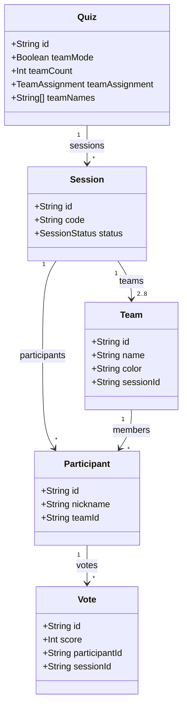
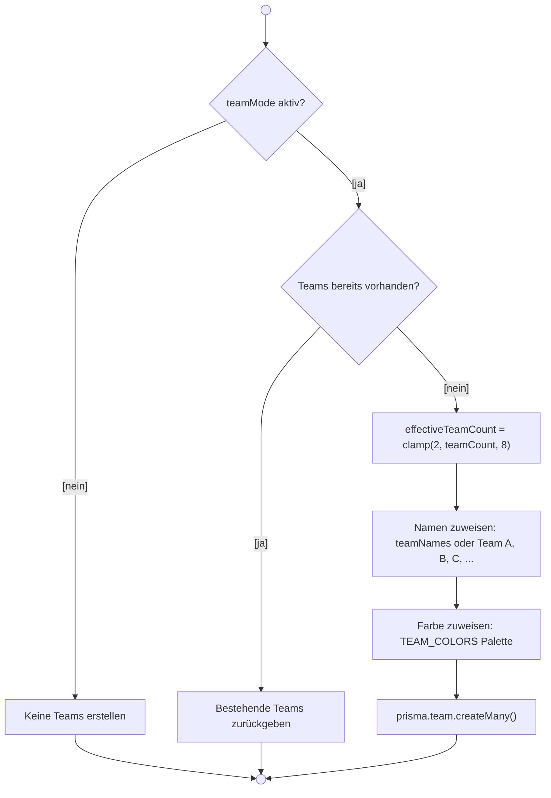
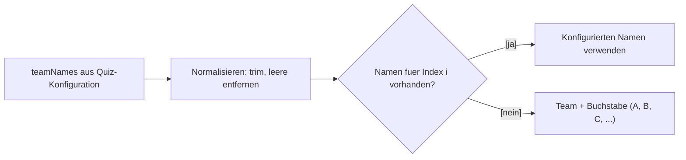
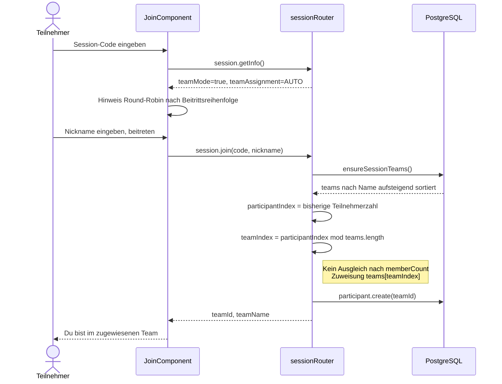
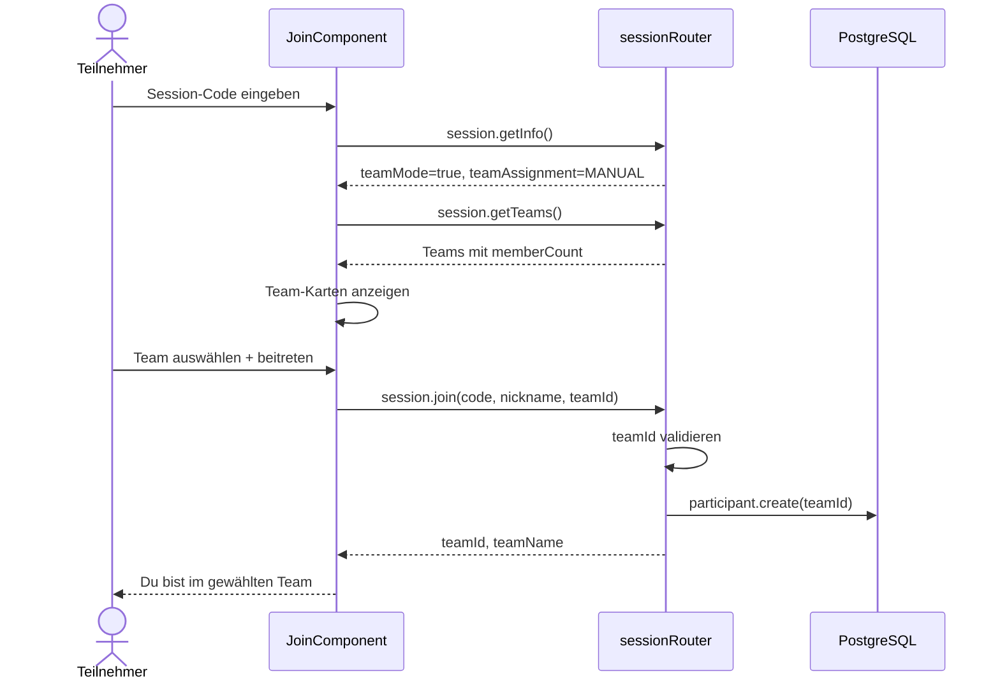
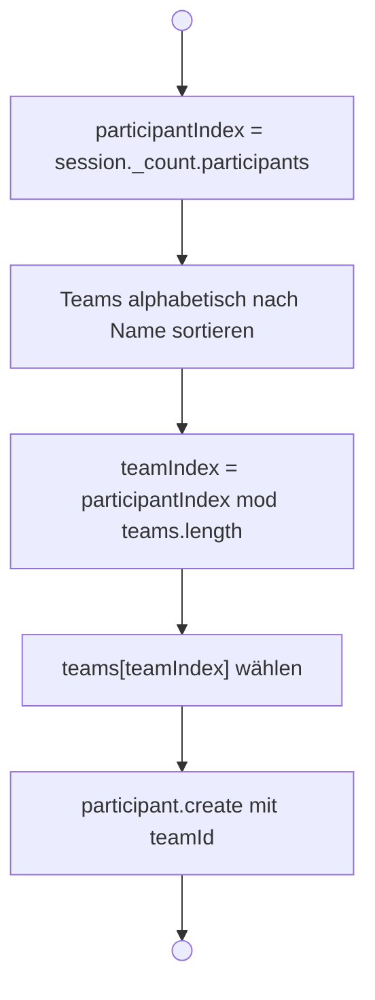
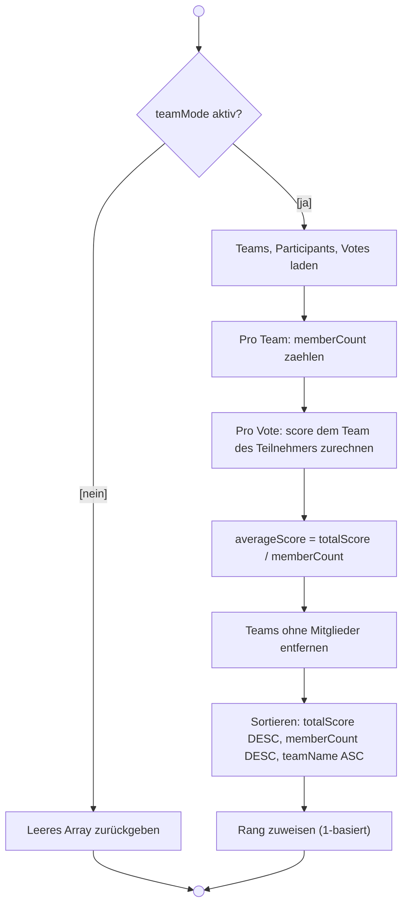
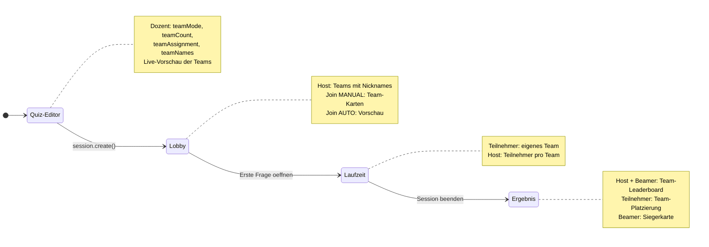

# Team-Modus (Story 7.1)

> **Zielgruppe:** Product Owner, Entwickler  
> **Stand:** 2026-04-01 (Abgleich mit `apps/backend/src/routers/session.ts`: `ensureSessionTeams`, `join`, `getTeamLeaderboard`)

## Konzept

Der Team-Modus ermöglicht es, Teilnehmende in **2 bis 8 Teams** aufzuteilen.
Teams können automatisch (**Round-Robin nach Beitrittsreihenfolge**, nicht nach kleinster
Mitgliederzahl) oder manuell (Teilnehmende wählen selbst) zugewiesen werden. Der Dozent kann
eigene Team-Namen vergeben oder die Standardnamen (Team A, Team B, …) nutzen.

---

## Konfiguration

| Parameter    | Feld             | Wertebereich                                    | Standard |
| ------------ | ---------------- | ----------------------------------------------- | -------- |
| Team-Modus   | `teamMode`       | an / aus                                        | aus      |
| Anzahl Teams | `teamCount`      | 2 – 8                                           | `null`   |
| Zuweisung    | `teamAssignment` | `AUTO` / `MANUAL`                               | `AUTO`   |
| Eigene Namen | `teamNames`      | max. 8 Eintraege, je max. 40 Zeichen, eindeutig | leer     |

Die Felder Anzahl, Zuweisung und Namen sind nur sichtbar, wenn `teamMode` aktiv ist
(Conditional-Visibility-Pattern).

---

## Datenmodell (Klassendiagramm)

Besonderheiten:

- `Team` gehoert immer zu genau einer Session (`@@unique(sessionId, name)`)
- `Participant.teamId` ist optional (`onDelete: SetNull`)
- `Team.color` ist eine feste Hex-Farbe aus einer Palette von 8 Farben

---

## Team-Erstellung (Aktivitaetsdiagramm)

Die Funktion `ensureSessionTeams()` wird an **drei Stellen** aufgerufen:

| Aufrufstelle       | Zeitpunkt                      |
| ------------------ | ------------------------------ |
| `session.create`   | Direkt nach Session-Erstellung |
| `session.join`     | Vor Teilnehmer-Erstellung      |
| `session.getTeams` | Bei Abfrage der Team-Liste     |

Durch die Idempotenz-Pruefung (existierende Teams werden zurueckgegeben) ist
mehrfacher Aufruf sicher.

### Farbpalette

| Index | Farbe   | Hex       |
| ----- | ------- | --------- |
| 0     | Blau    | `#1E88E5` |
| 1     | Gruen   | `#43A047` |
| 2     | Orange  | `#F4511E` |
| 3     | Violett | `#8E24AA` |
| 4     | Gelb    | `#FDD835` |
| 5     | Teal    | `#00897B` |
| 6     | Braun   | `#6D4C41` |
| 7     | Indigo  | `#5E35B1` |

### Namenslogik

Beispiel fuer `teamCount = 4`, `teamNames = ['Rot', 'Blau']`:

| Index | Name   | Quelle       |
| ----- | ------ | ------------ |
| 0     | Rot    | Konfiguriert |
| 1     | Blau   | Konfiguriert |
| 2     | Team C | Fallback     |
| 3     | Team D | Fallback     |

---

## Team-Zuweisung beim Join (Sequenzdiagramm)

### AUTO-Modus

### MANUAL-Modus

### Zuweisungsalgorithmus (AUTO)

Dieses Verfahren ergibt eine **Round-Robin-Verteilung in Beitrittsreihenfolge** über die
**alphabetisch nach `Team.name` sortierte** Teamliste aus `ensureSessionTeams()` (entspricht
`teamIndex = participantIndex % teams.length` vor dem `participant.create`).

1. Teilnehmer → Index 0, 2. → Index 1, … bei 4 Teams: 5. wieder Team an Position 0 usw.
   Bei gleichmäßigem Join sind die Gruppengrößen annähernd ausgeglichen; es gibt **keine**
   serverseitige „kleinste Gruppe zuerst“-Logik.

---

## Team-Leaderboard (Aktivitaetsdiagramm)

Entspricht `getTeamLeaderboard` in `session.ts`: Sortierung `totalScore` absteigend, bei Gleichstand
`memberCount` absteigend, dann `teamName` lexikographisch.

### Darstellung in der UI

Es gibt **keine** eigene `TeamLeaderboardComponent`. Die Daten kommen per
`session.getTeamLeaderboard` und werden in **SessionHost**, **SessionPresent** und **SessionVote**
eingebunden (Signals / Templates in den jeweiligen Session-Komponenten).

### Berechnungsbeispiel

| Team   | Mitglieder | Votes (Score)  | totalScore | averageScore | Rang |
| ------ | ---------- | -------------- | ---------- | ------------ | ---- |
| Team A | p1, p2     | p1: 40, p2: 60 | 100        | 50           | 1    |
| Team B | p3         | p3: 70         | 70         | 70           | 2    |

Team A gewinnt trotz niedrigerem Durchschnitt, weil `totalScore` das primaere
Sortierkriterium ist.

---

## Sichtbarkeit nach Rolle und Phase

| Phase        | Dozent (Host)               | Teilnehmer (Vote)                           | Beamer (Present)          |
| ------------ | --------------------------- | ------------------------------------------- | ------------------------- |
| **Editor**   | Konfiguration, Vorschau     | --                                          | --                        |
| **Lobby**    | Teams mit Mitgliedern       | Team-Auswahl (MANUAL) oder Zuweisung (AUTO) | --                        |
| **Laufzeit** | Teilnehmer pro Team         | Eigenes Team sichtbar                       | --                        |
| **Ergebnis** | Team-Leaderboard mit Balken | Team-Punkte, Platzierung                    | Siegerkarte + Leaderboard |

---

## Validierung (Frontend)

### Quiz-Editor

| Regel                             | Fehlercode           | Meldung                                              |
| --------------------------------- | -------------------- | ---------------------------------------------------- |
| Mehr Namen als Teams              | `tooManyTeamNames`   | "Gib hoechstens so viele Namen wie Teams an."        |
| Name laenger als 40 Zeichen       | `teamNameTooLong`    | "Jeder Team-Name darf maximal 40 Zeichen lang sein." |
| Doppelte Namen (case-insensitive) | `duplicateTeamNames` | "Jeder Team-Name darf nur einmal vorkommen."         |

### Join

| Regel                            | Fehler        | Meldung                      |
| -------------------------------- | ------------- | ---------------------------- |
| MANUAL ohne teamId               | `BAD_REQUEST` | "Bitte waehle ein Team aus." |
| teamId gehoert nicht zur Session | `BAD_REQUEST` | "Ungueltiges Team."          |

---

## tRPC-Endpunkte

| Endpunkt                     | Typ      | Beschreibung                                |
| ---------------------------- | -------- | ------------------------------------------- |
| `session.create`             | Mutation | Erstellt Session + Teams (wenn teamMode)    |
| `session.getInfo`            | Query    | Liefert teamMode, teamAssignment, teamCount |
| `session.getTeams`           | Query    | Teams mit memberCount fuer Join/Lobby       |
| `session.join`               | Mutation | Team-Zuweisung (AUTO/MANUAL) + Participant  |
| `session.getParticipants`    | Query    | Teilnehmer inkl. teamId, teamName           |
| `session.getTeamLeaderboard` | Query    | Team-Ranking nach totalScore                |

---

## Relevante Dateien

| Bereich                 | Datei                                                                                                 |
| ----------------------- | ----------------------------------------------------------------------------------------------------- |
| **Zod-Schemas**         | `libs/shared-types/src/schemas.ts` (TeamAssignmentEnum, TeamDTOSchema, TeamLeaderboardEntryDTOSchema) |
| **Prisma-Modell**       | `prisma/schema.prisma` (Team, TeamAssignment, Quiz.teamMode/teamCount/teamNames)                      |
| **Backend: Team-Logik** | `apps/backend/src/routers/session.ts` (ensureSessionTeams, join, getTeams, getTeamLeaderboard)        |
| **Frontend: Editor**    | `apps/frontend/src/app/features/quiz/quiz-edit/` und `quiz-new/`                                      |
| **Frontend: Join**      | `apps/frontend/src/app/features/join/`                                                                |
| **Frontend: Host**      | `apps/frontend/src/app/features/session/session-host/`                                                |
| **Frontend: Vote**      | `apps/frontend/src/app/features/session/session-vote/`                                                |
| **Frontend: Present**   | `apps/frontend/src/app/features/session/session-present/`                                             |
| **Tests**               | `apps/backend/src/__tests__/session.teams.test.ts`                                                    |
