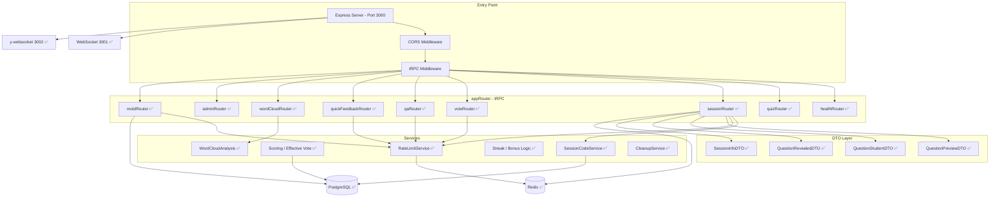

<!-- markdownlint-disable MD013 -->

# 🎓 Onboarding: arsnova.eu

**Stand:** 2026-07-05

Willkommen im Entwickler-Team von **arsnova.eu**. Dieses Dokument hilft dir als Studierende oder Studierender dabei, das Projekt zu verstehen, die Entwicklungsumgebung aufzusetzen und produktiv mitzuarbeiten.

**Noch keine Erfahrung mit Git, VS Code, Docker, npm oder dem Stack (tRPC, Prisma, Angular)?** Lies zuerst die kompakte Landkarte für Studierende: **[`docs/praktikum/EINSTIEG-TOOLS-UND-STACK.md`](praktikum/EINSTIEG-TOOLS-UND-STACK.md)** — danach kehrst du hierher zurück und arbeitest den Quickstart ab.

---

## 1. Quickstart: Entwicklungsumgebung einrichten

### Voraussetzungen

| Tool                    | Version                                                                          | Prüfbefehl               |
| ----------------------- | -------------------------------------------------------------------------------- | ------------------------ |
| Node.js                 | **LTS 20.x** oder **22.x** empfohlen (`.nvmrc` = 20.19.0; `nvm use` / `fnm use`) | `node -v`                |
| npm                     | ≥ 10 (nach `npm ci` zur Lockfile-Passung)                                        | `npm -v`                 |
| Docker & Docker Compose | aktuell                                                                          | `docker compose version` |
| Git                     | aktuell                                                                          | `git -v`                 |

**Node-Version:** Nimm für den Einstieg die per `.nvmrc` gepinnte **20.19.0** oder eine passende **22.x LTS**. Odd-/Current-Majors (z. B. **21**, **23**) sind für lokale Builds **nicht** unterstützt. Die vollständige Regel steht in der Root-[`package.json`](../package.json) (`engines`); dort ist auch **24.x** erlaubt, die **CI** baut aber weiterhin mit **Node 20 und 22** (GitHub Actions).

### Windows? Bitte direkt WSL2 nutzen

Wenn du **Windows** nutzt und noch **wenig Erfahrung** mit Entwicklungsumgebungen hast, nimm für dieses Repo bitte **WSL2 mit Ubuntu** als Standardweg.

**Empfohlener Weg für Windows-Newcomer:**

1. **WSL2 + Ubuntu** installieren.
2. **Docker Desktop** installieren und die **WSL-Integration** aktivieren.
3. **VS Code** mit **Remote - WSL** nutzen.
4. Das Repo **in WSL** klonen, z. B. nach `~/projects/arsnova.eu`.
5. Alle Befehle **im Ubuntu-Terminal** ausführen, nicht in PowerShell.

Für Einsteiger ist das deutlich robuster als ein natives Windows-Setup. So vermeidest du viele typische Probleme mit Docker, Prisma, File-Watchern und Build-Tools.

### Windows in 10 Minuten: Copy-Paste-Weg

Wenn **WSL2**, **Ubuntu**, **Docker Desktop** und **VS Code mit Remote - WSL** bereits installiert sind, reicht in der **Ubuntu-WSL-Konsole** meist dieser Ablauf:

```bash
mkdir -p ~/projects
cd ~/projects
git clone https://github.com/kqc-real/arsnova.eu.git
cd arsnova.eu
cp .env.example .env
npm ci
npm run setup:dev
npm run dev
```

Dann im Windows-Browser: **`http://localhost:4200`**

Wenn **WSL2/Ubuntu** noch nicht installiert ist, zuerst in **PowerShell als Administrator**:

```powershell
wsl --install -d Ubuntu
```

Danach Windows neu starten, Ubuntu einmal initial einrichten, Docker Desktop starten und erst dann den Linux-Block oben ausführen.

### Schnellster Weg zur ersten laufenden Minute

Wenn du das Repo zum **ersten Mal** startest und einfach nur eine **laufende Entwicklungsumgebung** brauchst, nimm genau diesen Weg:

```bash
git clone https://github.com/kqc-real/arsnova.eu.git
cd arsnova.eu
cp .env.example .env
npm ci
npm run setup:dev
npm run dev
```

Dann im Browser: **`http://localhost:4200`**

Das ist absichtlich der einfachste Pfad: **Deutsch**, beide Server laufen parallel, Postgres + Redis sind gestartet, Prisma ist vorbereitet und `shared-types` ist gebaut. **Englisch** brauchst du erst später; dafür gibt es **`npm run dev:en`**.

**Wichtig für Windows:** Diese Befehle laufen dann in **WSL/Ubuntu**, nicht in PowerShell oder Git Bash.

### Setup in wenigen Schritten

Nach **Clone oder Fork** müssen PostgreSQL und Redis laufen, das Datenbankschema angewendet sein und **`@arsnova/shared-types` einmal gebaut** sein — sonst fehlt u. a. `libs/shared-types/dist/` und das Backend startet beim ersten `npm run dev` nicht.

**Reproduzierbar wie in der CI:** Dependencies mit **`npm ci`** installieren (nutzt das Lockfile 1:1). Alternativ: `npm install`.

```bash
# 1. Repository klonen (oder deinen Fork)
git clone https://github.com/kqc-real/arsnova.eu.git
cd arsnova.eu

# 2. Umgebungsvariablen anlegen
cp .env.example .env
# Optional: für /admin lokal ADMIN_SECRET in .env setzen (siehe Root-README)

# 3. Datenbank & Redis starten (Docker) – nur Postgres + Redis für Lokalentwicklung
docker compose up -d postgres redis
# → PostgreSQL (Port 5432), Redis (Port 6379)
# Entspricht inhaltlich: npm run docker:up:dev

# 4. Dependencies (npm Workspaces)
npm ci

# 5. Datenbank-Schema anwenden und Prisma-Client generieren
npm run prisma:push
npm run prisma:generate

# 6. Geteilte Typen bauen (Pflicht vor erstem Dev-Start)
npm run build -w @arsnova/shared-types
```

**Kurz:** Einmalig **`npm run setup:dev`** (startet Postgres + Redis, `prisma:push`, `prisma:generate`, **shared-types-Build**) — deckt die Schritte 3–6 ab, danach **`npm run dev`**.

**Vor dem ersten Commit / bei Pre-Commit-Hook:** Ist nach `npm ci` noch kein Prisma-Client da, **`npm run prisma:generate`** ausführen (sonst schlägt `tsc` fehl).

### Entwicklungsserver starten

```bash
# Alles auf einmal (Backend + Frontend parallel, UI Deutsch):
npm run dev

# Gleiches Verhalten, explizit benannt:
npm run dev:de

# Oberfläche auf Englisch:
npm run dev:en

# Oder einzeln:
npm run dev:backend       # → http://localhost:3000 (tRPC-API)
npm run dev:frontend      # → http://localhost:4200 (Angular, DE-Quelltexte)
npm run dev:frontend:en   # → http://localhost:4200/en/ (Angular, EN)
npm run dev:frontend:de   # → http://localhost:4200 (Angular, DE-Quelltexte)
```

**Funktioniert alles?** Öffne **`http://localhost:4200`** im Browser (Standard-`dev`). Du solltest die Startseite mit dem **Server-Status-Widget** sehen. Wenn du **`npm run dev:en`** oder **`npm run dev:frontend:en`** nutzt, ist die URL **`http://localhost:4200/en/`**. Backend-Health (inkl. Redis) und tRPC laufen auf Port 3000; WebSocket auf 3001, Yjs auf 3002.

**SQM-Schwerpunkt Last/Performance?** Nach dem lokalen Start:
[`docs/praktikum/Arbeitsanweisungen SQM/05-last-pilot-durchfuehren.md`](praktikum/Arbeitsanweisungen%20SQM/05-last-pilot-durchfuehren.md)
und
[`docs/praktikum/HANDOUT-LAST-UND-PERFORMANCE-TESTS.md`](praktikum/HANDOUT-LAST-UND-PERFORMANCE-TESTS.md)
— erster Check: `npm run dev:backend` und `npm run load:k6:health`. Der
[lokale Gesamt-Testlauf vom 2026-07-10](implementation/LOCAL-TESTRUN-2026-07-10.md)
liefert die Ausgangsmessung; der
[QA-Nachlauf vom 2026-07-11](implementation/LOCAL-QA-RECHECK-2026-07-11.md)
belegt die Korrekturen der damals roten Gates.

### Typische Stolperstellen beim ersten Start

| Symptom                                 | Wahrscheinliche Ursache                                        | Direkt ausprobieren                                                   |
| --------------------------------------- | -------------------------------------------------------------- | --------------------------------------------------------------------- |
| `docker compose` geht nicht             | Docker Desktop ist nicht installiert oder nicht gestartet      | Docker starten, dann `docker compose version` prüfen                  |
| `npm run dev` bricht sofort ab          | Node-Version ist nicht passend                                 | `node -v` prüfen; dann `nvm use` oder Node 20/22 installieren         |
| Browser zeigt nicht `/en/`, sondern `/` | Das ist korrekt: Standard-`dev` ist **Deutsch**                | Einfach `http://localhost:4200` nutzen; für Englisch `npm run dev:en` |
| Fehler zu Prisma oder fehlenden Typen   | `setup:dev`, `prisma:generate` oder `shared-types`-Build fehlt | `npm run setup:dev` erneut ausführen                                  |
| Port 3000 oder 4200 ist schon belegt    | Voriger Dev-Server läuft noch                                  | `npm run free-dev-ports` und dann erneut `npm run dev`                |
| `/admin` funktioniert lokal nicht       | `ADMIN_SECRET` wurde nicht gesetzt                             | `.env` ergänzen und Backend neu starten                               |

**Spezialfall Windows:** Wenn das Setup unter Windows „zufällig kaputt“ wirkt, wechsle auf **WSL2/Ubuntu**, klone das Repo dort unter `~/...` neu und starte den Ablauf noch einmal komplett in WSL.

### Production-ähnlich lokal (Build + ein Server)

Willst du **lokal einen production-ähnlichen** Lauf (optimierter Build, ein Prozess liefert alles aus):

```bash
npm run build:prod    # Backend + Frontend für Production bauen
npm run start:prod    # Port 3000 freigeben, Backend starten (liefert Frontend aus)
npm run verify:production-serving
```

Im Browser **`http://localhost:3000`** öffnen. Bei belegtem Port zuerst `npm run free-port-3000`, dann `npm run start:prod`; oder mit anderem Port: `PORT=3010 npm run start:prod` → dann **`http://localhost:3010`** und `npm run verify:production-serving -- http://localhost:3010`. Für den Einstieg reicht das; Details zu Auslieferung, Gzip und Fallbacks stehen im Root-[`README.md`](../README.md).

---

## 2. Projektstruktur (Monorepo)

Das Projekt nutzt **npm Workspaces**, um Backend, Frontend und geteilte Typen in einem Repository zu verwalten. Änderungen an `@arsnova/shared-types` wirken sich sofort auf Backend und Frontend aus.

```text
arsnova.eu/
├── apps/
│   ├── backend/              # Node.js + tRPC API-Server
│   │   └── src/
│   │       ├── index.ts      # Express-Server, Startpunkt
│   │       ├── trpc.ts       # tRPC-Initialisierung (Router, Procedures)
│   │       └── routers/      # tRPC-Router (API-Endpunkte)
│   │           ├── index.ts  # appRouter – vereint alle Sub-Router
│   │           ├── health.ts # health.check, health.footerBundle, health.stats, health.ping
│   │           ├── session.ts# session.create, getInfo, join, getExportData
│   │           └── vote.ts   # vote.submit (mit Rate-Limit)
│   └── frontend/             # Angular 21 Single-Page-App (Angular-Style: core/shared/features)
│       └── src/app/
│           ├── app.component.ts   # Root-Komponente
│           ├── app.routes.ts     # Routing-Konfiguration
│           ├── app.config.ts     # Angular-App-Konfiguration (mit withFetch für SSR)
│           ├── core/             # App-weite Singletons
│           │   ├── ws-urls.ts    # WebSocket-URLs (tRPC, Yjs)
│           │   ├── trpc.client.ts# tRPC-Client (HTTP + WebSocket im Browser; SSR nur HTTP)
│           │   └── theme-preset.service.ts
│           ├── shared/           # Wiederverwendbare UI (preset-toast, server-status-widget)
│           └── features/         # Pro Route/Feature: home, quiz, session, legal, help
├── libs/
│   └── shared-types/         # Geteilte Zod-Schemas und TypeScript-Typen
│       └── src/
│           ├── index.ts      # Re-Exports
│           └── schemas.ts    # ALLE Zod-Schemas, DTOs und Enums
├── prisma/
│   └── schema.prisma         # Datenbankmodell (Single Source of Truth)
├── docs/                     # Dokumentation
│   ├── architecture/         # Architektur-Handbuch + ADRs
│   └── diagrams/             # Mermaid-Architekturdiagramme
├── docker-compose.yml        # PostgreSQL + Redis
├── AGENT.md                  # ⚠️ KI-Coding-Regeln (Pflichtlektüre!)
├── Backlog.md                # Alle User Stories mit Akzeptanzkriterien
└── package.json              # Root: npm Workspaces + globale Scripts
```

### Wichtige Zusammenhänge

| Paket               | npm-Name                | Aufgabe                                                                              |
| ------------------- | ----------------------- | ------------------------------------------------------------------------------------ |
| `apps/backend`      | `@arsnova/backend`      | API-Server – empfängt Requests, validiert mit Zod, greift auf DB zu                  |
| `apps/frontend`     | `@arsnova/frontend`     | Browser-App – Angular-Standalone-Components mit Angular Material 3 und SCSS-Patterns |
| `libs/shared-types` | `@arsnova/shared-types` | Geteilte Verträge – Zod-Schemas, die **beide** Seiten importieren                    |

**tRPC v11:** Backend und Frontend nutzen `@trpc/server` bzw. `@trpc/client` in Version 11. Das Frontend listet zusätzlich `@trpc/server` als Dependency – nur für die Bundler-Auflösung, da der Client intern darauf verweist; es wird keine Server-Logik im Browser ausgeführt.

> **Typsicherheit:** Wenn du ein Feld im Prisma-Schema änderst, muss das passende Zod-Schema in `libs/shared-types/src/schemas.ts` aktualisiert werden. Andernfalls schlägt der Build fehl.

---

## 3. Architektur-Philosophie

Das System ist nach dem **Local-First**-Prinzip entworfen:

- **Zero-Knowledge / Local-First:** Die dauerhafte Quelle für Quizzes ist die lokale Browser-Datenbank der Lehrperson. Für laufende Sessions wird serverseitig nur die temporär nötige Kopie gehalten.
- **Datensouveränität:** Das geistige Eigentum (die Fragen) verbleibt bei der Lehrperson — keine zentrale Quiz-Cloud, kein Account-Zwang.
- **Relay-Modell:** Das Backend fungiert als _flüchtiger Vermittler_ für Live-Daten während einer Hörsaal-Sitzung.

---

## 4. Aktueller Stand vs. Ziel-Architektur

> **Epics 0–5, 7.1, 9 und 10 sind umgesetzt; Epic 6 ist im Kern umgesetzt. Für Story 6.5 sind technische A11y-Befunde und Gates abgeschlossen, offen bleibt die manuelle Assistive-Technology-/Zoom-/OS-Abnahme; außerdem bleibt Story 6.6 (UX-Testreihen) offen. Epic 8 ist im Kern mit 8.1–8.4, 8.6–8.8 umgesetzt, offen bleiben 8.5 und 8.9a–8.9c.** Zusätzlich sind die numerische Schätzfrage 1.2d, Confidence 1.2i sowie die Kurzantwort-/Scoring-Bausteine 1.2e–1.2eb umgesetzt, während 0.7, 0.8, 1.2ec–1.2ed, 1.2f–1.2h, 1.6c–1.6d, 1.14a und 2.9 noch offen bzw. in Arbeit sind. Dieser Abschnitt zeigt den groben aktuellen Stand; für Architekturdetails sind `docs/architecture/handbook.md`, `docs/diagrams/` und die ADRs maßgeblich. A11y-Status: [`Accessibility-Umsetzungsjournal`](praktikum/ACCESSIBILITY-UMSETZUNGSJOURNAL.md). Offene Stories: [`Backlog.md`](../Backlog.md).

### Was bereits funktioniert (✅ Implementiert – Stand: 2026-07-05)

| Komponente                                                              | Beschreibung                                                                                                                            |
| ----------------------------------------------------------------------- | --------------------------------------------------------------------------------------------------------------------------------------- |
| Express + tRPC-Server                                                   | Backend auf Port 3000 mit `health.check`, `health.footerBundle`, `health.stats`, `health.ping` (Subscription)                           |
| Angular 21.2.x Frontend                                                 | Standalone Components, Signals, Angular Material 3, tokenbasiertes Theming, Startseite mit Server-Status-Widget                         |
| tRPC-Client                                                             | `httpBatchLink` (Queries/Mutations) + `wsLink` (Subscriptions)                                                                          |
| Redis-Anbindung                                                         | `ioredis`-Client, Health-Check, Rate-Limiting (Sliding-Window), Session-Code-Lockout                                                    |
| tRPC WebSocket                                                          | Separater WebSocket-Server (Port 3001) für Subscriptions                                                                                |
| Yjs y-websocket Relay                                                   | Backend startet y-websocket-Server (Port 3002) für Multi-Device-Sync                                                                    |
| Server-Status (Epic 0.4)                                                | `health.footerBundle` im Footer, `health.stats` im Detaildialog, `PlatformStatistic`/`DailyStatistic`, Service-/Laststatus              |
| Session-, Vote-, Q&A-, Blitzlicht-, Word-Cloud-, Admin- und MOTD-Router | `session`, `vote`, `qa`, `quickFeedback`, `wordCloud`, `admin`, `motd` mit Rate-Limiting; Live-Subscriptions für Session-Pfad           |
| Tempo-Blitzlicht                                                        | `TEMPO` als `quickFeedback`-Template mit vier Icons, mutablem Redis-Hotpath, Tendenzmodus und Spotlight-Einstiegen                      |
| Quiz-Scoring, Kurzantwort und Schätzfrage                               | `SINGLE_CHOICE`, `MULTIPLE_CHOICE`, `SHORT_TEXT` und `NUMERIC_ESTIMATE` sind bewertbar; Auswertungen nutzen die Effective-Vote-Regel    |
| Prisma-Schema                                                           | Vollständiges Datenbankmodell inkl. Q&A, MOTD, Admin-Audit, `PlatformStatistic` und `DailyStatistic`                                    |
| Zod v4-Schemas (`shared-types`)                                         | Alle Input-/Output-Schemas, DTOs, Enums und Exportverträge definiert                                                                    |
| Docker Compose                                                          | PostgreSQL 16 + Redis 7 (+ optional App-Container) per `docker compose up`                                                              |
| CI/CD-Pipeline                                                          | GitHub Actions: Prisma, TypeScript, Tests, Docker sowie Template-A11y, axe, Lighthouse, Reflow und PDF/UA (Node 20/22)                  |
| Session- und Besitzhärtung                                              | Host-Token, `hostProcedure`, Feedback-Host-Token, datensparsame Teilnehmerpfade und `accessProof` für Quiz-Historie                     |
| Last-/Performance-Teststrecke                                           | k6, Artillery, sechs Classroom-Smokes, Yjs, Freitext, Soak, standardisierte Reports und Browser-Referenzflows; lokaler QA-Nachlauf grün |

### Was als nächstes ansteht (🔲 Geplant / offen)

| Thema                        | Kurzbeschreibung                                                                                                         | Backlog / Referenz         |
| ---------------------------- | ------------------------------------------------------------------------------------------------------------------------ | -------------------------- |
| Barrierefreiheit & UX        | Story **6.5** (manuelle AT-/Zoom-/OS-Abnahme), **6.6** (Thinking Aloud)                                                  | Epic 6 / A11y-Journal      |
| Neue Fragentypen             | **1.2ec–1.2ed**, **1.2f–1.2h**: verbleibende Kurzantwort-/Fragentyp-Erweiterungen                                        | Epic 1                     |
| Q&A-Moderation               | Delegierte Q&A-Moderation (**8.5**) bleibt offen; Moderationskompass/NLP/Zusammenfassung (**8.9a–8.9c**) ebenfalls offen | Epic 8, ADR-0011, ADR-0032 |
| Last & Performance           | **0.7** lokal technisch grün; offen sind Staging-Langlauf, Produktionsbaseline und regelmäßiger Regressionsvergleich     | Epic 0, ADR-0013           |
| Sync & Word Cloud / Refactor | **1.6c**, **1.6d**, **1.14a** sowie **0.8** (Komplexitätsabbau / McCabe-Hotspots)                                        | Backlog                    |

**Hinweis für neue Stories:** **Epic 11** ist aktuell nur ein nicht beauftragter Erweiterungspfad für Verlagszugänge und ein Redaktionsbackend.

Vollständige Story-Liste und Status: [`Backlog.md`](../Backlog.md).

---

## 5. Komponentenbeschreibung (Stand: 2026-07-05)

Das folgende Diagramm zeigt eine vereinfachte **Backend-/Frontend-Architektur** des aktuellen Projektstands. Neben Quiz und Session sind `Q&A`, `Blitzlicht` inkl. Tempo-Template, `wordCloud`, `Admin` und **`motd` (Epic 10)** integriert.



> ✅ = im Projektstand 2026-07-05 umgesetzt

### A. Frontend (Angular 21.2.x)

Das Frontend nutzt modernste Angular-Features:

- **Standalone Components:** Keine `NgModules` – jede Komponente ist eigenständig importierbar.
- **Angular Signals:** Reaktiver UI-Zustand; keine manuellen Subscriptions für State.
- **tRPC-Client:** `httpBatchLink` (Queries/Mutations) und `wsLink` (Subscriptions) – beide aktiv.
- **Server-Status-Widget:** Footer-Dot über `health.footerBundle`; Detaildialog lädt `health.stats` inkl. Tagesrekord-Chart.
- **Yjs & IndexedDB:** Quiz-Daten Local-First im Browser; Yjs für Multi-Device-Sync.

### B. Praktikum und Dokumentation

Wenn du dich noch orientierst, starte immer mit der kompakten Landkarte für Studierende: [`docs/praktikum/EINSTIEG-TOOLS-UND-STACK.md`](praktikum/EINSTIEG-TOOLS-UND-STACK.md). Dort sind die wichtigen Grundbegriffe, Setup-Schritte und der Weg zu den restlichen Praktikumsdokumenten gebündelt.

Für Qualität und Tests sind diese Einstiege besonders relevant:

- [`docs/TESTING.md`](TESTING.md)
- [`docs/praktikum/HANDOUT-LAST-UND-PERFORMANCE-TESTS.md`](praktikum/HANDOUT-LAST-UND-PERFORMANCE-TESTS.md)
- [`docs/praktikum/PRAKTIKUM-SQM.md`](praktikum/PRAKTIKUM-SQM.md)
- **Unified Live Session:** Session-Shell mit Kanälen für Quiz, Q&A und Blitzlicht; zusätzlich Standalone-Blitzlicht über die Startseite.
- **MOTD:** Startseiten-Overlay, Archivzugang und Admin-Pflege sind in die Angular-App integriert.

### B. Backend (Node.js + tRPC)

- **tRPC Router:** health, quiz, session, vote, qa, quickFeedback, wordCloud, admin, motd. Typen und Zod-v4-Verträge über `@arsnova/shared-types`.
- **Rate-Limiting:** Redis Sliding-Window für Session-Code, Vote-Submit, Session-Erstellung und weitere Live-Aktionen; tRPC-Error `TOO_MANY_REQUESTS` mit Retry-After.
- **Service Layer:** SessionCode-, Scoring-/Effective-Vote-, Bonus-, Cleanup-, Plattformstatistik- und Admin-Logik sind integriert.
- **DTO Layer:** Data-Stripping für `isCorrect` ist entlang des Session-Status umgesetzt.
- **Prisma ORM 7.4.x:** Schema in `prisma/schema.prisma`; Migrations/Client per `prisma generate` und `prisma db push`.

### C. Infrastruktur

- **PostgreSQL:** Live-Session-Daten, Session-Quizkopien, Votes, Q&A, MOTD, Admin-Audit und Plattformstatistiken. Docker Compose.
- **Redis (✅):** Health-Check, Rate-Limiting (`ioredis`), QuickFeedback-Zustand, Presence-/Load-Signale und sessionnahe Live-Hilfsdaten; kein globaler Pub/Sub-Pfad für jedes Frage-Event.
- **WebSocket (Port 3001):** tRPC-Subscriptions (z. B. `health.ping`).
- **y-websocket (Port 3002):** Yjs-Relay für den Multi-Device-Sync der Lehrperson.

---

## 6. Das Zusammenspiel in einer Live-Session (Referenzmodell)

> Dieser Ablauf beschreibt das aktuelle Referenzmodell. Details dazu stehen in `docs/diagrams/diagrams.md`, `ADR-0009` und `ADR-0010`.

1. **Quiz-Upload:** Die Lehrperson wählt ein Quiz aus ihrer lokalen IndexedDB. Das Frontend sendet eine Kopie via `quiz.upload` (Zod-validiert) an das Backend.
2. **Session-Initialisierung:** Das Backend speichert die Quiz-Kopie in PostgreSQL, generiert einen 6-stelligen Code, erzeugt ein Host-Token und registriert die Session-/Token-Zustände in PostgreSQL bzw. Redis.
3. **Lobby-Phase:** Teilnehmende treten mit dem Code bei. Das Backend erstellt einen `Participant`-Eintrag; die Host-Ansicht aktualisiert sich über tRPC-Subscriptions mit Resync/Fallbacks. Redis stützt dabei Presence-, Rate-Limit- und einzelne Live-Hilfszustände.
4. **Frage-Aktivierung (Security):**
   - Die Lehrperson klickt „Nächste Frage“.
   - Das Backend setzt den Status auf `ACTIVE`.
   - Das **DTO-Stripping** entfernt `isCorrect` aus den Antwortoptionen.
   - Die gefilterten Daten (`QuestionStudentDTO`) werden via tRPC Subscription an die Geräte aller Teilnehmenden gepusht.
5. **Abstimmung:** Teilnehmende senden ihre Votes. Der ScoringService berechnet Punkte basierend auf Korrektheit, Antwortzeit und Schwierigkeitsgrad; `SHORT_TEXT` wird als bewertbarer Fragetyp mit Text-/Zahlen-/Einheitenlogik behandelt.
6. **Auflösung:** Die Lehrperson beendet die Frage (Status → `RESULTS`). _Erst jetzt_ sendet das Backend das vollständige Objekt (`QuestionRevealedDTO` inkl. `isCorrect`) an die Teilnehmenden.
7. **Auswertung:** Scorecards, Leaderboards, Teamwertung und Bonus-Codes nutzen die Effective-Vote-Regel: Bei Peer Instruction ersetzt Runde 2 die Runde 1; ohne Runde 2 zählt Runde 1.
8. **Parallele Live-Kanäle:** Innerhalb derselben Session können zusätzlich `Q&A` und `Blitzlicht` aktiv sein. Blitzlicht ist sowohl im Session-Kanal als auch direkt über die Startseite verfügbar; Standalone-Blitzlicht nutzt dabei ein eigenes Feedback-Host-Token. **Tempo** ist als vordefiniertes Blitzlicht-Template umgesetzt, nicht als vierter Session-Kanal.

---

## 7. Wichtige Regeln für Entwickler

> Diese Regeln sind ausführlich in [`AGENT.md`](../AGENT.md) beschrieben. Hier die Kurzfassung:

| Regel                                  | Beschreibung                                                                                                               |
| -------------------------------------- | -------------------------------------------------------------------------------------------------------------------------- |
| **Kein `any`**                         | TypeScript-Typen immer aus `@arsnova/shared-types` importieren                                                             |
| **Zod-Verträge pflegen**               | Neue API-Felder in `libs/shared-types/src/schemas.ts` und den tRPC-`.input()`/`.output()`-Verträgen nachziehen             |
| **Signals statt RxJS**                 | Für UI-State ausschließlich Angular Signals verwenden. RxJS nur für WebSocket-Streams                                      |
| **Security First**                     | Neues Feld an einer Frage? → Prüfen, ob es im `QuestionStudentDTO` entfernt werden muss                                    |
| **Scoring konsistent halten**          | Bewertbare Fragetypen und Scoreboards müssen der Effective-Vote-Regel aus ADR-0028 folgen                                  |
| **Standalone Components**              | Keine `NgModules`. Neue `@if`/`@for` Control-Flow-Syntax, kein `*ngIf`/`*ngFor`                                            |
| **Angular Material 3 + SCSS-Patterns** | Styling über Material-Komponenten, Design-Tokens und zentrale SCSS-Patterns (ohne Tailwind)                                |
| **ADRs schreiben**                     | Architekturentscheidungen als ADR in `docs/architecture/decisions/` dokumentieren; Zielbilder sauber vom Ist-Stand trennen |

---

## 8. Pflichtlektüre

| Dokument                                                                                                | Inhalt                                                                        |
| ------------------------------------------------------------------------------------------------------- | ----------------------------------------------------------------------------- |
| [`AGENT.md`](../AGENT.md)                                                                               | KI-Coding-Regeln und Architektur-Leitplanken                                  |
| [`Backlog.md`](../Backlog.md)                                                                           | Alle User Stories mit Priorität und Akzeptanzkriterien                        |
| [`docs/architecture/handbook.md`](architecture/handbook.md)                                             | Ausführliches Architektur-Handbuch                                            |
| [`docs/architecture/architecture-consistency-check.md`](architecture/architecture-consistency-check.md) | Aktueller Architektur-/Code-Abgleich und dokumentierte Driftpunkte            |
| [`docs/README.md`](README.md)                                                                           | Doku-Landkarte nach Rolle und Thema                                           |
| [`docs/ENVIRONMENT.md`](ENVIRONMENT.md)                                                                 | Umgebungsvariablen (Backend, Rate-Limits, Admin)                              |
| [`docs/SECURITY-OVERVIEW.md`](SECURITY-OVERVIEW.md)                                                     | Sicherheit, DSGVO, Rollen — Kurzüberblick                                     |
| [`docs/TESTING.md`](TESTING.md)                                                                         | Tests lokal, CI-Jobs (`npm test`, Lint, Build)                                |
| [`docs/GLOSSAR.md`](GLOSSAR.md)                                                                         | App-Begriffe (Workflows, UI, Rollen) — einheitlich mit ADRs/Features verlinkt |
| [`docs/architecture/decisions/`](architecture/decisions/)                                               | Architecture Decision Records (ADRs)                                          |
| [`docs/diagrams/diagrams.md`](diagrams/diagrams.md)                                                     | Mermaid-Diagramme (Backend, Frontend, DB, Sequenz)                            |
| [`prisma/schema.prisma`](../prisma/schema.prisma)                                                       | Datenbankmodell – Single Source of Truth                                      |
| [`libs/shared-types/src/schemas.ts`](../libs/shared-types/src/schemas.ts)                               | Alle Zod-Schemas und DTOs                                                     |

### Zurücksetzen auf einen bekannten Stand

Falls die Umgebung kaputt geht oder du einen sauberen Ausgangspunkt brauchst:

```bash
# Nur ausführen, wenn lokale Änderungen wirklich verworfen werden dürfen.
git fetch origin --prune
git switch main
git reset --hard origin/main
npm run clean:generated
npm ci
```

Wenn du bewusst auf einen historischen Zwischenstand zurückspringen willst, prüfe erst die im Repo wirklich vorhandenen Tags mit `git tag --list` und wähle dann einen passenden Referenzpunkt.

---

## 9. Begriffe

### 9.1 Produkt & UI — [GLOSSAR.md](GLOSSAR.md)

**Session**, **Host**, **Kanal**, **Blitzlicht**, **Kurzantwort**, **Effective Vote**, **Service-/Load-Status**, **Moderator** und **Tempo**: Die zentralen **nutzer- und produktnahen Begriffe** (inkl. Abgrenzung z. B. Blitzlicht vs. `quickFeedback` oder Tempo vs. eigener Session-Kanal) stehen im **[Projekt-Glossar](GLOSSAR.md)**. Bei neuen Features mit eigenem Vokabular dort Einträge pflegen (siehe Pflegehinweis in der Datei).

### 9.2 Technik (Onboarding-Kurzreferenz)

| Begriff                  | Erklärung                                                                                                                                                                                                 |
| ------------------------ | --------------------------------------------------------------------------------------------------------------------------------------------------------------------------------------------------------- |
| **Monorepo**             | Ein einzelnes Git-Repository, das mehrere Pakete enthält (hier: Backend, Frontend, shared-types). Verwaltet über npm Workspaces.                                                                          |
| **tRPC v11**             | TypeScript Remote Procedure Call – Framework für typsichere API-Kommunikation ohne REST-Boilerplate. Frontend und Backend teilen sich die Typen direkt.                                                   |
| **Zod v4**               | TypeScript-Validierungsbibliothek. Definiert Schemas, die sowohl zur Laufzeit (Eingabevalidierung) als auch zur Compile-Zeit (Typen) genutzt werden.                                                      |
| **Prisma 7.4.x**         | ORM (Object-Relational Mapping) für Node.js. Übersetzt TypeScript-Objekte in SQL-Queries. Das Schema in `schema.prisma` definiert die Datenbankstruktur.                                                  |
| **DTO**                  | Data Transfer Object – ein gefiltertes Datenobjekt, das nur die Felder enthält, die der Empfänger sehen darf. Zentral für die Sicherheit (kein `isCorrect` für Teilnehmende).                             |
| **CRDT**                 | Conflict-free Replicated Data Type – Datenstruktur, die parallele Änderungen auf mehreren Geräten automatisch und ohne Konflikte zusammenführt. Verwendet über die Bibliothek Yjs.                        |
| **Yjs**                  | JavaScript-Bibliothek für CRDTs. Speichert Daten in IndexedDB (Browser-Datenbank) und synchronisiert Änderungen als kleine Deltas über WebSockets.                                                        |
| **Pub/Sub**              | Publish/Subscribe – Messaging-Muster, bei dem ein Sender Nachrichten veröffentlicht und registrierte Empfänger sie erhalten. Im Repo gezielt genutzt, aber nicht als globaler Pfad für jedes Frage-Event. |
| **ADR**                  | Architecture Decision Record – kurzes Dokument, das eine technische Entscheidung, ihre Begründung und Alternativen festhält. Liegt unter `docs/architecture/decisions/`.                                  |
| **Subscription**         | tRPC-Mechanismus für Echtzeit-Kommunikation über WebSockets. Der Client registriert sich für Events, die der Server aktiv pusht (z. B. „neuer Teilnehmer beigetreten").                                   |
| **IndexedDB**            | Browsereigene NoSQL-Datenbank für große Datenmengen. Wird hier von Yjs genutzt, um Quizzes lokal zu persistieren – auch nach Browser-Neustart.                                                            |
| **Data-Stripping**       | Sicherheitsmechanismus: Das Backend entfernt sensible Felder (z. B. `isCorrect`) aus Objekten, _bevor_ sie an Teilnehmende gesendet werden – verhindert Schummeln via DevTools.                           |
| **Effective Vote**       | Auswertungsregel für Quiz-Wertungen: Bei Peer Instruction ersetzt Runde 2 die Runde 1; ohne Runde 2 zählt Runde 1. Gilt für Leaderboards, Scorecards, Teamwertung und Bonus-Codes.                        |
| **SHORT_TEXT**           | Bewertbarer Kurzantwort-Fragetyp für kurze Text-, Zahlen- und Einheitenantworten. Technisch eigener `QuestionType`, nicht Freitext mit Punkten.                                                           |
| **MOTD**                 | Message of the Day – Plattform-Kommunikation mit öffentlicher Read-API, Admin-Pflege, Archiv und aggregierten Interaktionszählern.                                                                        |
| **Service-/Load-Status** | `serviceStatus` beschreibt den Betriebszustand, `loadStatus` die aktuelle Systemlast. Beide kommen über `health.footerBundle`/`health.stats` in den Footer und Detaildialog.                              |

---

Viel Erfolg bei der Entwicklung von arsnova.eu! 🚀 Bei Fragen: Schau zuerst in die [Pflichtlektüre](#8-pflichtlektüre), dann frag im Team.
