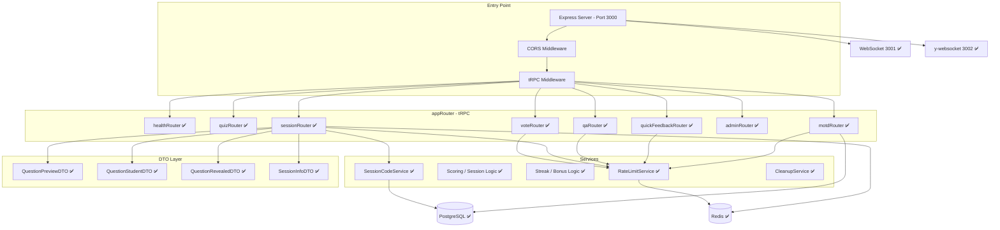

<!-- markdownlint-disable MD013 -->

# 🎓 Onboarding: arsnova.eu

Willkommen im Entwickler-Team von **arsnova.eu**. Dieses Dokument hilft dir als Studierende oder Studierender dabei, das Projekt zu verstehen, die Entwicklungsumgebung aufzusetzen und produktiv mitzuarbeiten.

**Noch keine Erfahrung mit Git, VS Code, Docker, npm oder dem Stack (tRPC, Prisma, Angular)?** Lies zuerst die kompakte Landkarte für Studierende: **[`docs/praktikum/EINSTIEG-TOOLS-UND-STACK.md`](praktikum/EINSTIEG-TOOLS-UND-STACK.md)** — danach kehrst du hierher zurück und arbeitest den Quickstart ab.

---

## 1. Quickstart: Entwicklungsumgebung einrichten

### Voraussetzungen

| Tool                    | Version               | Prüfbefehl               |
| ----------------------- | --------------------- | ------------------------ |
| Node.js                 | ≥ 20 (siehe `.nvmrc`) | `node -v`                |
| npm                     | ≥ 10                  | `npm -v`                 |
| Docker & Docker Compose | aktuell               | `docker compose version` |
| Git                     | aktuell               | `git -v`                 |

### Setup in 5 Schritten

Nach **Clone oder Fork** müssen PostgreSQL und Redis laufen und das Datenbankschema angewendet sein, damit die App mit der aktuellen DB-Struktur (inkl. aller Tabellen) arbeitet.

```bash
# 1. Repository klonen (oder deinen Fork)
git clone https://github.com/kqc-real/arsnova.eu.git
cd arsnova.eu

# 2. Umgebungsvariablen anlegen
cp .env.example .env

# 3. Datenbank & Redis starten (Docker) – nur Postgres + Redis für Lokalentwicklung
docker compose up -d postgres redis
# → PostgreSQL (Port 5432), Redis (Port 6379)

# 4. Dependencies installieren (npm Workspaces)
npm install

# 5. Datenbank-Schema anwenden und Prisma-Client generieren (DB auf aktuellen Stand)
npx prisma db push
npx prisma generate
```

**Kurz:** Einmalig `npm run setup:dev` (startet Postgres + Redis, wendet Schema an, generiert Client, baut shared-types), danach `npm run dev`.

### Entwicklungsserver starten

```bash
# Alles auf einmal (Backend + Frontend parallel, UI Englisch):
npm run dev

# Oberfläche in Quellsprache Deutsch (ohne XLF-Merge):
npm run dev:de

# Oder einzeln:
npm run dev:backend       # → http://localhost:3000 (tRPC-API)
npm run dev:frontend      # → http://localhost:4200/en/ (Angular, EN)
npm run dev:frontend:de   # → http://localhost:4200 (Angular, DE-Quelltexte)
```

**Funktioniert alles?** Öffne **`http://localhost:4200/en/`** im Browser (Standard-`dev`). Du solltest die Startseite mit dem **Server-Status-Widget** sehen (Epic 0.4: englische UI-Strings, Status-Indikator). Bei **`npm run dev:de`** die Root-URL **`http://localhost:4200`**. Backend-Health (inkl. Redis) und tRPC laufen auf Port 3000; WebSocket auf 3001, Yjs auf 3002.

### Production-ähnlich lokal (Build + ein Server)

Willst du **lokal einen production-ähnlichen** Lauf (optimierter Build, ein Prozess liefert alles aus):

```bash
npm run build:prod    # Backend + Frontend für Production bauen
npm run start:prod    # Port 3000 freigeben, Backend starten (liefert Frontend aus)
```

Im Browser **`http://localhost:3000`** öffnen. Bei belegtem Port zuerst `npm run free-port-3000`, dann `npm run start:prod`; oder mit anderem Port: `PORT=3010 npm run start:prod` → dann **`http://localhost:3010`**. Für den Einstieg reicht das; Details zu Auslieferung, Gzip und Fallbacks stehen im Root-[`README.md`](../README.md).

---

## 2. Projektstruktur (Monorepo)

Das Projekt nutzt **npm Workspaces**, um Backend, Frontend und geteilte Typen in einem Repository zu verwalten. Änderungen an `@arsnova/shared-types` wirken sich sofort auf Backend und Frontend aus.

```text
arsnova.eu/
├── apps/
│   ├── backend/              # Node.js + tRPC API-Server
│   │   └── src/
│   │       ├── index.ts      # Express-Server, Startpunkt
│   │       ├── trpc.ts       # tRPC-Initialisierung (Router, Procedures)
│   │       └── routers/      # tRPC-Router (API-Endpunkte)
│   │           ├── index.ts  # appRouter – vereint alle Sub-Router
│   │           ├── health.ts # health.check, health.stats, health.ping
│   │           ├── session.ts# session.create, getInfo, join, getExportData
│   │           └── vote.ts   # vote.submit (mit Rate-Limit)
│   └── frontend/             # Angular 21 Single-Page-App (Angular-Style: core/shared/features)
│       └── src/app/
│           ├── app.component.ts   # Root-Komponente
│           ├── app.routes.ts     # Routing-Konfiguration
│           ├── app.config.ts     # Angular-App-Konfiguration (mit withFetch für SSR)
│           ├── core/             # App-weite Singletons
│           │   ├── ws-urls.ts    # WebSocket-URLs (tRPC, Yjs)
│           │   ├── trpc.client.ts# tRPC-Client (HTTP + WebSocket im Browser; SSR nur HTTP)
│           │   └── theme-preset.service.ts
│           ├── shared/           # Wiederverwendbare UI (preset-toast, server-status-widget)
│           └── features/         # Pro Route/Feature: home, quiz, session, legal, help
├── libs/
│   └── shared-types/         # Geteilte Zod-Schemas und TypeScript-Typen
│       └── src/
│           ├── index.ts      # Re-Exports
│           └── schemas.ts    # ALLE Zod-Schemas, DTOs und Enums
├── prisma/
│   └── schema.prisma         # Datenbankmodell (Single Source of Truth)
├── docs/                     # Dokumentation
│   ├── architecture/         # Architektur-Handbuch + ADRs
│   └── diagrams/             # Mermaid-Architekturdiagramme
├── docker-compose.yml        # PostgreSQL + Redis
├── AGENT.md                  # ⚠️ KI-Coding-Regeln (Pflichtlektüre!)
├── Backlog.md                # Alle User Stories mit Akzeptanzkriterien
└── package.json              # Root: npm Workspaces + globale Scripts
```

### Wichtige Zusammenhänge

| Paket               | npm-Name                | Aufgabe                                                                              |
| ------------------- | ----------------------- | ------------------------------------------------------------------------------------ |
| `apps/backend`      | `@arsnova/backend`      | API-Server – empfängt Requests, validiert mit Zod, greift auf DB zu                  |
| `apps/frontend`     | `@arsnova/frontend`     | Browser-App – Angular-Standalone-Components mit Angular Material 3 und SCSS-Patterns |
| `libs/shared-types` | `@arsnova/shared-types` | Geteilte Verträge – Zod-Schemas, die **beide** Seiten importieren                    |

**tRPC v11:** Backend und Frontend nutzen `@trpc/server` bzw. `@trpc/client` in Version 11. Das Frontend listet zusätzlich `@trpc/server` als Dependency – nur für die Bundler-Auflösung, da der Client intern darauf verweist; es wird keine Server-Logik im Browser ausgeführt.

> **Typsicherheit:** Wenn du ein Feld im Prisma-Schema änderst, muss das passende Zod-Schema in `libs/shared-types/src/schemas.ts` aktualisiert werden. Andernfalls schlägt der Build fehl.

---

## 3. Architektur-Philosophie

Das System ist nach dem **Local-First**-Prinzip entworfen:

- **Zero-Knowledge / Local-First:** Die dauerhafte Quelle für Quizzes ist die lokale Browser-Datenbank der Lehrperson. Für laufende Sessions wird serverseitig nur die temporär nötige Kopie gehalten.
- **Datensouveränität:** Das geistige Eigentum (die Fragen) verbleibt bei der Lehrperson — keine zentrale Quiz-Cloud, kein Account-Zwang.
- **Relay-Modell:** Das Backend fungiert als _flüchtiger Vermittler_ für Live-Daten während einer Hörsaal-Sitzung.

---

## 4. Aktueller Stand vs. Ziel-Architektur

> **Epics 0–5, 7.1, 8, 9 und 10 (MOTD) sind umgesetzt.** Dieser Abschnitt zeigt den groben aktuellen Stand; für Architekturdetails sind die Living Docs in `docs/diagrams/` und die ADRs maßgeblich. Offene Stories: [`Backlog.md`](../Backlog.md).

### Was bereits funktioniert (✅ Implementiert – Stand: 2026-04-01)

| Komponente                                                 | Beschreibung                                                                                                               |
| ---------------------------------------------------------- | -------------------------------------------------------------------------------------------------------------------------- |
| Express + tRPC-Server                                      | Backend auf Port 3000 mit `health.check`, `health.stats`, `health.ping` (Subscription)                                     |
| Angular 21 Frontend                                        | Standalone Components, Signals, Angular Material 3, tokenbasiertes Theming, Startseite mit Server-Status-Widget            |
| tRPC-Client                                                | `httpBatchLink` (Queries/Mutations) + `wsLink` (Subscriptions)                                                             |
| Redis-Anbindung                                            | `ioredis`-Client, Health-Check, Rate-Limiting (Sliding-Window), Session-Code-Lockout                                       |
| tRPC WebSocket                                             | Separater WebSocket-Server (Port 3001) für Subscriptions                                                                   |
| Yjs y-websocket Relay                                      | Backend startet y-websocket-Server (Port 3002) für Multi-Device-Sync                                                       |
| Server-Status (Epic 0.4)                                   | `health.stats`, Widget auf Startseite (Polling 30s), Schwellwerte healthy/busy/overloaded                                  |
| Session-, Vote-, Q&A-, Blitzlicht-, Admin- und MOTD-Router | `session`, `vote`, `qa`, `quickFeedback`, `admin`, `motd` (Epic 10) mit Rate-Limiting; Live-Subscriptions für Session-Pfad |
| Prisma-Schema                                              | Vollständiges Datenbankmodell (Quiz, Question, Session, Vote, etc.)                                                        |
| Zod-Schemas (`shared-types`)                               | Alle Input-/Output-Schemas und DTOs definiert                                                                              |
| Docker Compose                                             | PostgreSQL 16 + Redis 7 (+ optional App-Container) per `docker compose up`                                                 |
| CI/CD-Pipeline                                             | GitHub Actions: Prisma validate/generate, TypeScript, ESLint, Tests, Docker-Build (Node 20/22)                             |

### Was als nächstes ansteht (🔲 Geplant / offen)

| Thema                 | Kurzbeschreibung                                           | Backlog / Referenz    |
| --------------------- | ---------------------------------------------------------- | --------------------- |
| Barrierefreiheit & UX | Story **6.5** (Abschlussprüfung), **6.6** (Thinking Aloud) | Epic 6                |
| Sicherheit Session    | Host-/Presenter-Zugang serverseitig härten (**2.1c**)      | Epic 2                |
| Markdown & Editor     | Bilder/Lightbox (**1.7a**), Editor-Toolbar (**1.7b**)      | Epic 1, ADR-0015–0017 |
| Q&A-Erweiterungen     | Delegation, Kontrovers-/Wilson-Sortierung (**8.5–8.7**)    | Epic 8                |
| Last & Performance    | Ausführbares Lasttest-Setup (**0.7**)                      | Epic 0, ADR-0013      |
| Weitere UX-Politur    | Feinschliff Startseite, Presenter, Beamer, Mobile/Tablet   | laufend               |

Vollständige Story-Liste und Status: [`Backlog.md`](../Backlog.md).

---

## 5. Komponentenbeschreibung (Stand: 2026-04-01)

Das folgende Diagramm zeigt eine vereinfachte **Backend-Architektur**. Neben Quiz und Session sind `Q&A`, `Blitzlicht`, `Admin` und **`motd` (Epic 10)** integriert.



> ✅ = im Projektstand 2026-04-01 umgesetzt

### A. Frontend (Angular 21)

Das Frontend nutzt modernste Angular-Features:

- **Standalone Components:** Keine `NgModules` – jede Komponente ist eigenständig importierbar.
- **Angular Signals:** Reaktiver UI-Zustand; keine manuellen Subscriptions für State.
- **tRPC-Client:** `httpBatchLink` (Queries/Mutations) und `wsLink` (Subscriptions) – beide aktiv.
- **Server-Status-Widget:** Zeigt auf der Startseite aggregierte Kennzahlen (`health.stats`, Polling 30s).
- **Yjs & IndexedDB:** Quiz-Daten Local-First im Browser; Yjs für Multi-Device-Sync.
- **Unified Live Session:** Session-Shell mit Kanälen für Quiz, Q&A und Blitzlicht; zusätzlich Standalone-Blitzlicht über die Startseite.

### B. Backend (Node.js + tRPC)

- **tRPC Router:** health, quiz, session, vote, qa, quickFeedback, admin. Typen über `@arsnova/shared-types`.
- **Rate-Limiting:** Redis Sliding-Window für Session-Code, Vote-Submit, Session-Erstellung und weitere Live-Aktionen; tRPC-Error `TOO_MANY_REQUESTS` mit Retry-After.
- **Service Layer:** SessionCode-, Scoring-, Bonus-, Cleanup- und Admin-Logik sind integriert.
- **DTO Layer:** Data-Stripping für `isCorrect` ist entlang des Session-Status umgesetzt.
- **Prisma ORM:** Schema in `prisma/schema.prisma`; Migrations/Client per `prisma generate` und `prisma db push`.

### C. Infrastruktur

- **PostgreSQL:** Live-Session-Daten (Sessions, Participants, Votes). Docker Compose.
- **Redis (✅):** Health-Check, Rate-Limiting (`ioredis`), vorbereitet für Pub/Sub in Epics 2–4.
- **WebSocket (Port 3001):** tRPC-Subscriptions (z. B. `health.ping`).
- **y-websocket (Port 3002):** Yjs-Relay für den Multi-Device-Sync der Lehrperson.

---

## 6. Das Zusammenspiel in einer Live-Session (Referenzmodell)

> Dieser Ablauf beschreibt das aktuelle Referenzmodell. Details dazu stehen in `docs/diagrams/diagrams.md`, `ADR-0009` und `ADR-0010`.

1. **Quiz-Upload:** Die Lehrperson wählt ein Quiz aus ihrer lokalen IndexedDB. Das Frontend sendet eine Kopie via `quiz.upload` (Zod-validiert) an das Backend.
2. **Session-Initialisierung:** Das Backend speichert die Quiz-Kopie in PostgreSQL, generiert einen 6-stelligen Code und registriert ihn in Redis.
3. **Lobby-Phase:** Teilnehmende treten mit dem Code bei. Das Backend erstellt einen `Participant`-Eintrag und informiert die Lehrperson in Echtzeit via Redis Pub/Sub → tRPC Subscription.
4. **Frage-Aktivierung (Security):**
   - Die Lehrperson klickt „Nächste Frage“.
   - Das Backend setzt den Status auf `ACTIVE`.
   - Das **DTO-Stripping** entfernt `isCorrect` aus den Antwortoptionen.
   - Die gefilterten Daten (`QuestionStudentDTO`) werden via tRPC Subscription an die Geräte aller Teilnehmenden gepusht.
5. **Abstimmung:** Teilnehmende senden ihre Votes. Der ScoringService berechnet Punkte basierend auf Korrektheit, Antwortzeit und Schwierigkeitsgrad.
6. **Auflösung:** Die Lehrperson beendet die Frage (Status → `RESULTS`). _Erst jetzt_ sendet das Backend das vollständige Objekt (`QuestionRevealedDTO` inkl. `isCorrect`) an die Teilnehmenden.
7. **Parallele Live-Kanäle:** Innerhalb derselben Session können zusätzlich `Q&A` und `Blitzlicht` aktiv sein. Blitzlicht ist sowohl im Session-Kanal als auch direkt über die Startseite verfügbar.

---

## 7. Wichtige Regeln für Entwickler

> Diese Regeln sind ausführlich in [`AGENT.md`](../AGENT.md) beschrieben. Hier die Kurzfassung:

| Regel                                  | Beschreibung                                                                                |
| -------------------------------------- | ------------------------------------------------------------------------------------------- |
| **Kein `any`**                         | TypeScript-Typen immer aus `@arsnova/shared-types` importieren                              |
| **Signals statt RxJS**                 | Für UI-State ausschließlich Angular Signals verwenden. RxJS nur für WebSocket-Streams       |
| **Security First**                     | Neues Feld an einer Frage? → Prüfen, ob es im `QuestionStudentDTO` entfernt werden muss     |
| **Standalone Components**              | Keine `NgModules`. Neue `@if`/`@for` Control-Flow-Syntax, kein `*ngIf`/`*ngFor`             |
| **Angular Material 3 + SCSS-Patterns** | Styling über Material-Komponenten, Design-Tokens und zentrale SCSS-Patterns (ohne Tailwind) |
| **ADRs schreiben**                     | Architekturentscheidungen als ADR in `docs/architecture/decisions/` dokumentieren           |

---

## 8. Pflichtlektüre

| Dokument                                                                  | Inhalt                                                                        |
| ------------------------------------------------------------------------- | ----------------------------------------------------------------------------- |
| [`AGENT.md`](../AGENT.md)                                                 | KI-Coding-Regeln und Architektur-Leitplanken                                  |
| [`Backlog.md`](../Backlog.md)                                             | Alle User Stories mit Priorität und Akzeptanzkriterien                        |
| [`docs/architecture/handbook.md`](architecture/handbook.md)               | Ausführliches Architektur-Handbuch                                            |
| [`docs/README.md`](README.md)                                             | Doku-Landkarte nach Rolle und Thema                                           |
| [`docs/ENVIRONMENT.md`](ENVIRONMENT.md)                                   | Umgebungsvariablen (Backend, Rate-Limits, Admin)                              |
| [`docs/SECURITY-OVERVIEW.md`](SECURITY-OVERVIEW.md)                       | Sicherheit, DSGVO, Rollen — Kurzüberblick                                     |
| [`docs/TESTING.md`](TESTING.md)                                           | Tests lokal, CI-Jobs (`npm test`, Lint, Build)                                |
| [`docs/GLOSSAR.md`](GLOSSAR.md)                                           | App-Begriffe (Workflows, UI, Rollen) — einheitlich mit ADRs/Features verlinkt |
| [`docs/architecture/decisions/`](architecture/decisions/)                 | Architecture Decision Records (ADRs)                                          |
| [`docs/diagrams/diagrams.md`](diagrams/diagrams.md)                       | Mermaid-Diagramme (Backend, Frontend, DB, Sequenz)                            |
| [`prisma/schema.prisma`](../prisma/schema.prisma)                         | Datenbankmodell – Single Source of Truth                                      |
| [`libs/shared-types/src/schemas.ts`](../libs/shared-types/src/schemas.ts) | Alle Zod-Schemas und DTOs                                                     |

### Zurücksetzen auf einen bekannten Stand

Falls die Umgebung kaputt geht oder du einen sauberen Ausgangspunkt brauchst:

| Git-Tag           | Beschreibung                                                                                   |
| ----------------- | ---------------------------------------------------------------------------------------------- |
| **`v0-epic0`**    | Stand nach Epic 0 (Redis, WebSocket, Yjs, Server-Status, Rate-Limiting, CI/CD) – **empfohlen** |
| **`v0-baseline`** | Nur Projekt-Skeleton (vor Epic 0)                                                              |

```bash
git reset --hard v0-epic0
npm install
```

---

## 9. Begriffe

### 9.1 Produkt & UI — [GLOSSAR.md](GLOSSAR.md)

**Session**, **Host**, **Kanal**, **Blitzlicht**, **Preset**, **Bonus-Code** usw.: Die zentralen **nutzer- und produktnahen Begriffe** (inkl. Abgrenzung z. B. Blitzlicht vs. `quickFeedback`) stehen im **[Projekt-Glossar](GLOSSAR.md)**. Bei neuen Features mit eigenem Vokabular dort Einträge pflegen (siehe Pflegehinweis in der Datei).

### 9.2 Technik (Onboarding-Kurzreferenz)

| Begriff            | Erklärung                                                                                                                                                                            |
| ------------------ | ------------------------------------------------------------------------------------------------------------------------------------------------------------------------------------ |
| **Monorepo**       | Ein einzelnes Git-Repository, das mehrere Pakete enthält (hier: Backend, Frontend, shared-types). Verwaltet über npm Workspaces.                                                     |
| **tRPC**           | TypeScript Remote Procedure Call – Framework für typsichere API-Kommunikation ohne REST-Boilerplate. Frontend und Backend teilen sich die Typen direkt.                              |
| **Zod**            | TypeScript-Validierungsbibliothek. Definiert Schemas, die sowohl zur Laufzeit (Eingabevalidierung) als auch zur Compile-Zeit (Typen) genutzt werden.                                 |
| **Prisma**         | ORM (Object-Relational Mapping) für Node.js. Übersetzt TypeScript-Objekte in SQL-Queries. Das Schema in `schema.prisma` definiert die Datenbankstruktur.                             |
| **DTO**            | Data Transfer Object – ein gefiltertes Datenobjekt, das nur die Felder enthält, die der Empfänger sehen darf. Zentral für die Sicherheit (kein `isCorrect` für Teilnehmende).        |
| **CRDT**           | Conflict-free Replicated Data Type – Datenstruktur, die parallele Änderungen auf mehreren Geräten automatisch und ohne Konflikte zusammenführt. Verwendet über die Bibliothek Yjs.   |
| **Yjs**            | JavaScript-Bibliothek für CRDTs. Speichert Daten in IndexedDB (Browser-Datenbank) und synchronisiert Änderungen als kleine „Deltas" über WebSockets.                                 |
| **Pub/Sub**        | Publish/Subscribe – Messaging-Muster, bei dem ein Sender (Publisher) Nachrichten veröffentlicht und alle registrierten Empfänger (Subscribers) diese erhalten. Umgesetzt über Redis. |
| **ADR**            | Architecture Decision Record – kurzes Dokument, das eine technische Entscheidung, ihre Begründung und Alternativen festhält. Liegt unter `docs/architecture/decisions/`.             |
| **Subscription**   | tRPC-Mechanismus für Echtzeit-Kommunikation über WebSockets. Der Client registriert sich für Events, die der Server aktiv pusht (z. B. „neuer Teilnehmer beigetreten").              |
| **IndexedDB**      | Browsereigene NoSQL-Datenbank für große Datenmengen. Wird hier von Yjs genutzt, um Quizzes lokal zu persistieren – auch nach Browser-Neustart.                                       |
| **Data-Stripping** | Sicherheitsmechanismus: Das Backend entfernt sensible Felder (z. B. `isCorrect`) aus Objekten, _bevor_ sie an Teilnehmende gesendet werden – verhindert Schummeln via DevTools.      |

---

Viel Erfolg bei der Entwicklung von arsnova.eu! 🚀 Bei Fragen: Schau zuerst in die [Pflichtlektüre](#8-pflichtlektüre), dann frag im Team.
