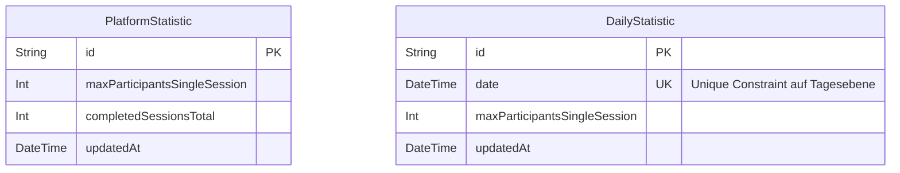
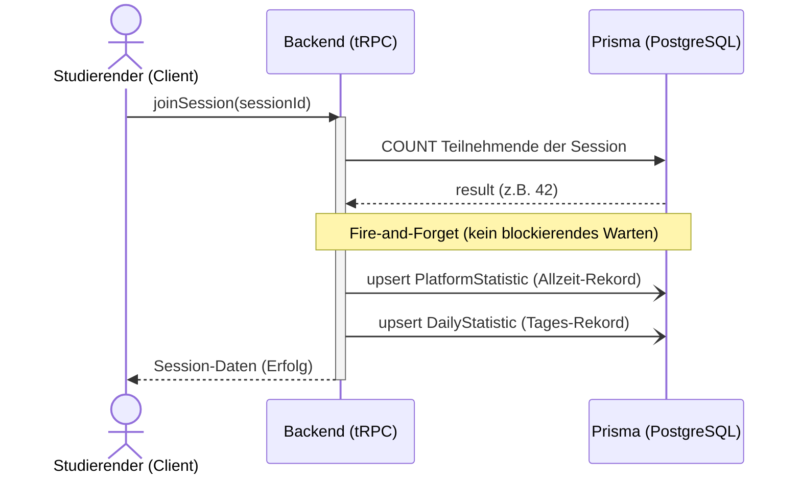
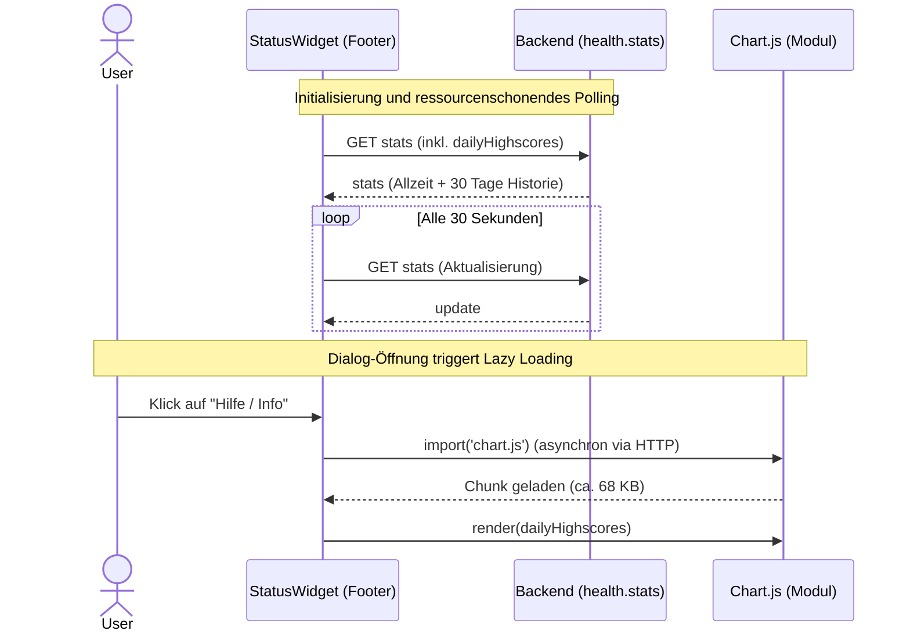

# Handout: Implementierung des "Tages-Teilnehmerrekords" in arsnova.eu mit einem KI-Agenten

**Zielgruppe:** Studierende im Informatikpraktikum (Software Engineering)
**Thema:** Architektur, Tech Stack und der proaktive Einsatz von KI-Agenten in bestehenden Codebasen.

---

## 1. Einleitung & Zielsetzung

In dieser Fallstudie betrachten wir die Erweiterung der Open-Source-Plattform **arsnova.eu**. Die Plattform wird für interaktive Vorlesungen (Audience Response System) genutzt.

**Das Feature:** Die bestehende Betriebsstatusanzeige (Footer-Widget) soll um einen **täglichen Highscore** der Teilnehmenden pro Session erweitert werden. Diese "Ganglinie" (Line-Chart) soll im Hilfe-Dialog des Widgets visualisiert werden.

**Das Lernziel:** Ihr werdet verstehen, welche Architekturschichten von diesem Feature berührt werden, wie man Performance-Fallen vermeidet und – besonders wichtig – wie man einen autonomen KI-Agenten (wie das Gemini CLI) strukturiert einsetzt, um solche Features in einer fremden, komplexen Codebasis zu konzipieren und umzusetzen.

### 1.1. Die Pflichtartefakte vor dem ersten Prompt

Dieses Handout ist bewusst **kein** reines Coding-Tutorial. Im Praktikum sollt ihr lernen, dass agentisches Software Engineering mit **Artefakten** beginnt, nicht mit blindem Code-Generieren. Fuer dieses Feature muessen vor dem ersten Prompt mindestens diese Dateien offen sein:

- **Produktvertrag:** `Backlog.md`, **Story 0.4a** "Tagesrekord-Verlauf im Server-Status-Hilfedialog"
- **Bestehender Feature-Kontext:** `docs/features/server-status-widget.md`
- **API-Kontext:** `docs/architecture/decisions/0003-use-trpc-for-api.md`
- **i18n-Kontext:** `docs/architecture/decisions/0008-i18n-internationalization.md`
- **Status-/Dialog-Kontext:** `docs/architecture/decisions/0021-separate-service-status-from-load-status-with-live-slo-telemetry.md`
- **Neue Architekturentscheidung fuer dieses Feature:** `docs/architecture/decisions/0024-daily-session-records-in-server-status-help-dialog.md`
- **Agenten- und Repo-Kontext:** `AGENT.md` und `.cursorrules`

**Didaktischer Kern:** Das Backlog sagt **was** geliefert werden soll. Das ADR sagt **warum** und unter welchen Leitplanken. Der Branch und der Pull Request machen sichtbar, **wie** im Team daraus ein geprueftes Inkrement wird.

**Begleitmaterial fuer die Lehre:**

- [Aufgabenblatt Story 0.4a](./AUFGABENBLATT-STORY-0.4A-TAGESREKORD.md)
- [PR-Review-Checkliste Story 0.4a](./PR-REVIEW-CHECKLISTE-STORY-0.4A.md)

---

## 2. Architektur & Tech Stack (arsnova.eu)

Die Plattform nutzt einen modernen Full-Stack. Für unser Feature müssen wir fast alle Schichten berühren (vertikaler Durchstich):

### 2.1. Persistenzschicht (PostgreSQL & Prisma ORM)

- **Status Quo:** Der Allzeit-Rekord liegt in der Tabelle `PlatformStatistic`.
- **Erweiterung:** Eine neue Tabelle `DailyStatistic` mit den Spalten `date` (als Unique Constraint) und `maxParticipantsSingleSession`.
- **Konzept:** Nutzung von **Upsert** (Update or Insert) Operationen in SQL/Prisma, um Race-Conditions bei gleichzeitigen Zugriffen (viele Studierende treten gleichzeitig bei) zu verhindern. Diese Persistenzentscheidung wird fuer das Praktikum bewusst in **ADR-0024** festgehalten.

**Datenbankschema (ER-Diagramm):**



### 2.2. Backend & API (Node.js & tRPC)

- **Status Quo:** Bei jedem Beitritt (`apps/backend/src/routers/session.ts`) wird synchron der Teilnehmer gezählt und _asynchron_ (`void updateMaxParticipantsSingleSession(...)`) der Rekord geprüft.
- **Erweiterung:** Das Backend muss zusätzlich prüfen, ob der Tagesrekord gebrochen wurde.
- **API (`health.stats`):** Die Datenabfrage erfolgt über tRPC. Das `ServerStatsDTO` (Data Transfer Object) wird um ein Array `dailyHighscores` erweitert, welches die Werte der letzten 30 Tage liefert. Damit bewegen wir uns direkt im Rahmen von **ADR-0003**.
- **Architektur-Fokus (Echtzeit vs. Polling):** arsnova.eu ist ein Echtzeitsystem. Das Speichern des Rekords darf den Beitritt nicht verzögern (Daher: `void` = Fire-and-Forget). Die Aktualisierung der Anzeige bei allen Clients erfolgt bewusst _nicht_ über teure WebSockets, sondern über ressourcenschonendes HTTP-Polling (alle 30 Sekunden). Das passt zur bestehenden Trennung von kompaktem Footer und Detaildialog aus **ADR-0021**.

**Ablauf beim Session-Beitritt (Sequenzdiagramm):**



### 2.3. Frontend (Angular & Chart.js)

- **Erweiterung:** Im `ServerStatusHelpDialogComponent` wird ein Chart eingefügt.
- **Performance-Fokus:** Chart-Bibliotheken sind oft sehr groß (300-800 KB). Um das Time-to-Interactive der App nicht zu ruinieren, treffen wir zwei Entscheidungen:
  1. **Minimalismus:** Wir nutzen das kleine `chart.js` (ca. 68 KB) komplett ohne Angular-Wrapper, um Overhead zu sparen.
  2. **Lazy Loading:** Das Chart wird über Angulars `@defer`-Direktive asynchron erst dann geladen, wenn der Dialog tatsächlich geöffnet wird.
- **UI-Governance:** Neue Beschriftungen, Diagramm-Titel und ARIA-Hinweise muessen den Regeln aus **ADR-0008** folgen.

**Zeitliches Verhalten & Performance (Sequenzdiagramm / Lazy Loading):**



---

## 3. Der Workflow mit dem KI-Agenten

Ein KI-Agent ist kein einfacher Chatbot. Er hat Zugriff auf das Dateisystem, kann Shell-Befehle (wie `grep` oder `git`) ausführen und Dateien lesen/schreiben. Entscheidend ist aber: Er muss in einen **sauberen Teamprozess** eingebettet werden. Fuer dieses Praktikum ist daher nicht nur der Code wichtig, sondern die komplette Kette **Backlog -> ADR -> Branch -> Commits -> Pull Request**.

### Phase 0: Onboarding & Pflichtkontext

Bevor der KI-Agent überhaupt involviert wird, muss er ein klares und detailliertes Gesamtbild des Repositories erkunden.

- **Aktion:** Man fordert den Agenten explizit auf, sich an den echten Repo-Artefakten zu orientieren, z. B. durch den Prompt: _"Lies `AGENT.md`, `.cursorrules`, `Backlog.md` Story 0.4a, `docs/features/server-status-widget.md`, ADR-0003, ADR-0008, ADR-0021 und ADR-0024. Fasse mir erst die Leitplanken zusammen, bevor du Implementierungsschritte vorschlaegst."_
- **Nutzen:** Der Agent lernt nicht nur Coding-Regeln, sondern auch den Produktvertrag und die Architekturgrenzen kennen.

### Phase 1: Problem im Backlog schärfen

Anstatt direkt nach Code zu fragen, wird zuerst die Story gelesen und auf Unklarheiten abgeklopft.

- **Aktion:** Der Nutzer arbeitet gegen **Story 0.4a** im `Backlog.md`.
- **KI-Arbeit:** Der Agent vergleicht Story, bestehende Doku und Code. Er benennt offene Produktfragen, zum Beispiel: _Werden fehlende Tage als `0` aufgefuellt? Bleibt das Footer-Widget unveraendert?_
- **Didaktischer Punkt:** Gute Agentenarbeit beginnt mit **Anforderungsanalyse**, nicht mit Dateierzeugung.

### Phase 2: Architekturentscheidung mit ADRs absichern

Wenn ein Feature neue Persistenz, neue API-Felder oder neue Frontend-Muster mit sich bringt, reicht das Backlog allein nicht.

- **Aktion:** Relevante bestehende ADRs werden gelesen, und fuer die neue Entscheidung wird **ADR-0024** angelegt oder verfeinert.
- **Didaktischer Punkt:** Das Backlog beschreibt den **Soll-Zustand**. Das ADR dokumentiert die **Begruendung** und die verworfenen Alternativen.

### Phase 3: Feature-Branch anlegen

Erst jetzt beginnt die eigentliche Umsetzungsvorbereitung im Repository.

- **Aktion:** Es wird **nicht** direkt auf `main` gearbeitet, sondern auf einem sprechenden Feature-Branch, zum Beispiel:

```bash
git switch -c feature/0.4a-daily-session-record-history
```

- **Didaktischer Punkt:** Der Branch ist keine Formalie, sondern der geschuetzte Raum fuer Experiment, Review und Rueckfrage.

### Phase 4: Kontextaufbau (Research)

Nun darf der Agent recherchieren, aber gezielt entlang der Story und der ADRs.

- **Aktion:** Der Nutzer äußert einen konkreten Wunsch: _"Erweitere die Betriebsstatusanzeige gemaess Story 0.4a."_
- **KI-Arbeit:** Der Agent nutzt Suchwerkzeuge (`grep_search`), um Relevanz zu finden. Er untersucht, wo `maxParticipantsSingleSession`, `health.stats` und der `ServerStatusHelpDialogComponent` bereits verarbeitet werden.

### Phase 5: Strategie & Architekturdiskussion (Plan Mode)

Bevor Code geschrieben wird, wird diskutiert. Der Agent wird in den **Planungsmodus** versetzt.

- **KI-Vorschlag:** Der Agent schlägt vor, eine mächtige Bibliothek (ECharts) für das Diagramm zu nutzen.
- **Menschliches Eingreifen (Der Dozent/Entwickler):** Als Entwickler hinterfragen wir: _"Wie groß ist ECharts? Was ist mit der Performance? Passt das ueberhaupt zum Hilfe-Dialog statt zum Footer?"_
- **KI-Korrektur:** Der Agent analysiert die Bundle-Größen und schlägt Alternativen (Chart.js) sowie Architektur-Patterns (Lazy Loading, Null-Auffuellung der 30-Tage-Achse, Polling statt WebSocket) vor.

### Phase 6: Ausführung & Validierung

Der Agent arbeitet nun autonom die Liste aus dem Plan ab (Datenbank -> Backend -> shared-types -> Frontend), aber immer mit kurzen Validierungsschleifen.

- **Validierung:** Nutzung von CLI-Tools (`vitest`, Typecheck, Linting, ggf. Bundle-Pruefung), Testen der App im Browser, Diff-Kontrolle.
- **Didaktischer Punkt:** Ein Agent ist kein Autoritaetsersatz. Gruene Checks sind der erste Filter, menschliches Review der zweite.

### Phase 7: Pull Request als sozialer Prüfpunkt

Der Pull Request ist der Moment, in dem aus privater Agentenarbeit ein **teamfaehiger Vorschlag** wird.

- **Aktion:** Der Branch wird mit einer klaren PR beschrieben, zum Beispiel:

```text
Titel: feat(status): add daily session record history

- Story: 0.4a
- ADR: 0024
- Scope: DailyStatistic, health.stats, ServerStatusHelpDialog
- Validierung: Typecheck, Vitest, manuelle UI-Pruefung
- Risiken: Bundle-Groesse, Polling-Verhalten, A11y des Charts
```

- **Didaktischer Punkt:** Im Pull Request prueft das Team nicht nur _ob_ der Code funktioniert, sondern auch _ob_ Story, ADR, Tests und Begruendung zusammenpassen.

### Phase 8: Der Implementierungsplan

Der Agent formuliert einen verbindlichen Plan. Der Entwickler behält die volle Kontrolle und genehmigt diesen erst, wenn er logisch einwandfrei ist.

_(Der von uns akzeptierte Plan für dieses Feature befindet sich in Sektion 4)._

---

## 4. Der akzeptierte Implementierungsplan

Dieser Plan wurde durch die Diskussion in Phase 2 vom KI-Agenten erstellt und vom Entwickler (Dozent) freigegeben. Anhand dieses Plans wird das Feature nun strukturiert umgesetzt.

### 4.1. Objective

Erweiterung der Betriebsstatusanzeige um einen täglichen Highscore der Teilnehmer/innen pro Session. Diese "Ganglinie" der Tagesrekorde soll im "Allzeit-Rekord"-Panel des Server Status Help Dialogs als hochwertiges Line-Chart ("vom Feinsten") angezeigt werden. Um die Frontend-Performance nicht zu beeinträchtigen, wird `chart.js` (als leichtgewichtige Bibliothek) genutzt und lazy geladen (ohne den schweren Wrapper `ng2-charts`).

### 4.2. Key Files & Context

- **Produktvertrag:** `Backlog.md` (Story 0.4a)
- **Feature-Doku:** `docs/features/server-status-widget.md`
- **ADR-Kontext:** `docs/architecture/decisions/0021-separate-service-status-from-load-status-with-live-slo-telemetry.md`, `docs/architecture/decisions/0024-daily-session-records-in-server-status-help-dialog.md`
- **Datenbank:** `prisma/schema.prisma`
- **Backend-Logik:** `apps/backend/src/lib/platformStatistic.ts`, `apps/backend/src/routers/session.ts`, `apps/backend/src/routers/health.ts`
- **API-Schema:** `libs/shared-types/src/schemas.ts`
- **Frontend-Dialog:** `apps/frontend/src/app/shared/server-status-help-dialog/server-status-help-dialog.component.ts` (und `.scss`)
- **Package:** `apps/frontend/package.json`

### 4.3. Implementation Steps

#### 4.3.1. Datenbank (Prisma)

- Eine neue Tabelle `DailyStatistic` zu `prisma/schema.prisma` hinzufügen:
  ```prisma
  model DailyStatistic {
    id                           String   @id @default(uuid()) @db.Uuid
    date                         DateTime @unique @db.Date
    maxParticipantsSingleSession Int      @default(0)
    updatedAt                    DateTime @updatedAt
  }
  ```
- Migration ausführen (`npx prisma migrate dev --name add_daily_statistic`).

#### 4.3.2. Backend-Logik & API

- **`platformStatistic.ts`:** Eine Funktion `updateDailyMaxParticipants(count: number)` hinzufügen, die via Prisma "Upsert" den Rekord für das heutige Datum (`UTC`) aktualisiert.
- **Session Join (`session.ts`):** Den bestehenden Aufruf asynchron erweitern, dass er auch die Tages-Statistik bedient (`void updateDailyMaxParticipants(newParticipantCount)`).
- **`schemas.ts`:** Das `ServerStatsDTOSchema` um `dailyHighscores` erweitern:
  ```typescript
  dailyHighscores: z.array(
    z.object({
      date: z.string(),
      count: z.number(),
    }),
  ).optional();
  ```
- **`health.ts`:** In der Route `health.stats` die Datensätze der letzten 30 Tage aus der Tabelle `DailyStatistic` auslesen und dem `ServerStatsDTO` hinzufügen.

#### 4.3.3. Frontend (Chart.js)

- **Abhängigkeiten:** `npm install chart.js` in `apps/frontend`.
- **Lazy Loading:** `chart.js` wird streng asynchron geladen. Wir verwenden keine Angular-Wrapper. Das HTML-Canvas-Element wird in einem `@defer`-Block platziert.
- **UX & Design ("vom Feinsten"):**
  - **Type:** `line`, **Styling:** Weiche Kurven (`tension: 0.4`), gefüllter Bereich (`fill: true`), minimale Achsen (keine Grid-Linien).
  - **Tooltips:** Aktivieren für Datum und Rekord-Anzahl.
  - **Responsiveness:** `maintainAspectRatio: false` in einem flexiblen Container.
- **Template Anpassung:** Das Chart im Template unterhalb des "Allzeit-Rekord"-Wertes platzieren, inklusive Überschrift "Verlauf (Letzte 30 Tage)".

#### 4.3.4. i18n

- Hinzufügen der nötigen Strings zu den `.xlf` Dateien.

## 5. Fazit

Die Arbeit mit KI-Agenten erfordert **Systemverständnis**. Die KI nimmt uns die mechanische Schreibarbeit ab, aber **ihr als Software Engineers** steuert die Initialisierung (Context) und trefft die finalen Architektur- und Performanceentscheidungen.

Gerade fuer das Praktikum gilt deshalb: Ein gutes Feature beginnt nicht beim ersten Code-Snippet, sondern bei der Kette **Story -> ADR -> Branch -> Validierung -> Pull Request**. Erst wenn diese Kette sauber ist, wird aus agentischer Unterstuetzung echtes Software Engineering.
